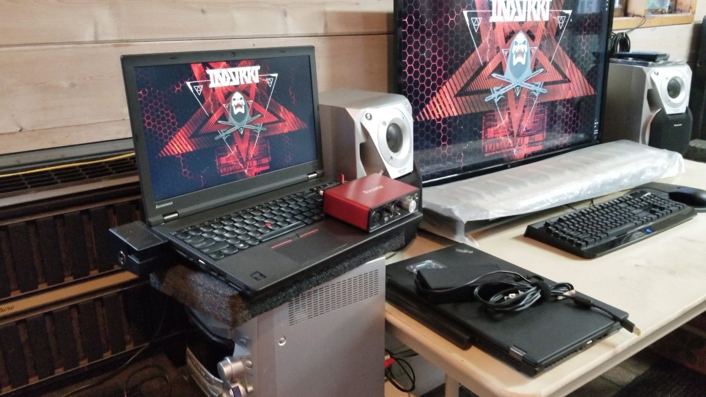
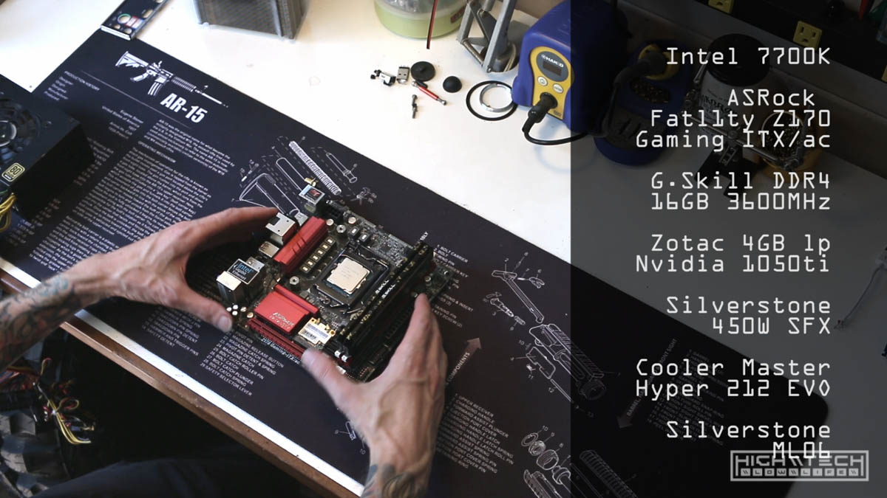
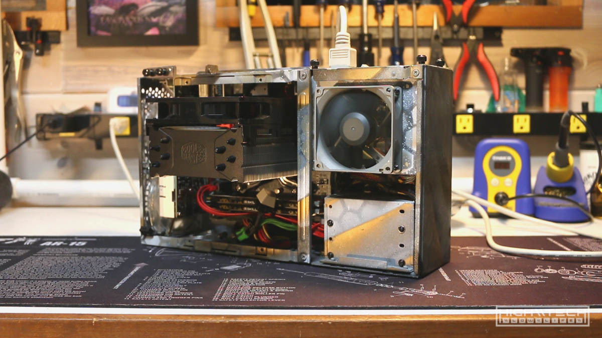
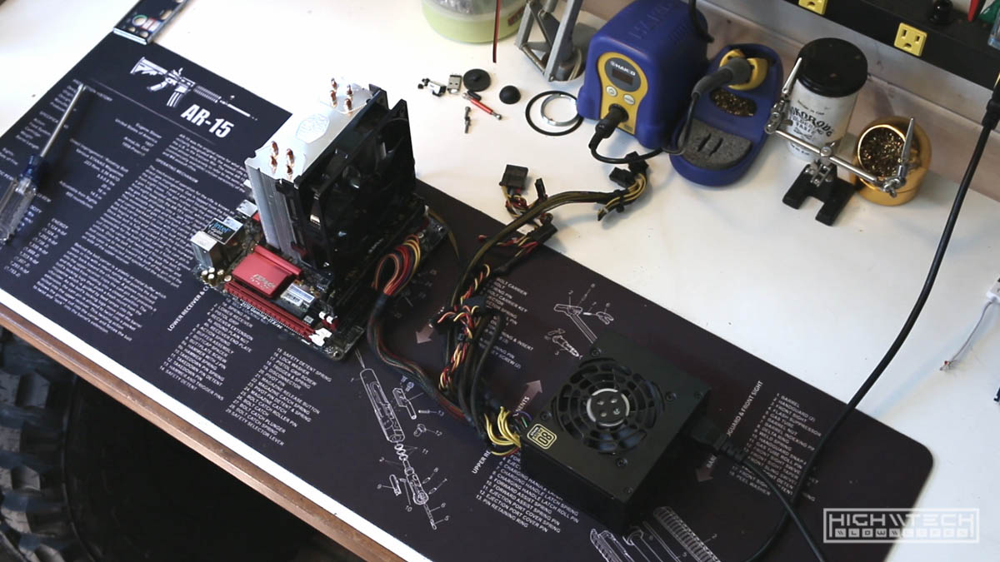
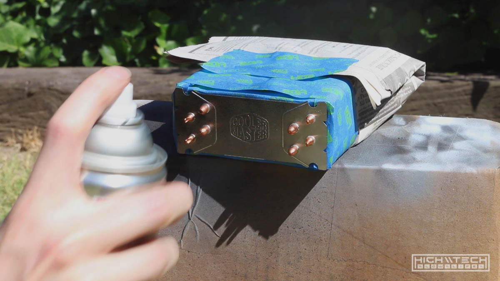
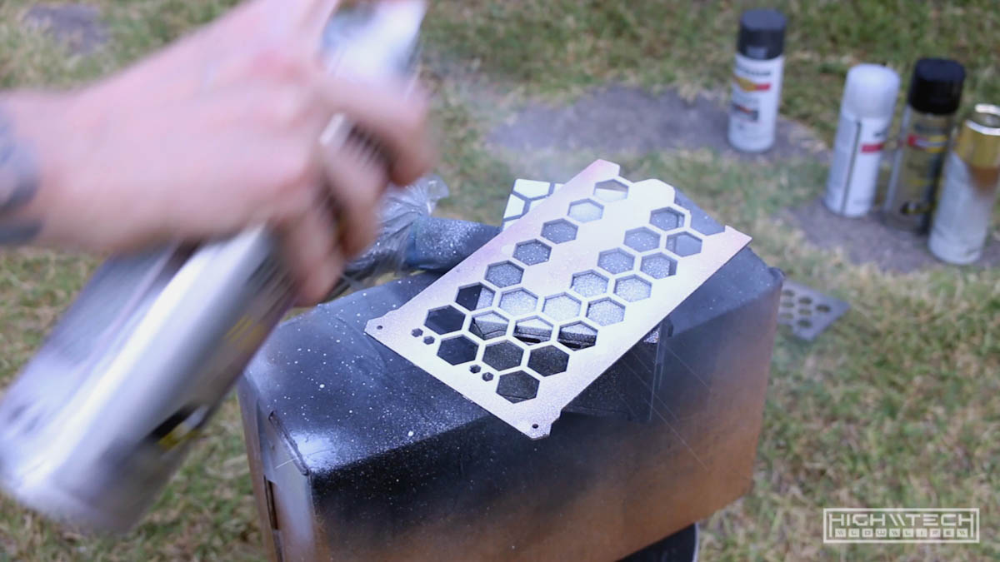
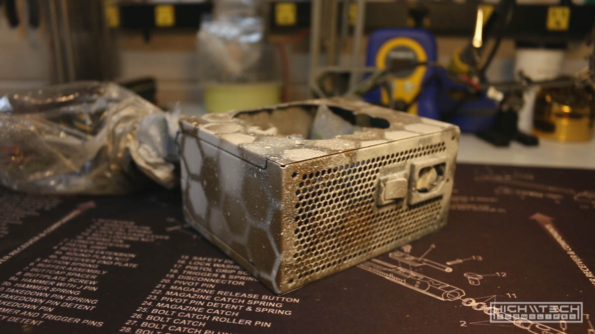
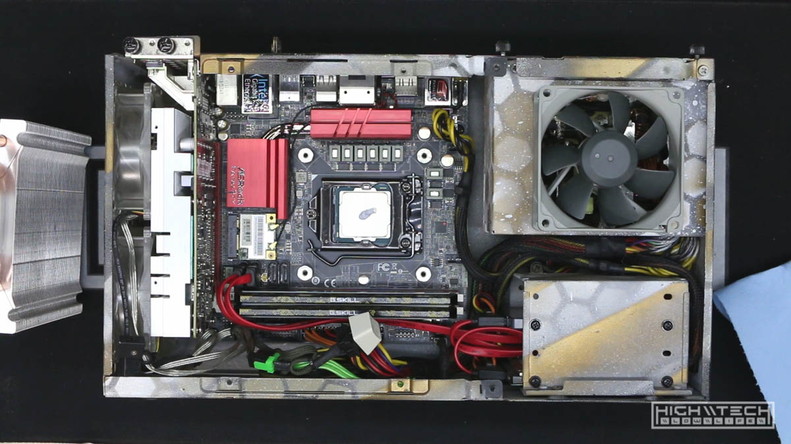
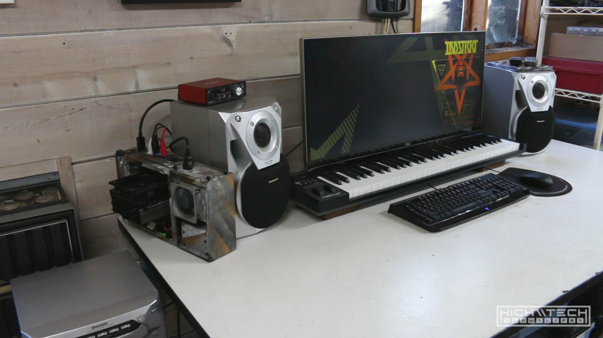

# \\\ Mini DAW Workstation \\\

Do you ever have those times where a simple computer issue cascades into a total change of just about everything on your desk? 

This isn't really a tutorial, so apologies if it's not step-by-step, just take what you can from it - maybe it will inspire you in some way with your own setups. 

I originally was just going to use my ThinkPad W541 for music production, but I had a 2560x1080 ultrawide monitor I wanted to use. The monitor is a Korean off-brand (Crossover) and only has a single DVI port, but no worries I can use an adapter or a dock, but soon I realized. This monitor for whatever reason would not display when attached to my W541. I tried adapters, different cables, docks, what-have-you, no signal. It works just fine with my desktop computers so I'm not sure what the problem is with this combo*.  Sometimes it's easier just to change your mind or direction on a project which can yield a quicker or even better solution, and I did have a bunch of parts laying around to build a desktop, so here I go. 



```
*After some testing much later on I realized that this monitor could not be used if you were using it paired with a another monitor as well (multi-monitor). I had never encountered this before, but I confirmed by plugging in the Crossover monitor on a system I knew it worked with, and then as soon as I plugged in another monitor the Crossover would go black and not display signal anymore, as soon as I unplugged the 2nd monitor then the Crossover would come back to life and display correctly. Since all laptops inherently have a monitor already, any monitor you attach to them will be the 2nd monitor, so it looks like this Crossover monitor can only be used by itself, which is a bummer because I love using tons of monitors on a single computer.

After even more testing, I realized that it could be used multi-monitor, just not with this particular laptop/dock. The W541 dock has had some issues with multi-monitor setups, although it does work with a 1080p monitor I am using at work, so I'm thinking it's a picky dock with an odd monitor. I did try the Crossover direct into the laptop with no dock but still did not get a signal, although the W541 does not have a native DVI port (only mini DP) so it could have been the adapter or cable. I may revisit this in the future to try and solve actually solve it, but probably not.  
```


The parts I cobbled together were from a previous 4790K ITX build, but I had sold that mobo+cpu combo. It had been further out of commission because I dropped a screw into the PSU and after shaking it, I figured it must have fallen out, but it really had wedged itself between something important (capacitor) and the case causing a short and rendering my power supply toasted. You know it's over when you smell burnt chips (RIP). So I needed a new power supply as well. 



These are the parts I had for this build; 

* CPU: Intel 7700K
* Motherboard: ASRock Fatl1ty Z170 Gaming ITX/ac
* RAM: G.Skill DDR4 16GB 3600MHz
* GPU: Zotac 4GB low profile Nvidia 1050ti
* PSU: Silverstone 450W SFX
* Cooler: Cooler Master Hyper 212 EVO
* Case: Silverstone ML06 ITX
* SSD: Samsung EVO 850 256GB
* HDD: WD 1tb 2.5"

[PCPP Link](https://pcpartpicker.com/list/LCmsrV)

The case I had previously painted in my "signature" hex camo affair, the PSU was matching but since it died I'd have to somewhat recreate that paint job on the new (used) PSU. I also wanted to do something different for the CPU cooler so I figured giving it some paint would make it unique as well. It's great to buy used hardware that is scratched up and kinda ugly if you're just going to be painting it anyway. 

  

I used to be into giant desktops with multiple loop water cooling setups but in the past couple years I have moved towards strictly air cooling and smaller ITX builds. 


## \\\ Components Test (loudness test) \\\

I'm a stickler for quiet computers, so I needed to test if the new power supply would be quiet enough for me. I plugged it into the motherboard and powered on to see if it was louder than the CPU fan (which is quiet). It was so, it had to go. I used a Noctua fan on the previous power supply, so I would be porting that over to the new one, which required some modification to the power supply. 



I opened the power supply and clipped the power wires to the old fan. Because I wanted to mount the Noctua fan to the *outside* of the power supply casing, I figured it would be easier to install if I put a connector on it and solder a mating connector to the power supply, so I did that. The old fan is only 80x15mm but the Noctua fan is 80x25 which wouldn't fit inside the casing. I wouldn't be reinstalling everything until after paint, but both the fan and power supply were ready for reassembly. 

## \\\ Paint \\\

I didn't paint much on the heatsink, just one fin really, so it was easy to scuff with sandpaper (somewhat rough grit, 220) to help the paint stick better. Remember you're not "sanding" you're just scuffing the surface. I masked the rest of the heatsink with some blue tape and old newspapers, simple. 

The power supply was a bit more involved to prep for paint. I ended up cutting the grille for the fan out to allow a bit more airflow to the internal components, it's not necessary, but why not it can't hurt. The hardest part of the prep was the stickers on casing, and hindsight 20/20 I would have just left them (or at least the largest one with the specs). I spent quite a while removing the stickers with an x-acto knife and heatgun, it wasn't worth the time as this is the "back" of the PSU that wouldn't even be seen, oh well. Getting all the sticker residue off as I could I actually sanded some of it off when I went to scuff. 



Now with everything ready, just blast with spray paint. For the heatsink I went with flat black as I most likely will be using a different heatsink for this computer in the future so there wasn't much a of a reason to "match" the paint and black goes with everything. Just some coats of Rustoleum high performance and then sealed with some matte clear for protection. I didn't use to use clear coat but it really does help a lot in terms of protecting the finish, so it's worth the extra step to preserve your paintjob. 

The power supply I wanted to match (somewhat) the paint I already had for the case, this required a stencil I made (it's just some simple hexagon pattern) just overlay the stencil, paint some, move it some, use a different color, repeat. If you use darker colors first, then lighter and don't match the pattern "exactly" on top it creates a cool effect that looks like it has depth or a mild 3D effect, which I happen to think is cool. I am only letting each "layer" dry for 5 minutes or so before moving on to the next color.



After fully drying both I shot them with matte clear again for more protection and let them finally dry. 



## \\\ Reassembly \\\

Reassembly was straight forward, hardest part was screwing the fan onto the casing of the PSU. This would have been a lot easier with a right angle screwdriver, which I didn't have, so made my own with a removable phillips head tip and ratcheting spanner. Still took a while. 

Mini ITX is a bit more difficult because you have a lot of components in a tiny space, just take your time and your efforts in wire management will pay off as it will make it easier to install and remove components later the better your wire management is. I didn't do an insane job, but for the rapidity in which I change components it's good enough for me. 

Heatsink > CPU > Motherboard > PSU > SSD\HDD > GPU 



Because I'm using this case in an unconventional way there is no longer a stock LED or power button, I wired up a Cherry MX blue switch to be my power button, and I don't care much for LEDs as far as a power indicator, I know it's on because the fan is spinning. 

## \\\ Aftermath \\\



This build went well and I didn't have any issues even when connecting to the problem monitor, but strangely enough - my main monitor in my room had started to "glitch" on me, usually on hot days so I think it's power supply related. I ended up purchasing a replacement ultrawide (3440x1440) so I delegated my older high res ultrawide to be used with this mini setup which is way better than the 2560x1080 I would have been using, although had I known I would just be using a different monitor I could have just continued using my W541 and I wouldn't have needed to build this computer at all, but honestly I usually just make up excuses to build computers, so I'm not too bothered. 
