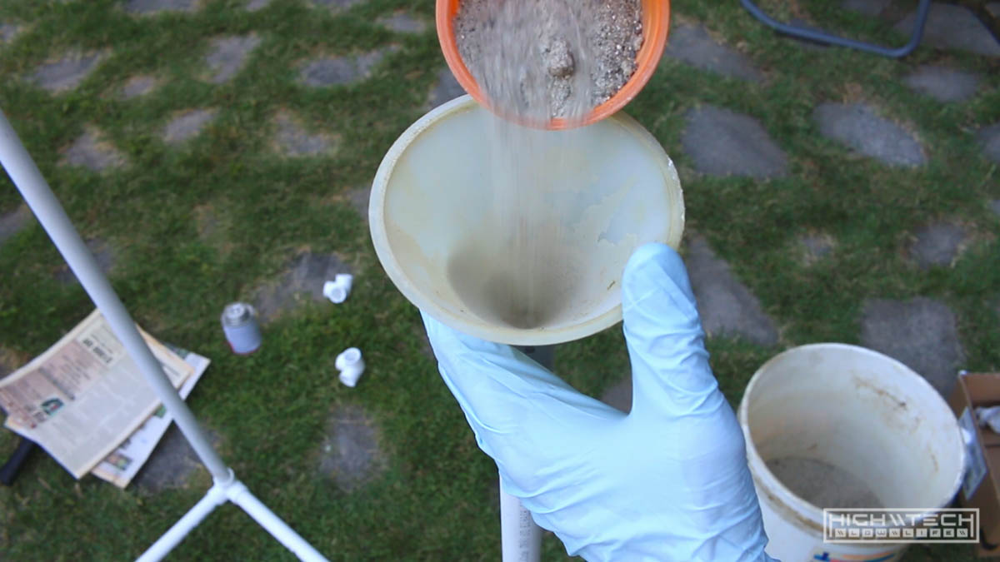
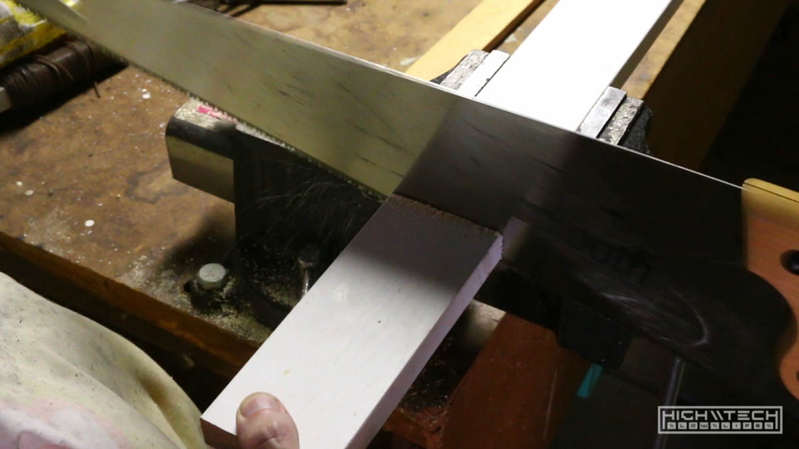

<div class="video-container"><iframe width="1024" height="576" src="https://www.youtube.com/embed/UPiKP_sS6c8" title="YouTube video player" frameborder="0" allow="accelerometer; autoplay; clipboard-write; encrypted-media; gyroscope; picture-in-picture" allowfullscreen></iframe></div>

# \\\ Overhead Camera Mount \\\

This is probably the worst time to get into content creating, so I'm doing it! I figured that a lot of what I would be capturing would probably be on a desk or workbench and trying to work with a camera in front of you is annoying and one over your shoulder would not get a very good shot, and also be annoying. If the camera is right over your working space it frees up a lot of space to move around and also gets the best shot possible. Since you're already making something that is hovering above your workspace why not stick some cheap LED strips on it and make it more useful. This project was mostly inspired by [this](https://www.youtube.com/watch?v=HCoHc3_4aCE). 


Admittedly this build was mostly "hacked" together without much consideration for finesse or *finishing*. You could make a very nice (and rigid, ...and also expensive) one of these out of aluminum 80/20 or steel pipe. I will revisit this build down the road and upgrade, but for now this works very well, is very cheap, and was very easy to make. 


## \\\ Things You'll Need  \\\
```
- Materials \\\
- PVC pipe (3x - 10ft pieces)
- PVC fittings (2x - 90deg, 6x - 3-way 90s)
- PVC glue
- Wood boards (2x - 2x1x45" or so....)
- LED strip (white)
- LED dimmer *(optional)*
- 2A toggle switch *(optional if not using a dimmer)*
- AC/DC power adapter (12V - *preferably 2A+* )
- 90deg camera mount *(optional)*
- Sand
- 
- Tools \\\
- Hacksaw \ PVC chopper
- Wood saw
- Hot glue gun
- Zip-ties
- Drill
- Time (2-4hrs) 
```

## \\\ Planning and Measuring \\\

First I measured *very roughly* how big I wanted the frame to be. I wanted the frame to be wide enough to not be in the shot while shooting, and also tall enough so I could zoom out and see the entire space but then zoom down enough for details. I thought about having a way to raise and lower the camera platform for even more flexibility, but this is a very quick 'n dirty DIY build and I settled on a happy medium for height, which was about 24". For the length I went with 40". I made a very basic sketch so I could visualize all the fittings I would need and then made my trip to the hardware store. 


I went with 3/4" PVC to make up the structure, I would have gone with 1" for more rigidity but my hardware store trip didn't have *all* the fittings I needed in 1". 3/4" is strong enough for what I'm doing, but thickness (T H I C C) is a consideration when building with a lot of factors at play; rigidity, weight, strength. I bought three 10' lengths of PVC for about $3 each, so that was pretty cheap, I wasted a bit of material by chopping these pieces at the hardware store in half so they would fit in my car better, but had I left them 10' I could have utilized more of my cuts on a single piece, but I will sacrifice some $ and hassle for convenience and ease of transport. 

You'll need two 90 degree (right angle) connectors, smooth on both sides. You'll also need six 3-way connectors which is a 90 degree but with another 90 degree coming off the z-axis. 

So...
- 8x of 24" pvc
- 3x of 40" pvc
- 2x of 90 degree connectors
- 6x of three-way 90 degree connectors

I also picked up some PVC glue to hold them together. 


## \\\ Frame Assembly \\\

I cut all the pieces to length by roughly measuring and marking with a sharpie. A hacksaw does short work of these pretty cleanly, they do have choppers that will do it faster but a bit less accurate. With some cleanup with a file I was able to get these quite square, they don't have to be perfect so maybe the chopper would have been a better solution, but I didn't have one, plus sawing things is fun. 


After cutting, I started to assemble the side pieces, just run some glue on the inside of the fittings and press as much as you can. It's not going to be exact, but that's ok. Once you've built up some of the structure you can start filling it with sand using a funnel. I went overboard with the sand, but I figured it would make it more stable, although I think you really only need the bottom parts filled for a lower center of gravity, so go with that. Less sand is easier to work with and when you're connecting the two ends together with the longer pieces less will spill out. I managed to do this without spilling much sand and with all the tubes nearly completely filled up. Pour, shake, pour, shake, done. 



I don't know how long the PVC glue takes to cure, but I was able to move my now pretty heavy frame (20lbs or so... thanks sand!) immediately just due to the friction of the connectors. Halfway there, not bad! 

I was a bit disappointed however at how "flimsy" and "wobbly" the structure felt, even with the sand. The recommendation here was that the top wood panel was going to add rigidity, and that will require cutting a whole on the wood and finding a wood piece (or buying one) large enough to cover the entire top. I thought more and more, and adding some x-braces to the rear of the frame would definitely stiffen it up and make it less wobbly, and also the top would help too. I decided to not put rear braces on yet to see if just the top would suit my liking. I couldn't find a large enough piece of scrap wood so I figured it would actually be easier just to find a thinner piece of wood, that way I wouldn't have to cut a hole in it for the camera, I could just mount it and hang it over the wood plank, easy. Undoubtedly having the full piece of wood on top would add rigidity more so than just a thinner piece of wood, but I was willing to try it out first, since I already had the wood to experiment with. 


## \\\ Wood, Holes and Zip-Ties \\\



I cut a piece of wood longer than the top of the frame because I wanted it to overhang about an inch or so, this is where I would drill the holes to lace the zip-ties through. I roughly measured, cut with a wood saw, then measured again to where the holes for the zip-ties would go, leaving enough room to wrap around the frame. I then drilled out 6 holes in each end. Bam. 


I did acquire this fancy right-angle camera mount from my work (with permission of course...) so all I had to do was find the center of the board I just cut, then make sure that with the camera mounted that the lens would overhang enough to where I could manipulate the zoom and focus, I drilled a large hole for the bolt and cinched it up. I then placed the wood plank roughly where I wanted the camera to reside over the workspace and laced the zip-ties through and tightened it down to the frame. Not too tightly though, I still want to be able to slide the board fore and aft or to adjust the angle a bit just in case the camera isn't centered vertically. Although having a ball mount helps in this regard too, but if you wanted to go the cheaper DIY route, just cut two blocks of wood to make a 90 degree "shelf" and drill a hole to mount the camera (just watch the video I linked in the beginning of this article, here I'll paste it again; [this](https://www.youtube.com/watch?v=HCoHc3_4aCE) )


With just the board now on top it is quite a bit stiffer, but still a bit... "wavy" when bumped or pushed, I'm ok with it so far though. I cut another smaller / thinner plank of wood as a base to mount more overhead LEDs, this wood piece is very thin and light and doesn't have to be strong or hold a camera or anything like that. I used the same method for mounting, 4 holes each side, lace the zip ties and you're golden. 

## \\\ LEDs, Power Adapters, and Hot Glue \\\

I removed the camera mount and then flipped the entire frame over so I could have easy access to the bottom of the boards. I'm putting my LEDs on a pretty robust potentiometer dimmer switch which I bought on eBay for $5 ( [12V 8A LED Strip Dimmer](https://www.ebay.com/itm/1-10-12V-8A-LED-Light-Protect-Strip-Dimmer-Adjustable-Brightness-Controller-96W/163209263856?ssPageName=STRK%3AMEBIDX%3AIT&var=462405034493&_trksid=p2060353.m2749.l2649) ) It's overkill for this project, but hey - it's chunky, and it's easy to use and fits perfectly on my wooden board. Hindsight 20/20 I should have just used a big toggle for on/off since I probably will be running this lighting full blast nearly all the time, but I guess it is handy to be able to dim the lights, unless you really want to dim, I would say forgo this and just wire in a toggle to on/off from the power adapter or if you *really* don't care about such conveniences, just plug and unplug the adapter every time you use it. 


Speaking of power adapters, I collect and save AC/DC adapters from various components that die for DIY projects such as this. I found one that was 12V 2A (believe it was for an old external HDD enclosure) in my stash which will be more than enough power for the single light strip I'm putting up. I chopped the ends on the bullet connector then put them in the input terminals on the dimmer and screwed them down. Remember to check polarity as DC components don't like running backwards. 


The LEDs I bought for this project were the much more powerful and brighter 5630 strips ( [eBay link](https://www.ebay.com/itm/5M-300-LED-Strip-Light-3528-5050-5630-SMD-RGB-Ribbon-Tape-Roll-Waterproof-DC-12V/182359007531?ssPageName=STRK%3AMEBIDX%3AIT&var=690655836231&_trksid=p2060353.m2749.l2649) ) for $7.50 they're not bad and very bright, just make sure you have the amps to push them as they will consume a lot more power than even the larger 5050 chips. These are cheaper because they're not silicone coated or "waterproof" if you're going to be using your overhead cam outdoors a lot, you may want to opt for the more durable waterproof strips. 


I screwed the LED leads from the strip into the output of the dimmer switch terminals, I used two wood screws to screw down the dimmer module, I plugged in the power supply and turned the knob and gee-wilikers batman; it was more daylight during the day. The dimmer works great and you can get some pretty granular control over the dimming steps - *noiceee*.

**Mounting the LEDs**
There are a lot of ways to tackle this next step but I've recently gotten into hot glue after despising it for forever without really ever using it. There's just something about hot glue that screams *"I'm going to fall apart very soon, just you see"* but I have been very impressed by it lately in terms of how strong it holds and how well it sticks to a variety of materials. I very liberally hot glued the strips down the wood planks, double row for each wood piece. I stupidly forgot about the hole I needed to avoid for the camera mount so my clean lines I was laying down had to get squirrely quickly. It's ok, this project isn't going to be winning any aesthetic awards, plus it's on the bottom and you're not going to be staring at the lights, especially when they're on because it is very bright. 


You don't have to use hot glue, you can use large staples, more zip-ties, screw-down plastic clamps... superglue, all kinds of things. The LEDs will get warm, but not enough to melt the glue again, so hot glue was the easiest for me. The strips do have an adhesive backing which will work for... some time, but with the heat and how crappy that adhesive is, I imagine it was only a matter of time until my lights started falling down into my shots, so hot glue is just another up front payment towards don't-annoy-me-later insurance. 

After my *too much glue because it's fun to glue things* session, I wrapped and zip-tied the power supply cord out of the way so the frame would be easy to move around once disconnected from the wall. I put the frame on my work bench, plugged in the power supply, and turned the knob and behold ~ it actually came out great and it's very well-lit. 


## \\\ Final Touches \\\

For some finishing touches, I put some foam around the base PVC pipes, if only to raise the camera up another inch. I realized after building it that I could have used a couple more inches in height, but after using it for a while I think I did (accidentally) stumble on a good median for wide angled view and zoomed view. The foam also makes it easier to accidentally bump it into things without damaging them when moving it around. Also you can put things on the legs without damaging the legs nor the thing you're putting over the legs, so that is nice to have as well. 


If I need the camera up higher I can always put some blocks under the frame and raise it that way, or later if I really want I can put some blocks under the top plank that holds the camera... really there are a bunch of ways to get to a further distance from the workspace with the camera, I think for my setup it's nearly perfect though, and I'm happy with it. 


Honestly, the frame still does wobble a tiny bit if you bump it, but even if you're thumping on the desk I have it on, it barely sways, and if it does, it smoothly sways. The production I'm doing is intentionally grungy/DIY so for myself and my audience they will not *(better not!)* care much for things like that, but if you're making something extremely professional then this build may not be up to par for you. I'm happy with how rigid it is, but I understand that this may not be acceptable for other people, so keep that in mind. I think if you truly want "the" most rigid platform, you'd make this out of metal, and not have it resting on the surface you are capturing. That will be much more expensive, and harder to make and also take a lot more time making, and not to mention be harder to move or put away, and to me the benefits of having something very robust and rigid do not outweigh the convenience of building and using this frame. 

Total cost was; 
- $26 for PVC, fittings and glue
- $5 for dimmer
- $7.50 for LEDs

$38.50 total, not bad.  

I already had the AC adapter, wood, tools, camera mount, zip-ties, foam and hot glue so I'm not factoring those in, but these things aren't very expensive either (except for the camera mount, depending on which one you get, but I already offered an alternative/cheaper solution for that too). 


That's it! If you make one, please create / improve / adjust this build to suit yourself better. 
