<div class="video-container"><iframe width="1024" height="576" src="https://www.youtube.com/embed/o-wbPVkkyWg" title="YouTube video player" frameborder="0" allow="accelerometer; autoplay; clipboard-write; encrypted-media; gyroscope; picture-in-picture" allowfullscreen></iframe></div>

# \\\ WASD CODE Wireless Keyboard Conversion \\\

I want to start off with a note; **I'm well aware** that there are already some pretty great (and inexpensive) bluetooth wireless mechanical keyboards out there, if you just want something cheap and done - obviously this is not the guide for you. 

This is for those who want to take their existing keyboard and make it wireless, those who enjoy taking things apart, voiding warranties, soldering, cramming things into small spaces... you get the idea. Some really awesome keyboards just simply aren't offered with a wireless option, and finally (thanks to a few more recent advancements in tech) this is now feasible in a (somewhat) elegant DIY package.

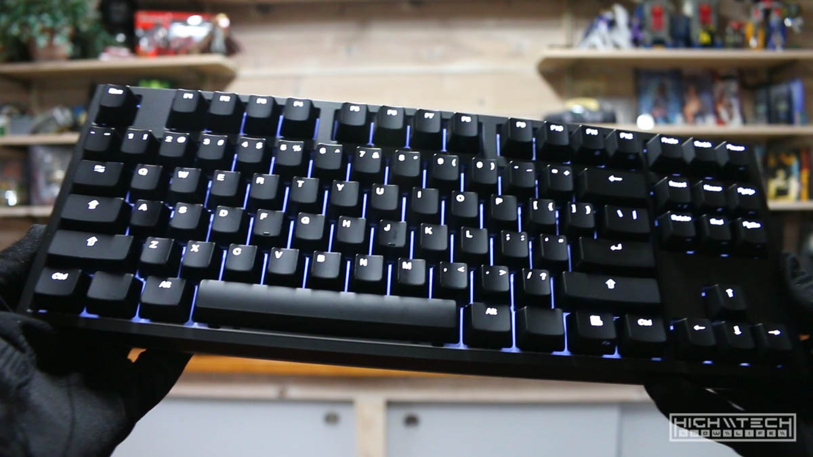

# \\\ Things You'll Need: \\\

## 1. The Keyboard (duh)

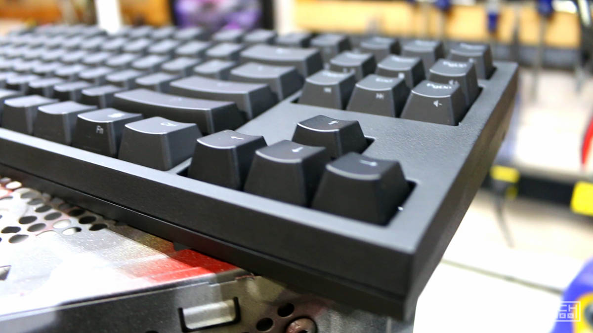

I'm creating this guide using a specific keyboard (the WASD CODE), but the fundamentals of what I'm doing can be blueprinted to work with other keyboards. The most important things you need to look out for is enough internal space within the keyboard case to house the parts you'll need to make the conversion. Of course you can  always modify, attach, 3D print, duct tape, zip-tie-bundle or otherwise find **some** solution to hold or carry these parts if there simply isn't enough room within the keyboard case pertaining to your specific keyboard. 

## 2. The Magic Box

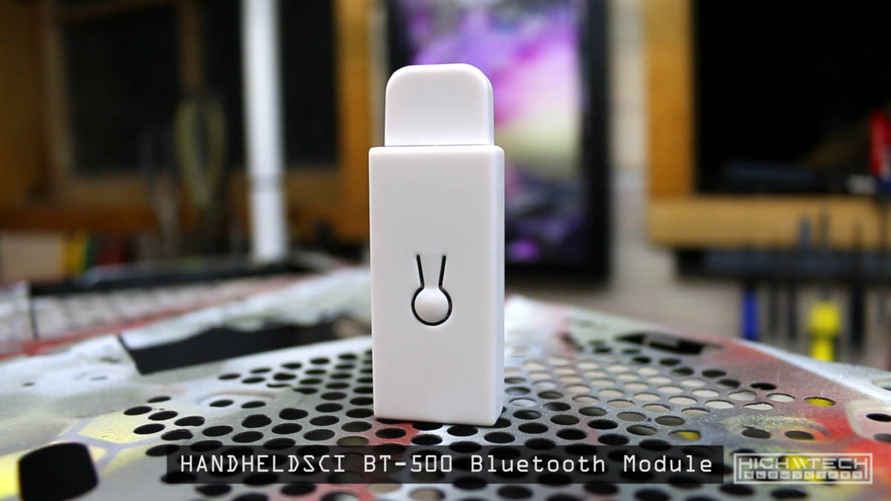

What really makes this all possible is the [Handheld Scientific BT-500](http://handheldsci.com/kb/). this tiny little adapter takes your USB signals and converts them to bluetooth wireless signals to be read by any bluetooth phone, laptop, desktop, tablet, you-name-it. Handheldsci has been making wireless adapters for quite some time now, and this latest rendition is much smaller and more portable than their previous release, which makes it perfect for what we're going to use it for. 

## 3. The Battery

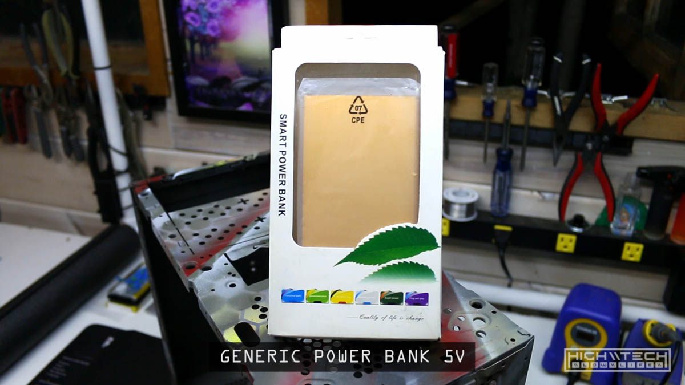

Because **you're going wireless** you will no longer have the USB cable to power your keyboard, so you're going to need some way to power the board as well as the wireless adapter. Thankfully lithium batteries have gotten much smaller, more energy dense and cheaper over the last couple of years, which also makes this project possible. 

* ~~You have some flexibility here, but judging by how small the cases for keyboards are you're going to want to find the slimmest power bank possible for best results. For this specific case I have gone through quite a few power banks trying to find a good size and I've found a very generic bank on eBay that is just slim enough to work. These can be attained for $10-15 and they come in a variety in a variety of colors and brandings, but they're essentially all the same with two USB outputs on the bottom. Just check the photo and find one similar for as cheap as you can get it.~~

* ~~The beauty of getting a power bank as opposed to a just a battery pack is that the bank already has an included small PCB with a buck converter (to convert the 3.7v pack to 5v USB output that makes the keyboard happy) as well as a ton of battery protection built-in such as overvoltage, undervoltage, battery charge cut-off, etc. If you just get a battery pack, adding these (buck converter and battery protection circuits) are some things I would highly recommend, you really don't want to come back to find your keyboard in flames ...or worse.~~

100 x 65 x 6.5mm is about the largest battery you will be able to fit without hacking up the case a lot more. Not all of these battery banks are created equal so you might get one that is smaller or larger, smaller is fine but you won't get as much runtime. Obviously the  the capacity oflarger the battery the longer the duration of use before you have to charge again, but a higher capacity battery is also well... **larger**, so that's going to take up more space, it's a balancing act between pack size and the ability to hide it within the keyboard case. 

---

* **I no longer recommend getting a power bank**, it's better to get the charge circuit and battery separately so you know you'll get one that turns off when a load is applied, and also find a battery with the correct dimensions. 

I can't find the 'exact' charge circuit I used to make these, but these parts are going to constantly be evolving as they are a ubiquitous and as chips change and layouts get more efficient they rarely stay exactly the same for too long. 

Some recommendations:
I'm sure these links will break so it helps to know what to search for. eBay or AlieExpress will net you what you want, most likely Amazon will as well but I haven't sourced from there personally. 

Charge Circuit: 
- [This most likely will work](https://www.aliexpress.com/item/1005001374265342.html?spm=a2g0o.productlist.0.0.5a3576a4JXtj7l&algo_pvid=686d729f-e1b9-42d4-9f35-9a1fd3cd6ced&algo_exp_id=686d729f-e1b9-42d4-9f35-9a1fd3cd6ced-22&pdp_ext_f=%7B%22sku_id%22%3A%2212000015851249830%22%7D)
"usb power bank pcb" or "dual usb power bank pcb". The only real requirement is that they can be turned off when a load is applied. 

- Another seller I recommend is [HengCheng](https://www.aliexpress.com/store/group/For-3-7v-li-ion-bms/812679_514736790.html?spm=a2g0o.store_pc_groupList.0.0.35864d21zn1ae1)
You can even use USB Type-C with PD for faster charging, like this board: [Quick Charge 3.0 Power Bank Part PD3.0 Li Ion Battery Pcba Supply Circuit Board PCB 5v2a 9v2a 12v1.5a Booster Module USB](https://www.aliexpress.com/item/33039428180.html?spm=a2g0o.productlist.0.0.370d60e2GiuXv0&algo_pvid=22170dc3-a98b-4dd0-a6c0-b5a95f3fad7f&algo_exp_id=22170dc3-a98b-4dd0-a6c0-b5a95f3fad7f-43&pdp_ext_f=%7B%22sku_id%22%3A%2267349461701%22%7D)

Battery:
- [This seller has some batteries](https://www.ebay.com/str/tesky12)
It's kind of hard to search by dimension (at least on eBay), using "3.7v lipo battery 3000mah" will get you some good results. If you start looking in the 3000-4000mah range it should be in the ballpark for the dimensions you need, just dig through them to find the largest pack that will fit. 

```
Tangent about charge circuit PCBs incoming... 
Not all charge circuits are created equal! I found this out through trial and error
Testing different ones to see how they perform. Some will always be 'on' when a load is applied and you cannot turn them off, this is not ideal for the ‘soft power button’ setup. If you use one of these boards, you will need a way to interrupt power to the battery (or the wireless module) to ‘turn off’ the keyboard to save power. 
```

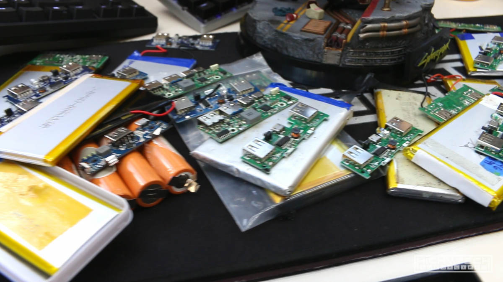

```
Most will not allow you to turn off the device when charging, however I did find one board that did, which could be nice for charging faster by disabling the output so all the input charge is fed to the battery without any drain (I’ve heard this is also better for the batteries). Although all the boards I have tested do allow ‘pass through’ charging meaning you can apply a load and charge at the same time. Some boards however may not, which could get annoying if you cannot use your keyboard while you are charging. 

Also some of these charge circuits have a minimum power draw or they will turn off on their own, which can be annoying because it will turn off your keyboard, but then the 'load applied means turn on' so you'll be stuck in a loop where your keyboard is turning on and off all by itself, all because of the logic of the charge circuit and the keyboard not going over that power threshold. 
```

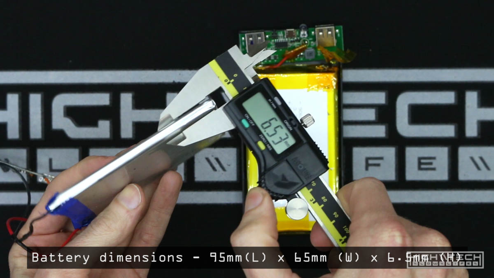

```
I actually wouldn't bother buying a power bank, it may cost a bit extra but it's better to find out the exact battery dimensions you can use then purchase a battery you know will fit. Also the charge boards are quite cheap and you can get one that you 'know' will allow you to power off with a load attached as a lot of the ones included in power banks do not allow this. You can wire up your keyboard with external switches and create your own custom on/off circuitry but the cleanest is to just use a relay. This will allow you to use one push button to turn the keyboard off / on and also toggle between wired / wireless without needing to install additional switches. If you install your own toggle switch for on / off then it doesn't matter if the charge circuit can power off with a load attached - you wire it up how you want, there are a lot of options and hopefully with all of the info I'm providing you will find something that suits your needs. 
```
Run times will vary greatly depending on how big your keyboard is, and if you have backlighting or not. For this TKL board I am getting about 28 hours per charge on medium backlight brightness, you will get way more or way less run time depending on the backlighting. I did a lot of testing on different boards to see how much power they draw. The BT module alone will pull 50mA, and typically a mechanical keyboard will use 10-40mA. Backlighting can suck a ton of power, so your battery life will suffer. Full brightness on this will be drawing 270mA! 

```
Battery: 3000mah (approx) @5V

104 medium brightness (brightness 3)
Full charge run time - 17 hours! 

87 medium brightness (brightness 3)
Full charge run time - 27.5 hours!

Bluetooth adapter: 0.05 - 0.055a, manual says 40ma

--- V2 ---

CODE V2 TKL
amps: 0.011a (no backlighting)

amps: 0.039a (brightness 1)
amps: 0.053a (brightness 2)
amps: 0.080a (brightness 3)
amps: 0.107a (brightness 4)
amps: 0.145a (brightness 5)
amps: 0.198a (brightness 6)
amps: 0.272a (brightness 7)

CODE V2 fullsize 
amps: 0.011a (no backlighting)

amps: 0.041a (brightness 1)
amps: 0.058a (brightness 2)
amps: 0.089a (brightness 3)
amps: 0.121a (brightness 4)
amps: 0.166a (brightness 5)
amps: 0.226a (brightness 6)
amps: 0.316a (brightness 7)

--- V3 ---

CODE V3 TKL (V3 firmware)
amps: 0.023a (no backlighting)

amps: 0.030a (brightness 1)
amps: 0.068a (brightness 2)
amps: 0.110a (brightness 3)
amps: 0.165a (brightness 4)
amps: 0.220a (brightness 5)
amps: 0.260a (brightness 6)
amps: 0.298a (brightness 7)

CODE V3 TKL (V2 firmware)
amps: 0.016a (no backlighting)

amps: 0.022a (brightness 1)
amps: 0.060a (brightness 2)
amps: 0.100a (brightness 3)
amps: 0.160a (brightness 4)
amps: 0.210a (brightness 5)
amps: 0.255a (brightness 6)
amps: 0.290a (brightness 7)

CODE V3 fullsize 
amps: 0.031a (no backlighting)

amps: 0.037a (brightness 1)
amps: 0.083a (brightness 2)
amps: 0.126a (brightness 3)
amps: 0.200a (brightness 4)
amps: 0.260a (brightness 5)
amps: 0.305a (brightness 6)
amps: 0.350a (brightness 7)

--- 60% ---

CODE VP3 (60%)
amps: 0.089 (no backlighting)

amps: 0.094 (brightness 1)
amps: 0.099 (brightness 2)
amps: 0.110 (brightness 3)
amps: 0.121 (brightness 4)
amps: 0.139 (brightness 5)
amps: 0.158 (brightness 6)
amps: 0.185 (brightness 7)
```

## 4. Some Tools (and misc other things...)

To finish this project you'll need at least a phillips-head screwdriver, flat-head screwdriver, flush-cut wire cutters, a soldering iron, some solder, some light gauge wire (16-24 awg), a drill, some small drill bits, a small micro-switch if you so desire, hot glue gun, some patience, some swear-words at the ready and some time (I have confidence that you could do this in 2-4 hours or less for this specific keyboard). Other keyboards will potentially take more time and you may have to try out a few different batteries or get creative with the placement of parts within the case. 

# \\\ Let's Make Some Mistakes! \\\

**Smart person note -** It's always a good idea to dry-run or test all of the components you're going to be using before you start getting all hack-the-planet and chopping things up. This is a good place to drop a breadcrumb and verify that all the things you will be meshing together work on their own separately. This will save you many headaches down the road when something doesn't work only to find it wasn't you that was the problem (but let's face it 99% of the time it is us...). I'm currently a fan of sanity, so plug everything in first, test the keyboard, test the battery, test the wireless adapter, and test them all together. Only after you confirm that these things work on their own as they should, shall you proceed. This should be true of any project you take on, it's much easier to untie a knot that is comprised of one string and it only gets exponentially harder the more strings you add. 

## Step 1 - Opening the case

**First you'll need to get into the keyboard case.** For this TKL model, there is one screw under the warranty sticker (it's so satisfying to rip these off - savor the experience of being a living and free person without fear of future consequences), the rest of the operation is completed by pressing into the tabs with a flat-head screwdriver between the two case halves to separate them. 

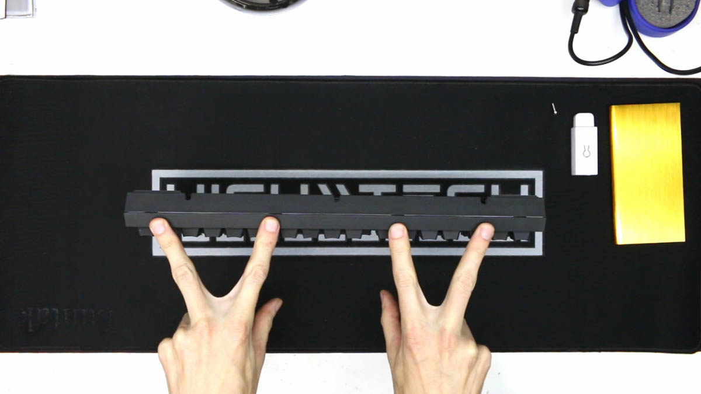

You want to press with just enough force to release the clip, but not so much that you break them off entirely. There are 4 tabs in the back (start here), 2 on each side (that's next...), then 4 more in the front (you do these last). Hopefully you were gentle enough not to break any of the tabs, but if you did - it's ok, the case will go back together with a few missing without an issue. 

Put the top case halve to the side as we won't be needing that until final assembly. Gently lift up the PCB/Plate from the bottom case halve and disconnect the daughter board from the back of the PCB via the connector. You can now put the PCB to the side as well as we're going to be mainly focusing on and working on the bottom case halve.   

## Step 2 - Making room for the magical parts

**The first space-saving measure is to remove the guts from the bluetooth adapter.** The white casing can be easily removed by prying the two halves apart. The PCB is very small with the largest components being the USB ports and the microswitch, which you-guessed-it, we'll be removing too. This isn't completely necessary to do, but I have found that removing these parts does make it easier to fit with some very precious clearance. I clip the end ground points on the USB ports because it makes them a lot easier to desolder from the board, you can just clip it all off, just... get them off however you can. Do be careful though because on this adapter the pads/traces for the USB ports are quite fragile, it's ok if you rip one off, you can just scratch off some more of the trace and solder to that, but it's easier just not to damage it in the first place. The microswitch on top is pretty easy to just desolder as it is surface-mount and not through-hole, but clipping it off is easier. Set this part aside, we'll come back to it later. 

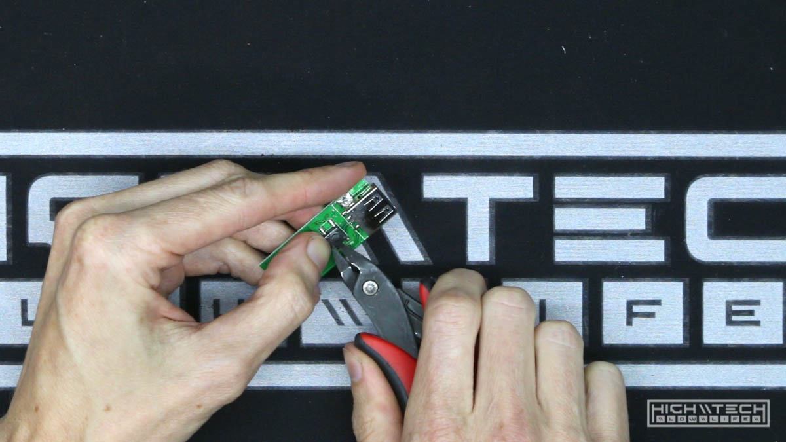

**Next remove the battery and PCB from the power bank enclosure.** 
Pry up the labeling on the bottom of the bank so you can get to the two tiny screws that hold the plastic end cap on. Pry the end cap off and slide the PCB and battery out the bottom, you can remove the plastic end cap if it's still hanging on the PCB as we don't need that either.  

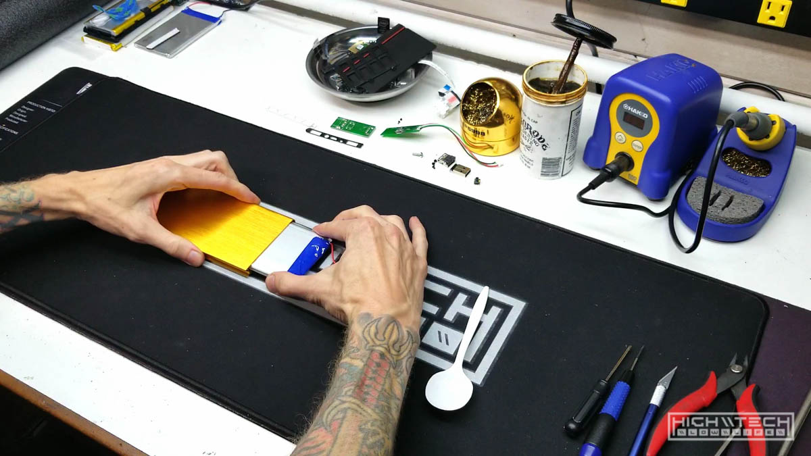

**Now we make room for the trimmed down components in the case** 
There isn't a ton you really have to do to make room on the bottom keyboard case halve since the battery is slim and magic box is also tiny. There is one support post that is in the way of where we want to place the battery, so get out your dremel if you like, or if you have flush-cut wire cutters you can clip it off very easily in one snip.

Another note; for this particular keyboard case there is an embedded cable channel that if you remove entirely (dremel hack n' slash) you will have a lot more room for everything, including more or larger batteries. It will make the bottom of your keyboard ...ugly, but if you're like me then function > form = the most beautiful form. 

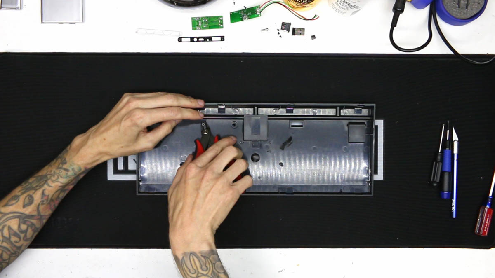

## Step 3 - Frankenstein surgery

**Finally we get to the fun part!** Now that we have an assemblage of parts we can start wiring everything together. 

**Prepping the USB charge port.** We're going to be repurposing the micro USB daughterboard PCB from the keyboard as our charge port for the battery (much class, such elegance), remove it from the keyboard case with the 3 tiny phillips-head screws. We technically only need the red (5v+) and black (Ground -) wires to charge the battery, but desolder all 4 wires, since we'll be using this 4-pin connector with leads later. Put both the 4-pin connector with leads, and the daughterboard to the side for now. 

**Prepping the battery charging PCB.** Take your battery guts and desolder the two wires on the charging circuit PCB that go to the battery because we're going to be making these longer, make sure the battery leads don't touch each other (touchy touchy = smokey smokey), you can put some electrical tape temporarily on the ends if you're feeling unsafe. Put the battery aside for now. 

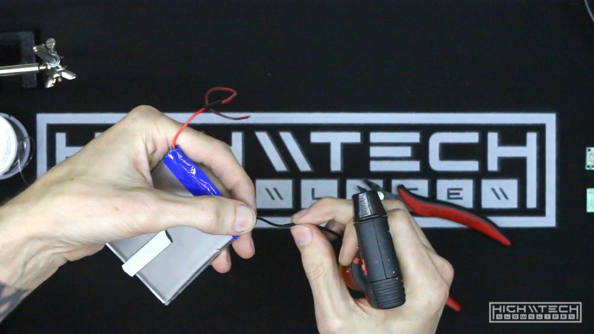

**Connect the charge port from the keyboard to the battery charging PCB.** Take some length (15cm or so) of small wire (you can strip an old USB cable for the internal wires) and solder two leads, positive (red) and negative (black) from the keyboard micro USB PCB to the battery charging PCB. It can be very hard to solder these wires to the micro USB port on the battery charging PCB, so I have found that just using the much larger type-a port on the right of the battery charging PCB will work as well and it's much easier to solder to (although I have done it to the micro usb with success, but the connection isn't as robust when assembling and it's just harder to get right). 

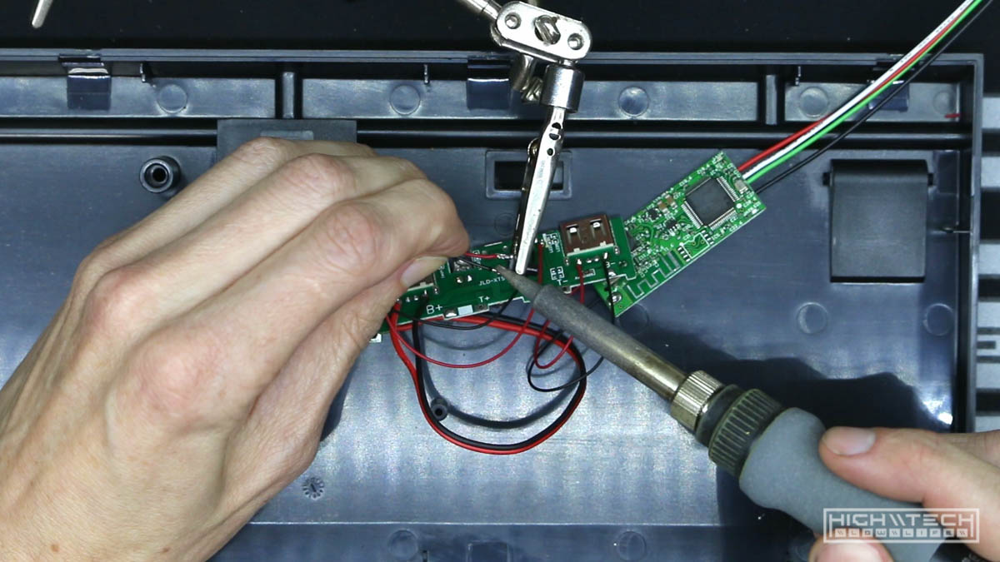

This gives us a way to charge the battery from outside the keyboard! 

*Another option is to strip the connector from the included USB cable that came with your power bank, cut the connector off and peel back all of the molding to expose the end of the connector, now you can solder to these two leads (make sure you get the polarity correct!) Now you can plug the connector into the PCB*

**Connect the battery charge circuit PCB to the wireless adapter PCB.** Take another small length of small wire (6cm or so) and solder two leads from the other side of the charge circuit PCB type-a to the **power input** of the wireless adapter PCB. You only need red and black, this will power the wireless adapter from the battery. 

I made an infographic to illustrate different wiring schemas and how I progressed in my journey. The one I would recommend is just using the internal bluetooth module firmware switch, the wiring is much simpler. However there are some caveats with using this method - one is you can't update the keyboard firmware because the module is acting as a wired 'usb bridge'. Also you are limited to 6-key rolloever. If you don't care about those two things, then this is the way to wire it up. If you need a direct USB for your wired connection for firmware flashing and N-key rollover, then you'll have to add a relay (or mechanical slider switch). If your keyboard is newer you may even have to wire in two relays to disconnect the white and green data lines to the wireless module when switched to wired mode. 

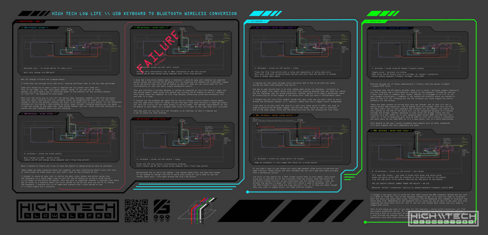

[PDF version (so you can zoom)](wireless_schematic.pdf)

**Connect the wireless adapter PCB to the keyboard.** Grab that 4-pin connector with leads that you put aside earlier from the keyboard daughterboard, we're going to solder those leads to the **data input** of the wireless adapter - black/green/white/red. Now you'll be able to connect the keyboard to the wireless adapter using the 4-pin connector! Be careful with these leads as the PCB pads on the wireless adapter are not the strongest and with a lot of pulling or twisting while you're assembling you may lift a trace or pad - which you do not want. I'd get out my hot glue gun and give a reinforcing dab on both areas that you soldered just for some much needed strain-relief. 

**Wire up the on/off microswitch.** Because of the placement of our charging circuit PCB which currently has the on/off switch for the battery we need to relocate the switch so that you can turn your keyboard on/off without having to open the keyboard case (that'd be nice, right?). You can repurpose the switch from the charge circuit PCB, but I find it easier just to purchase a new (and somewhat larger) microswitch that is 6x6x8mm. Let's attach some length (12cm or so) of black and red wires to go from the new switch to the exist switch that is soldered to the underside of the charge circuit PCB. 

**Make a hole for the on/off switch.** Let's drill a small hole in the case so we can access the switch from outside the case. You can put this anywhere you want, but since I'm right-handed I find the right side of the case very natural to operate the on/off switch. The hole size is 5/32 or 4mm, you're going to want to put this in the right rear of the case (or wherever you want really, just make sure your leads are long enough to reach the charge circuit switch).  Slip the switch down and through the hole you made and do your best to center it as you don't want the switch binding. **Solder the leads to your switch first, before you glue!** If you glob your switch in glue it's going to be very hard to solder the wires on after you do this. Use adequate hot glue to hold it in place, you're going to be pressing this switch many times so you need some reinforcement and support for this little guy. 

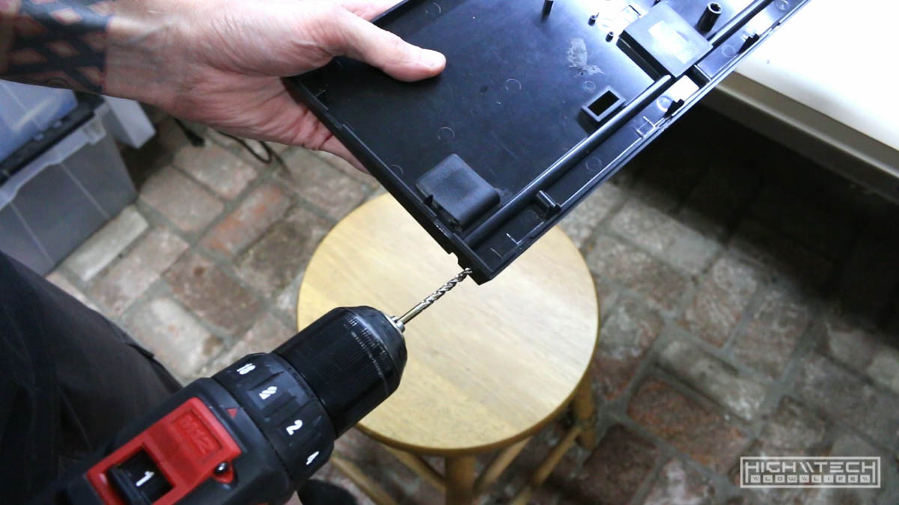

**Make some holes for the battery capacity indicator LEDs.** Another great benefit with using a battery bank as opposed to just a battery pack is that the charge circuit has battery capacity indicator LEDs soldered on the board. All we have to do is drill some small holes in the bottom of the case so that if we want to check how much capacity we have left in the battery we can just lift up the board and take a look! The LEDs are very tiny so you only need a 5/64th or 2mm drill bit. This battery bank charge circuit fits near perfectly between the right keyboard foot recess and the dipswitch opening, give yourself some space from the top of the channel, I've lined up the LEDs by eye and etched their location into the case with a scribe then drilled the 4 holes so that when you place the charge circuit board in its spot the LEDs line up with these holes. It doesn't have to be exact because even the ambient LED light emission will be enough for you to tell if the LED is lit or not. Pretty cool!!

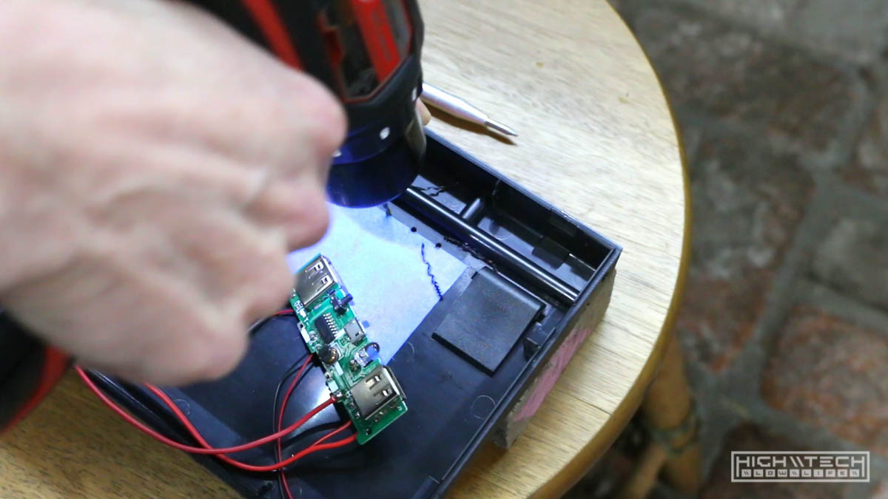

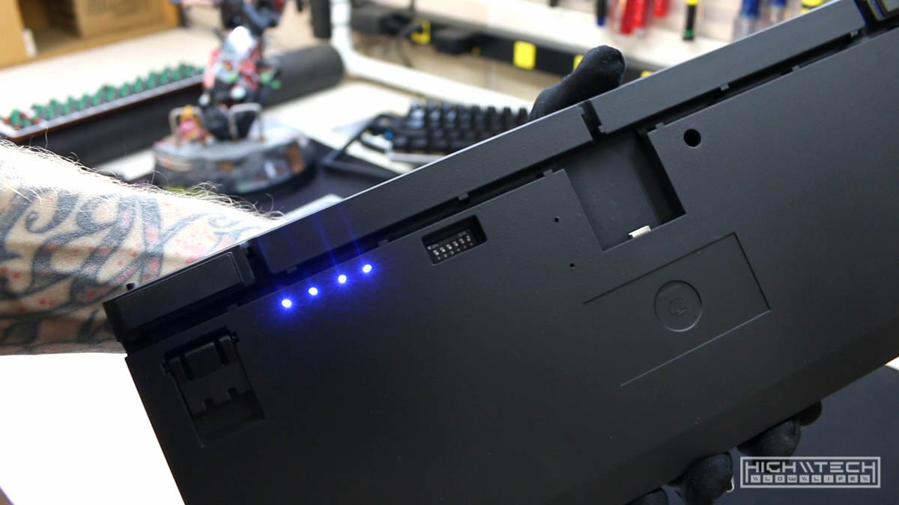

**Solder the battery to the charge circuit PCB.** Solder some longer (20cm or so) and thicker wires (18-20awg or so) to the battery leads, then solder these to the corresponding polarities on the battery charge circuit PCB. **B+ = red (positive). \ B- = black (negative)** Be careful to not mix up the polarity on any of the connections you're making, trust me it's not going to be fun times, especially the battery connections. You're going to want to place the battery as far back and to the left as possible, butt it up against the channel molding. 

**Now is a good time for another test!** just to make sure you have everything working correctly before you tack things down and reassemble. 

Plug the 4-pin connector into the keyboard and lay it on top of the bottom case halve and press your new power button, do lights come on? Awesome, can you connect via bluetooth to the keyboard? Great. Hold your new power button and see if you can turn it off. Now press it again to turn it on again. 

After this plug the keyboard into either a USB wall charger, or a computer to charge the battery. Do you see the lights on the bottom of the case blinking showing the battery is taking a charge? You did it! 

## Step 4 - Final finishing touches

**Let's tack everything down so it doesn't flop around when you're taking it places.** I like to put a small bit of foam on the front of the battery, this comes very close to contacting the keyboard PCB and I just feel a little safer knowing there is something between the PCB and the battery. You can use some layers of duct tape, or blue tape or a small acrylic piece, basically any non-conductive barrier between the battery and the keyboard PCB. It has to be very thin though because it does touch or comes very very close to it so you don't have a lot of room for this barrier. Tack down the battery with a few small dabs of hot glue in the corners of the battery. 

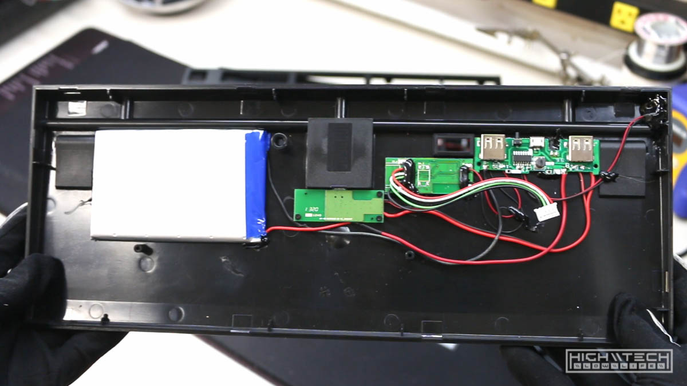

Screw down the charge port with the 3 little screws, then wedge the charging circuit PCB between the dipswitch opening and the right foot recess. It fits very tightly so you don't really need glue here, but I still put a dab anyway just for good measure. 

I then place the wireless adapter PCB under and to the left of the charging circuit and dab it down with more hot glue, you want it close enough to where it can reach the keyboard connector. 

Do a quick once-over and tack down any wires that are unruly, you want everything as flat as possible so that the keyboard PCB can lay in its rightful spot. If any parts are causing the PCB not to lay flat, the case will not snap together properly, or it will be very tight and cause other problems. 

Connect the keyboard PCB to the wireless adapter and lay it flat in its resting spot hovering above your creation. Snap the top half of the case to the bottom half and secure it with the bottom screw. 

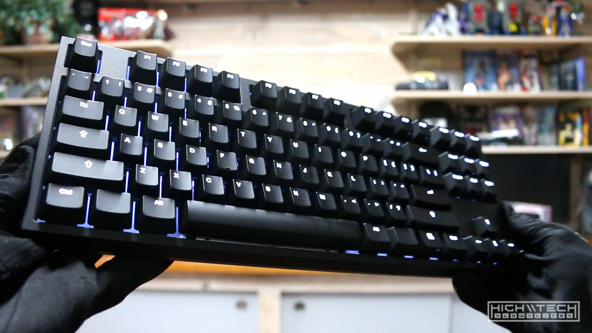

**Stand back and behold your creation! You did it!!**

Pair via bluetooth to your device (no password needed) and enjoy your once-wired, now-wireless keyboard. 

## Closing thoughts
While I was making this I went through quite a few renditions of how to wire it. I kept running into tiny roadblocks and trying to find a way around them. 

Since this is now a 'wireless-only' keyboard, I thought, what if you ran into a scenario where you didn't have a bluetooth device but still wanted to use your keyboard to connect to it? it wouldn't be possible.

But can it be done? Yes, it can, but it takes a bit more wiring. 
My first revision was to add a way to pass the the data lines from the port to the keyboard PCB, simple. The only issue is that when you plug it in, it's feeding data to both the blueooth module *and* the keyboard directly which causes them both to fight back and forth over who has authority in sending the signals, which results in essentially an uplugging and plugging in of your keyboard back and forth over and over rending it unusable. Not good. 

I then thought, ok... so what we really need is a way to 'turn off' the bluetooth module when we are plugging in to the computer directly, I'll have to add a switch somewhere, which really does cut down on the cleanliness of a single discrete push button switch. I thought on it more and realized I can 'hijack' the LED flashlight toggle by doubletapping the power switch for on/off! So cool, yet sadly this did not work either. I did get it to work with one module, but it may have been out of spec because the flashlight LED circuit only provides up to 50mAH of power, and our bluetooth module is rated at 40mAH, so it technically should work, but it doesn't. It will turn off for a second but shut itself off (probably because it's drawing too much power), which sent me back to the drawing board. 

I really wanted to make it so this single switch could perform multiple functions, so then I started thinking about relays. I essentially have a very low power switch but a relay would allow me to use that to switch some higher power, like from the charge circuit! I looked for the smallest relays I could find and I bought some but low and behold these were ground-switched relays and my LED circuit only supplies or removes positive, so I was stumped again. I called upon my neighbor who is an electrical genius and he had these incredible tiny relays in his lab/garage so he gave me some and they did the trick. The relay is a Panasonic [AGQ2004H](https://www.mouser.com/ProductDetail/Panasonic-Industrial-Devices/AGQ2004H?qs=HLLy2pIPwuuiBmIcwDW5Ow%3D%3D). This allowed me to use the 'soft power' switch to toggle the relay which could then supply and take away power to the bluetooth module. Simply turn off the module when connecting directly, and then turn it back on when you want to go wireless. Now, the only issue with this setup is that if you want to plug into the PC to charge *and* use the keyboard wirelessly, you can't because you run into the same issue with both data lines being connected at the same time. Thankfully the relay has a lot of pins for switch more than one connection, so I figured out that if you disconnect the white data line, then it will work (you don't need to disconnect both, the green is ok ~ however, on some keyboards you will need to disconnect both, which I did experiment later with, but you need to add an additional relay, because there aren't enough pins for 3 white connections and 3 green and the power switch off of one relay ~ more on that in a future project however). 

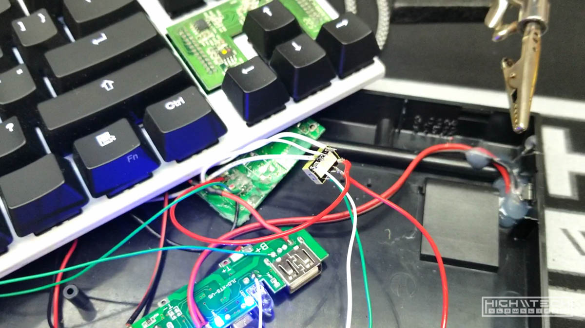

I did experiment with not having a relay and having simpler wiring internally, but that led me to taking some of the 'switching' outside of the keyboard, like needing to use a special cable that only has the power and ground lines running (I clipped the white data line) which did work, but then I thought it was kind of stupid to have to carry around two cables for when you want to plug into a computer and use the wireless (probably not a strong use case for this, but you never know). I then thought you could throw a toggle switch on the cable itself to break the white data line and then reconnect with the flip of a switch, which could be nice for a configurable cable, but I think it's just easier to throw a relay inside, or just live with the fact that if you are plugging into the computer to charge, then just use the wired connection. 

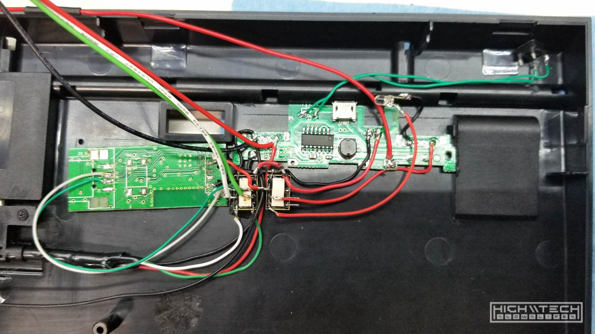

I also played around with adding an additional switch (a slider switch) which did allow me to achieve the same results without a relay. Basically anything you want can be achieved it's just a matter of how many switches and relays you want (or will need) to use.

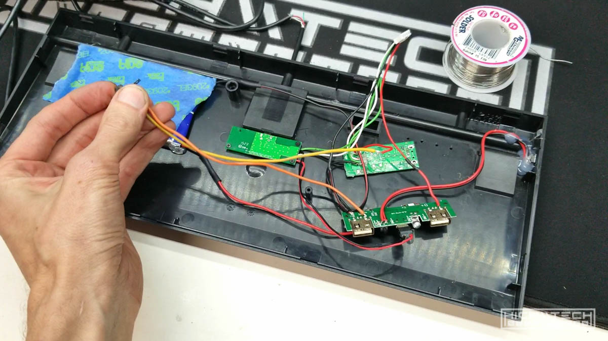

You don't have to follow this tutorial to a "T", you can use it as a foundation to adapt and build your wireless keyboard however you want it. The product recommendations and wiring schematics should help you immensely. 

Good luck! 

