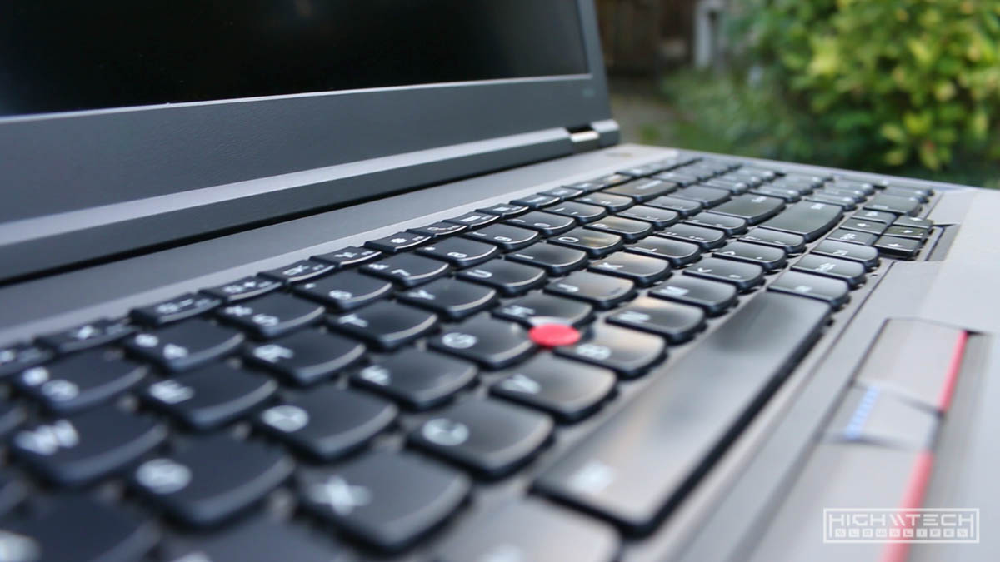

<iframe width="1024" height="576" src="https://www.youtube.com/embed/v=xF2ldzoYqH8" title="YouTube video player" frameborder="0" allow="accelerometer; autoplay; clipboard-write; encrypted-media; gyroscope; picture-in-picture" allowfullscreen></iframe>

# \\\ Custom Painted ThinkPad W541 \\\

I've always wanted to personalize a laptop by painting it. It's a stupid idea and I wouldn't recommend it, if you want to "do it right" you have to disassemble the laptop to the parts you want painted and don't want painted. You might be able to get away with some creative masking, but I feel the effort expended to mask one you might as well just disassemble it, the end product will come out better and it will ultimately be easier.
I always try to buy used items to save some money,  and then sell them later after their use threshold has tapered to recoup some of that money. Once you customize something it will typically limit its resale value (negatively) although if you make something cool and it's unique enough there might be a market for that - but nine out of ten times you will be losing out on potentially making a resale harder with less value retention. So might be something to consider before taking apart your laptop and painting it. 
This isn't really a guide, maybe something more to inspire you to create your own.   

# \\\ Things You'll Need: \\\

## 1. The Laptop (duh)

My favorite laptop right now is the Lenovo Thinkpad W541, yes - it's a bit older (4th gen Intel), to me - at the time of writing this, it hits the sweet spot of price to performance. It's not a small or light laptop, it's a tank and I like that, what can I say? I like big-ass laptops and I cannot lie. Pair this with a dock and you have a very decent desktop replacement (but why would you ever want to replace a desktop???) I wont gush too long about it, it's just an awesome computer and from the awesome Thinkpad line. These can be found "relatively" cheap on eBay, I picked this up for $440 which is very decent considering the specs.

Lenovo Thinkpad W541
-  Intel Core i7-4810MQ 3.8GHz processor
- 24GB RAM
- Nvidia Quadro K2100M 2GB dedicated graphics card
- 500gb SSD
- 3K (2880x1620) IPS screen
- Backlit keyboard
- Webcam

I got it cheaper because It didn't come with an OS, but usually the Windows product keys are embedded on these systems, so just find the ISO online and it will be activated after install. 
You can find these consistently on eBay for 500-600 with varying specs, I always look for the RAM size first because a lot of sellers will put them up with 8GB and that's a no-go. 16GB is a must these days, and anything more than that is just a bonus. Typically the high-end versions will have 32GB of ram which is great. 
I also picked up a Core i7 Extreme i7-4940MX processor which bumps the clocks a bit, but honestly the 4810MQ is plently beastly and the extra heat isn't worth it, I just like maxing my systems when I can, plus I was completely disassembling it anyway, so while I'm in there, why not? I sold the 4810 for nearly half of what I got the 4940 ($180) for, so while I really wouldn't deem it worth it, it's not that too crazy of an expensive upgrade. 
I highly recommend trying to find the 3K screen models, to me the FHD (1920x1080) versions that screen is crap compared to the IPS 3K goodness. The 3K are much more rare, and usually more expensive, but it's worth it. 
This is not a good computer choice if you're a "gamer" the Nvidia card included is more workstation oriented and not for chopping frames, if you're into productivity though, this laptop is dynamite. 
Did I talk about the computer enough?? I could talk about hardware all day... 

## 2. Stencils

Right now (...ok for a while now) I've been obsessed with camouflage... all kinds, but really hex camo. No, not that "Kryptek" wavy kind, I don't care if it's more effective, it doesn't look aesthetically pleasing to me. I used to just always paint everything flat black, I did that for so long that I got bored with that and I've been painting this "hex camo" on so many things I own, it's a bit of a signature style to me even if it is something simple. 
It all started with some fan grilles I made for my water cooled desktop, these were just some acrylic prototypes that I cut to test fit before getting them made from aluminum, I just had them laying around after and I wondered what it would be like to use it as a mask/stencil so I tried it with some woodland spray paint colors and it looked really cool. When I first started using these stencils I would just paint and overlap them randomly and it looked well enough but I realized that if I line up the stencil it looks even better. After painting so many things like this I also discovered that if I paint lighter colors underneath darker colors and vice versa it produces a drop shadow 3D effect that really makes the paint job all that better. You can really take it to the next level by varying your fades so that they're not even, being able to see the faded cut off will create even more depth. 

I cut these fresh acrylic stencils because I didn't have one large enough to cover the largest parts of the laptop panels and I wanted a bit more of a uniform look. 

## 3. Paint

I almost exclusively use Rustoleum spray paint cans, just because they're inexpensive and always available at my local hardware stores. I've tried different types with different nozzles, but just the classic ones work the best for me. They make official "Camouflage" very flat colors and these are really great at making authentic looking camo. They are very very matte which helps give you that "extra" look, while also covering up any flaws. I always use a matte clear after painting as a protective layer but it does add some sheen to the matte colors which is ok, I do notice that the clearcoat also makes the colors look deeper which is cool. 

## 4. Masking Tape

I use blue painters tape to cover any parts I don't want to paint. I ended up leaving the hdd caddy in the bottom part of the case so I wanted to make sure I masked the parts I didn't want to paint, also I didn't completely disassemble the top of the case so there were some wires for the wifi antennae that I wanted to cover as well. I told myself to make sure to mask the window for the webcam but... I forgot so now that's opaque and covered in paint, but the brightside is now I don't have to cover it for privacy, because it's always covered, forever. I can make my own window out of acrylic to replace it if I ever wanted to use the webcam, but if you're painting yours, don't forget this step. 

# \\\ Let's Ruin A Laptop! \\\

**Smart person note -** I got really high from painting too many days in a row. I was painting outside but prolonged exposure to paint will give you a headache (yes, even outside). I usually don't paint this many parts, this many days in a row and hindsight 20/20 I would have either taken more breaks, or bought a respirator, or both. My headache was my brain mourning the death of my brain cells, it wasn't the best feeling. 

## Step 1 - Getting all of your parts ready

 Thankfully Thinkpads are quite easy to disassemble (for a laptop that is). You don't need any special tools other than a small phillips head screwdriver, the rest of it just pulls apart. Just take your time and try to take it apart without breaking anything. The plastic they use is very tough so it shouldn't be too much trouble. 
After you have all of the parts you want to paint separated, give them a light scuffing with some sandpaper, this will help the paint stick to the parts. You don't have to "sand down" the parts, just give parts some scuffed texture, it shouldn't take too long to do all of the parts. After they are good and scuffed up, give them a wipe down with some soap and water or alcohol to make sure they are clean. A clean surface will allow the paint to stick a lot better, especially if you have just sanded them. Prep during this part with the sanding and cleaning will make a huge impact on how well the paint sticks, so take some time and do it right. 
Allow adequate time for the parts to dry after cleaning them, you don't want to spray on parts that aren't fully dry. 

## Step 2 - Spraying

Lay out your parts so that you can paint them without painting other things that you don't want painted. 
I first gave my pieces a coat of primer (dark gray), although this part probably isn't necessary I wanted my base layer to be dark gray. After that I laid my stencil down and aligned it the best I could, then I started with the first color (dark green) and sprayed the entire part that was covered in the stencil and then removed the stencil. I moved onto the next part and continued the process. 
After hitting all the parts with the green I let them all dry about 15 minutes. This was a very hot day (90F+) so the paint was already drying as it hit the part within 30 seconds or so, but I gave it some time between coats. 

**A word of caution** - be careful painting in the hot sun, this has never happened to me before, but it did on this project where a plastic part warped (slightly melted) and it caused me a lot of problems down the line trying to fix it. It's ok to paint in the sunlight but letting them dry, I would find a shady spot to where their temperature will not keep climbing. The heat does make the parts dry faster, but if it's warm enough already, then they will dry fast enough without the direct sunlight. 
I kept layering the paint in waves, I lay the stencil right over my previous application of paint as accurately as I could, there will still be some variation, which is actually what you want to create that 3D effect, but still, getting the stencil to remain "the same" on each coat makes a big difference in how well the paint job comes out. Next I moved on to the lighter green, then the next wave was tan, then finally the dark brown. 

If you notice the paint goes from dark to light to dark, dark gray > dark green > light green > tan > dark brown, doing this and varying the area I cover creates depth in both color and shape. You don't have to do it this exact way, and if you start with lighter, then go darker, then lighter, or even just dark to light, or light to dark you will get a different looking effect just by varying the order. Play around with it and see what looks the coolest to you. 

After 15 minutes to dry between each coat and lots and lots of stencil layer, spraying, stencil removing, etc I finally was done with all the parts. 
After all of the parts were fully dry I covered them all with 2-3 coats (15 minutes between coats) of clear matte, just to protect the finish I put down. 

## Step 3 - Printing (optional + comments on mistakes) 

This top of the case gave me a lot of trouble in a lot of different ways, all my fault of course but trouble no less. I made a mistake of leaving it out in the sun to dry, on a very hot day, for hours. I came back later to see that it had sagged in the middle of the part.  This was because this piece houses the screen and it has hinges embedded. I was going to remove the hinges but it would have required a lot more disassembly and I also wanted to paint the hinges as well. So the hinges were actually propping up the case so the sun had heated it up so much that the plastic started to warp and melted to rest down on the box it was set on. It was really weird because none of the other parts did this but they weren't propped up at a weird angle and were laying flat, I think had I just let the hinges hang off the box then this wouldn't have happened, but it was quite the pain to try and "fix". 

Another issue was that I wanted my logo mark painted over the camo on the back of this part and while I was making the stencil I debated on how large I should make it. I wanted it to be a bit bigger because this would allow more fidelity in the stencil because you can only go so small using a stencil and spray paint unless you're using like a sticky vinyl stencil (which I wasn't). So for just gravity holding down the stencil it will not provide you with a super clean edge. I could have taped some parts down, pressed down on other areas of the stencil while painting to remedy this but I figured if I just make it bigger my edges don't have to be so sharp and it will still read well. After painting I wasn't happy with neither the size, nor the edges, I knew it would be a bit fuzzy but it was softer than I imagined, and also was larger than I would have liked so I got the worst of both worlds, too big, too fuzzy. To fix this I would have to repaint the entire piece and essentially start from scratch doing all the layers of camo and stencil just to get back to my starting point - no fun. I really should have just been "ok" with it, because honestly it didn't look too bad, but it just wasn't what I had envisioned in my mind. I had an idea to clean up the edges with a very fine tipped marker and I gave it a try to salvage this piece. 

The marker did its job and I was able to make the edges look cleaner, however it still had that "hand made" quality which the stencils will also bring, which is not a bad thing, it's just not the direction I wanted this to go. I wanted the white to be sitting right on top of the camo, and bordering the edges in black took away from that, which I didn't like, and none of this solved the other issue was that I made this stencil just too big. I think I would have been happy with it had I just laid down some lighter coats, but I really wanted it to be opaque, but this would have made the edges a bit less fuzzy, so you'd have to trade off between opacity and edge definition. This is mistake number 4 for this top piece, that's warping, stencil is too large, stencil is too fuzzy edged, now the marker I just put on it is not to my liking. 
I was a bit disappointed because I was happy with the hex camo I was able to spray on the back but to fix all this I'd have to redo that. I slept on it and the next day I decided to first try to fix the warping, I used a heat gun and was able to make it "better" but not perfect, I wasn't sure if I would ever make it as flat as it originally was so I was looking up replacement parts on eBay just in case I had to go "full nuclear" and just replace the part entirely to start over from ground zero. 

Grrr...

I let the part sit out in the sun this time with a piece supporting the middle (the sagging part) and upside down in the hopes that gravity would correct what it initially had done. It "kind of" did it, I kept helping it bend more by giving it pressure, but still it would seemingly go back to its initial bend after cooling. I thought maybe if I over correct that it would settle in the middle of the bend, so I though maybe if I "flash" cool it down it would help, so after leaving it for periods of 20 minutes out in the sun I could physically feel it being pliable so I would pop it in the freezer to cool it off and every time it would go back to its original bend... hmm. I kept doing this until I left it out there for even longer and then just let it cool in the shade with more time and it got very very close to being perfect again. It's still not as flat as it was when it came from the factory, but it's flat enough not to notice unless you're really looking. I'm ok with it. Finally. 
Next came fixing the stencil paint that was on there, so that meant starting from scratch. I sanded off all the paint I just put on there, and getting the white stencil paint was quite thick because I wanted it to be opaque remember? I was sanding for a while, but the part is so thin I wanted to make sure I didn't sand too much to give me higher or lower spots, I did pretty well, it wasn't perfect but at least it was ready to be painted again... hooray. I painted it all over again using all the steps and methods I did to get me to that point and it actually came out better than the first time so I was very happy with that and I was glad I made the decision to start over instead of just living with it. After many many passes and coats and stencil laying, I cleared it all and let it dry for a few days. 
Now, I do have access to a UV printer through my work and I figured that the fidelity of edge cleanliness I could get from the printer would be much better than the spray stencil so I had to do a lot of testing to get the print to line up where I wanted it. After a lot of setup and getting everything set up - I used cling wrap to cover the part that I was printing on so I could see where my print was aligned, this meant that every time I printed it I had to unwrap and "place" it in the same exact spot for it to line up again for the next practice pass. Of course the first time I put it in the printer, the head caught the wrap, moved the part, and pulled the wrap up from the part to where I actually printed a white line diagonally over the part... this was not shaping up to be a good printing session. Should I quit and try again a different day? 

No, I don't give up that easily... 

I persevered and kept going, I used some alcohol and thankfully the tiny strip of white I printed was able to be removed from the clear coat without much effort and it didn't affect the paint underneath. I finally was ready to lay down the ink after many test passes. I unwrapped the top, placed it as symmetrical as I could and pressed "go". This was either going to be worth it or I'd need to start all over, even if it was misaligned by a small bit, it would be very noticeable and I'd have to start all over again. This part with the printing was the most nerve wracking of the build because I was printing on almost every piece and that was just more and more opportunities for things to look terrible. The first print didn't really print at all, because there was still some "sag" in the part it was right in the middle right where I wanted the ink to go and it ended up being a bit too far away from the print head (it needs to be about 2mm from the print head) and I was probably about 4 or 5mm because the part was sagging. This left the top with a clouded mist of white... no good. It was barely noticeable, but you can still tell, so I took the part out and tried to clean it off with alcohol but it was cured pretty well for the most part, I did manage to clean it up a bit but I could still tell. I figured if I have to redo it anyway, I might as well give it another go with the print and see what it would look like. There is a setting on the printer to shoot the ink further (for situations like this) so I did that setting and it actually printed very well. I'm still not happy about the slight white mist but it's very faint and I'm ok with it at this point, I did not want to redo everything all again just for this. The print however came out looking great. 

I originally was only going to print the top and then the small little "W541" lettering on the inside part of the screen piece, but of course since I was going to be printing these parts anyway, I decided to get carried away and added a lot of text and graphics because to me seeing white futuristic text over woodland hex camo is just incredible looking. So the night before I went overboard and made up some graphics to cover a lot of the panels on the inside. I'll admit that it's a bit much and overdone and maybe a little busy, but I'm happy with it. 

After totally nailing all of the other panels (well besides from the top of the bottom case, it's slightly maligned...) everything else came out great, even the white semi-transparent part I put on the bottom near the hand rest. It's just really cool. That was quite stressful putting these parts in the printer, but it was definitely worth the time designing, and setting it all up to print in the right spots for each piece. 
I know most people do not have access to a very expensive UV printer, but you could replicate this with some vinyl stickers, which actually might be better because you could reposition them if need be or even change them up later to update the look. 
After printing I clear coated everything once again just to lock in the ink and give it a layer of protection. 

## Step 4 - Assembly and final thoughts

After all the parts completely dried I started the assembly process which is just the same as the disassembly just in reverse. I had taken this laptop apart quite a few times so it was faster and easier each time, I think I could do it within 10 minutes now, the first time I put it back together I missed a tiny plastic piece (some network card placeholder) and 3 screws, but the other times didn't miss anything. After putting it together I was really blown away by how well it came out and how different and cool it looked. 

This was much more work than I had anticipated, but I did make quite a few mistakes that would have saved me a lot of time and headache, plus with more experience printing it would have gone smoother and faster as well. Each time I do these kinds of projects I learn more which is the biggest thing to takeaway with doing anything. I definitely learned not to leave plastic parts out in the sun for hours if you don't want them warping. I think I should have been a lot more loose with my painting and stenciling, I'm always torn between things looking too rough and too clean and trying to find that balance between too much and not enough. 

I will be doing this project again in the future because of how well it came out, I really want a P71 or P72 Thinkpad (17" behemoth! with a 4K screen and 64GB of RAM) but those are still newer and much more expensive so I will wait until the prices comes down, but I will be painting another laptop in the future. The things I would have done differently; 

- Been more loose with my painting
- Shifting the hex to be on a diagonal for more movement
- Not leaving parts out in the sun to dry
- Wore a respirator while painting 

I feel like I could have made the camo even more dynamic looking had I not aligned the hex to the bounds of the case and canted it off of the right angles, I also would have added more variation in the paint fade edges, I would have incorporated more splattering too, to me this gives it a very ethereal and dynamic quality when you contrast it with the "proper" application in other areas. I will be implementing all of these things in the next laptop painting project, but in the meantime I will enjoy my very unique W541. 
All in all it was an fun experience where I learned a lot and the finished product looks amazing! 
