# \\\ Ebike [3.0] - The Build - Part 1 \\\

<iframe width="1024" height="576" src="https://www.youtube.com/embed/tbnb8zvLVA0" title="YouTube video player" frameborder="0" allow="accelerometer; autoplay; clipboard-write; encrypted-media; gyroscope; picture-in-picture" allowfullscreen></iframe>

In this episode we tackle a good portion of the main frame assembly and fitting of the electrical components. 

This is the 3rd ebike I have made and this started out as just a "throw something together with some parts and make it a beater" but... I've always had a hard time just making shi\\y things, so of course with this I went ahead and made it "too nice" and [here I go again. ](https://www.youtube.com/watch?v=WyF8RHM1OCg)

I swear on my next bike build it will be more thrown together, but don't hold me too that because I'll probably disappoint (me from the future here, yes I'm disappointed). 

I was debating building another ebike after the happiness and success I had with my first two, and I probably wouldn't have but I found a pretty good deal on parts on craigslist so I figured, why not? I had a scheme of migrating my battery from my 2nd bike and then getting a better (more powerful) battery for it since the motor is larger, so that was the initial plan. 

This definitely isn't a guide, maybe something more to inspire you to create your own.   

## \\\ Parts \\\

Full parts list:
(If I don't have a link then you should be able to find it using the search term in quotes (eBay, Amazon, Aliexpress, etc.) 

- Motor - QS 205 V3 [Aliexpress](https://www.aliexpress.com/item/33053718579.html?spm=2114.12010612.8148356.4.50b97b0bpT6e4w)
- Controller - Sabvoton SVMC72150 150A [Aliexpress](https://www.aliexpress.com/item/4000091751735.html?spm=a2g0o.store_pc_groupList.8148356.32.511b6972N9mTQL)
- Battery - Custom 72V 30AH pack (340x130x120mm XT90 connector) [Aliexpress](https://risklight.aliexpress.com/store/806274?spm=a2g0s.9042311.0.0.27424c4dahMGRx)
- Frame - EEB Enduro Ebike Frame [EnduroEbike](https://www.enduroebike.com/sale-6876762-full-suspension-steel-electric-enduro-bike-frame-350w-5000w-ccc)
- Wheels - They came with the used parts I bought, 17" rear, 18" front
- Fork - ZOOM [Aliexpress](https://www.aliexpress.com/item/4000333014335.html?spm=a2g0o.productlist.0.0.14ad6783TDKmRc&algo_pvid=bc7f195b-1b23-4795-91dd-6a6c643f3ad7&algo_exp_id=bc7f195b-1b23-4795-91dd-6a6c643f3ad7-21&pdp_ext_f=%7B%22sku_id%22%3A%2210000001370076036%22%7D)
- Rear Shock - ~~Fox DHX RC4~~ (too expensive, would recommend this instead) DNM RCP2S 3 [Aliexpress](https://www.aliexpress.com/item/33042738097.html?spm=a2g0o.productlist.0.0.7db128c8umzMBs&algo_pvid=8664cded-ec4e-42bd-8f8c-90251877ff53&algo_exp_id=8664cded-ec4e-42bd-8f8c-90251877ff53-0&pdp_ext_f=%7B%22sku_id%22%3A%2267315843533%22%7D)
- Handlebars - (came with the parts, any decent MTB bars will do)
- Handlebar mounts [eBay](https://www.ebay.com/itm/143344871441)
- Handlebar extension "MTB Handlebar Extension Mount Bike"
- Headset - "FSA Hammer 1-1/8" Bike Headset Threadlesss Black Heavy Duty Oversized BMX MTB" 
- Charge port - CNLINKO 2 Pin Power Connector [eBay](https://www.ebay.com/itm/122857358641)
- Headlight - 18W Headlight 12V [eBay](https://www.ebay.com/itm/222731070015)
- Pedals [eBay](https://www.ebay.com/itm/143320814443)
- Chain - "KMC Gold 112 link" 
- Crank - 104BCD Crank set (32T BLACK) - [eBay](https://www.ebay.com/itm/173990724198)
- Chainring bolts - "RaceFace Chainring Bolt/Nut Pack, 8x8.5mm 4-Pack"
- Buck Converter - "DC 36V-72V To 12V 10A 120W Converter"
- Throttle (Grips) - "Right-Hand Twist Throttle Red eBike BAFANG BBS01 BBS02"
- XT90 connectors - [eBay](https://www.ebay.com/itm/273954010364)
- Brakes - Avid (came with the parts, not sure exactly what kind, any decent 203mm hydraulic brakes will do fine)
- Brake Adaptor - "Shimano F203P/S Disc Brake Adaptor for 203mm Rotor"

First, a minor rant on ebikes and ebike building and ebike frames...

If you're building an ebike with a large motor it just makes sense to buy a frame that is meant to accommodate a big motor. Large dropouts that are heavily reinforced, a large open area for the battery (and a means to carry it). It's not that you can't do it on a regular mountain bike frame, it just poses a lot more problems and if you're ever building a bike like this, trust me there will be problems already. 

I will argue that it's stupid to go over 40mph on a 'bicycle' and it's stupid to build one that can do that. I don't know the specific technical or mathematical equations regarding physics involved but I have read that at this specific speed the wind resistance is so great that each increment of speed that you want to travel past this threshold requires exponentially more power to do so. I definitely think it's smarter, cheaper and easier to just make a lighter bike that goes really fast, instead of a very heavy, very expensive and very powerful bike that goes marginally faster (40mph vs 60mph). 40mph on a bicycle is scary, 60 feels like you're gonna die. Once you start pushing past 40 it's good (imperative?) to have tires that can handle it (motorcycle wheels and tires) and everything just starts to get heavier, larger and more expensive. It's stupid and a waste of money and just, there I said it. 

With that being said however, just because something is stupid, doesn't mean you shouldn't do it. I could argue that almost everything we do as humans is stupid, so why should we stop now. My previous ebikes were a blast, enough to make me want to build a 3rd (and now even plans for a 4th... (~ here from the future again, you've built 11 ebikes now!) 

wow, that was annoying to read! Right? /rant

## 1. The frame

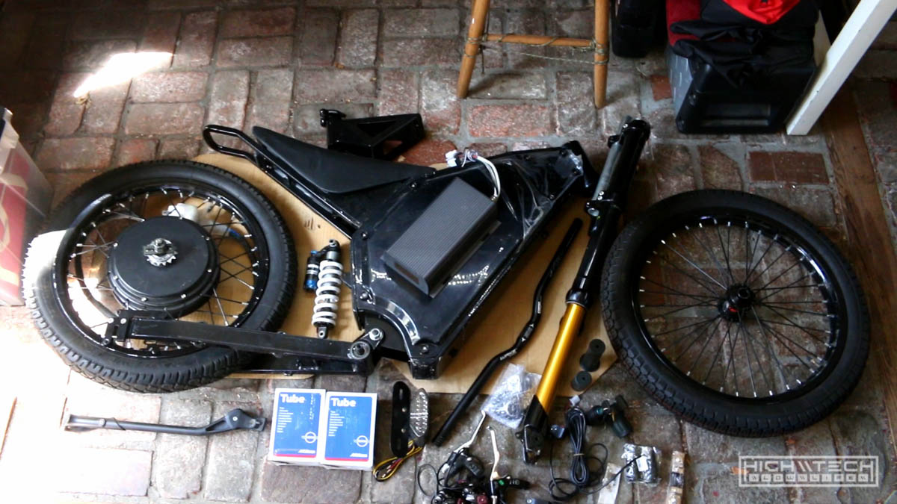

The frame is an EEB Electric Enduro Bike frame, or a Chinese clone of one, or I don't really know the origins, but I assumed they were all made in China. Anyway, it's pretty good, it has 150mm dropouts and can fit a huge battery pack and has full suspension, it's quite light in comparison to my other Chinese frame of a similar design. Monoshock rear swingarm with suspension fork up front. If you're building an ebike I would strongly recommend at the very least a front suspension fork but ideally a full suspension frame, when you're going fast you hit those bumps faster. This frame is probably the most common larger ebike frame out there, which is good because there are a lot of resources on the internet regarding building and setting them up. 

The front fork is a super cheap Chinese "Zoom" brand fork, it's very heavy and doesn't work as well as my much lighter DNM fork on my other bike, although it is about half the cost as the DNM, just materials and fit and finish are very poor in comparison. It works though, and it's cheap, so there is that. I think for forks you get what you pay for. 

The rear shock is a Fox shock (I think). 

## 2. The motor

It's a ([QS 205 50H V3 3KW](http://www.cnqsmotor.com/en/article_read/QS%20Motor%20205%2050H%20V3%20Motor%203000W%20Electric%20High%20Power%20Bike%20Spoke%20Hub%20Motor/259.html)) rear hub moto, 150mm axle width. Peak output is 6KW briefly, depends on your battery and controller. It was the baddest of the ebike hub motors until the 273 V3 came out. 

## 3. The controller

When I bought the parts is came with a Sabvoton SVMC72080 80A sinewave controller, I really like these controllers but I ended up selling this one because it's older and you can't use a fancy tft screen with it, and I like screens. So I hand-me-down'd the SVMC72150 150A controller from my other bike, because it has a cool display that shows you power use, battery indication, speedometer and a bunch of other cool things. Plus it's just an excuse to buy an even more powerful controller for my other bike (duh).

## 4. The battery

Ok so the battery is the one I had been using on my other bike and it's a 72v 30Ah pack and it's huge (340x130x120mm). It weighs 20lbs! That's more than some peoples entire bike! When I was making my 2nd bike I really didn't know much about ebikes or batteries and I made the mistake of getting a pack with a much lower amp discharge rating on the BMS. It is either 50A or 80A on the BMS, and because I bought this in China - the communication wasn't so great so I'm not really sure what it is, but it does work. I figured this would be a better fit for this motor though since it's smaller and uses less power, so now the plan is to get a more powerful battery for my other ebike and use this one here.  

## 5. Miscellaneous odds n ends

Some generic "LED bike headlight". The parts I bought off Craigslist included a tail light, but I think I'm going to do some red LED strips instead. The handlebars are just some cheap aluminum ones, the headset also just some cheap aluminum ones (running theme here...) I picked up a cool 'gold' KMS chain and I had a chain tensioner from my previous build that I didn't use and since this swingarm has vertical dropouts it's pretty much a necessity. I also had some brakes from a failed attempt in my last build so I utilized that (203mm rotor for extra stopping power). The regen on these motors are very good so I only run a front brake, in the rare case that my battery was completely dead and I needed to make an emergency stop I'd be kinda screwed but it's just easier to have regen in the back and a large disc in the front, I'm willing to take the risk but I'd advise not to do it this way and put one in the back "just in case". 

# \\\ The build! \\\

This build was honestly kind of a pain in the a$$, but they seemingly always end up that way no matter how "simple" they appears at first.  

## Paint prep

rant/ I told myself this was just going to be a "thrown together dirty build" but here I was - from the jump - painting things and making them all pretty. If you "really" care about the quality of your paintjob you'll assemble it all first, make sure everything works correctly, then tear it down to nothing to paint, then reassemble (again). I opted to just paint first, try my best not to mar things up too badly upon assembly, fumbled a few things, but overall I think the paintjob came out a lot better than I was expecting, although maybe my hopes were on the lower side. /rant

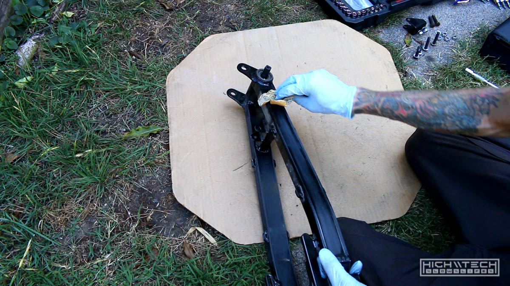

Prepping for paint always goes the same, scuff and scour the surfaces with a big grit sandpaper (220ish) you don't have to take things down to bare metal, just enough to give the pain something to grab onto. Then clean thoroughly (or not) with soapy water and or alcohol. Allow plenty of time to dry, you don't want to paint on wet surfaces. 

## Spraying

I have done lots of my signature "hex camo" paintjobs before and this time I wanted to try something different, so I created a digital camo stencil based off of a tiger stripe pattern. I created the stencils out of acrylic by cutting them with a laser. 

I painted automotive primer on all of the parts first, about two coats. The gray goes on very thick because it's sandable, but I rarely sand it after because most of the painting I do is matte and flat colors are very forgiving with imperfections, so it doesn't have to be glass smooth for the paint to look good. 

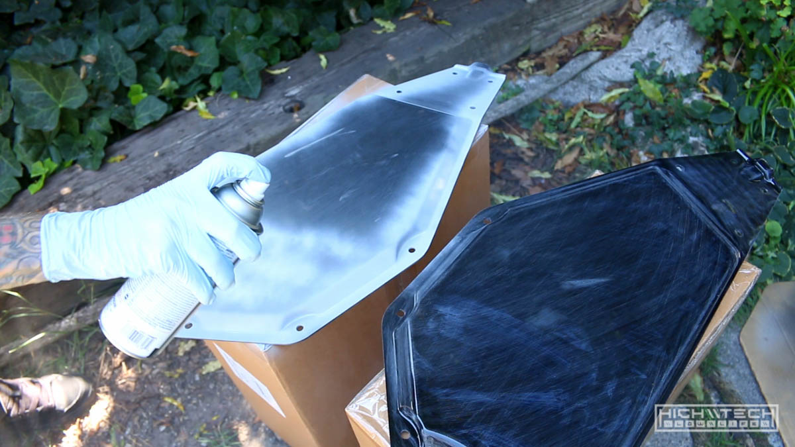

After that I moved on to the stencils, the pattern is very linear (literally boxes/digits) so for this to look better you need to line things up as best you can, which gets a bit difficult the more layers you put on. I found that I thought the stencils I made were patterned in a way to allow me to turn them upside down and have them "lock" in place, but I was wrong. They really only keyed into one another in one orientation so this made having more variation more difficult, but I managed with what I had to work with. I'm glad I made a few stencils because having this variety allowed me to line things up more easily with variation which is more akin to how the real digi-camo pattern is comprised. 

Most of the surfaces of the bike parts are flat, so this made painting layers of the pattern easier. For the rounded and angled parts I opted to break one of the stencils into smaller pieces so I could fit them flat against these smaller spaces. Just lay the stencil down, spray the first color, move the stencil, spray more of the same color. Allow time to dry, then move on to the next color and repeat, and repeat, and repeat. I think I used 5 or 6 different colors, so this took a really long time. 

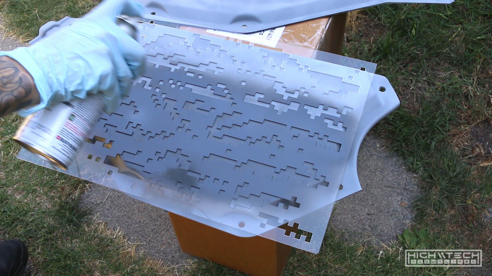

When I was done I wasn't quite happy with what I had created, the pattern came out really well (except for the top panel... which of course is the one you see the most...). Two errors occurred, one was that I was a little "off" on my stencil placement for the top panel, which resulted in things looking very muddy and undefined in comparison to all my other panels, and there really isn't a way to fix this other than starting over. My second error which was made in my paint selection, the "beige" gray I chose was a bit too light, and also the light blue was a bit too light as well. This is all preference, but the look I was going for was a more "subdued" look that has less contrast and right now my parts were looking like digital 'confetti'. I decided since all the other parts came out defined and the pattern was clear, to just redo the top panel and start over. It wasn't that large of a part and I it wouldn't be that bad to start over, so I did. I just recoated everything as best I could with gray primer to start a base, it didn't "completely" cover everything evenly, but covered enough to start again. Lay stencil, paint color, move stencil paint color, wait to dry, start with another color, repeat repeat repeat. I got it right the second time! 

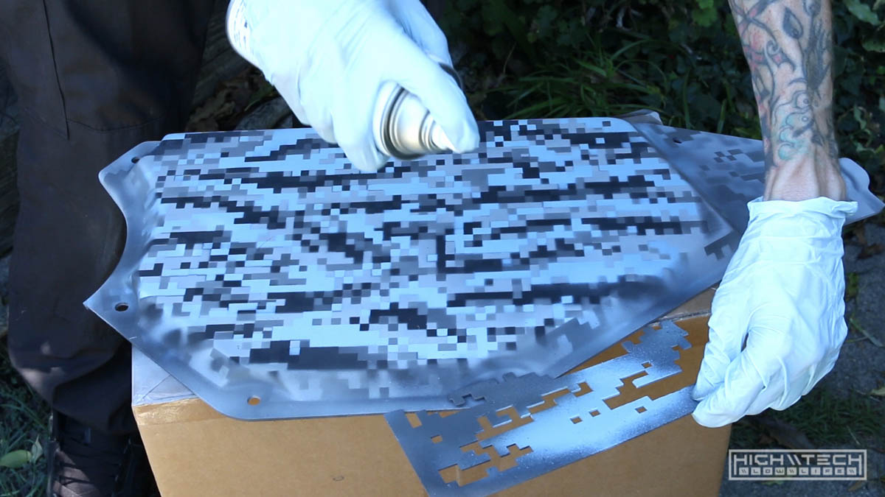

Now with my parts matching, what to do about the colors? I figured maybe if I just gave them a misting of a darker color, maybe it would knock back some of the contrast? Flat black from further away and being very cautious not to overdo it, I was able to spray just enough to tint the panels darker, and it was actually pretty easy to control how much I was spraying so I was able to reach that low contrast darker look I was going for. Nailed it. 

For the smaller parts that were red I just took apart all of the smaller parts I had and painted them flat black. Done. The red anodizing did look cool, just didn't fit the color scheme of the bike. 

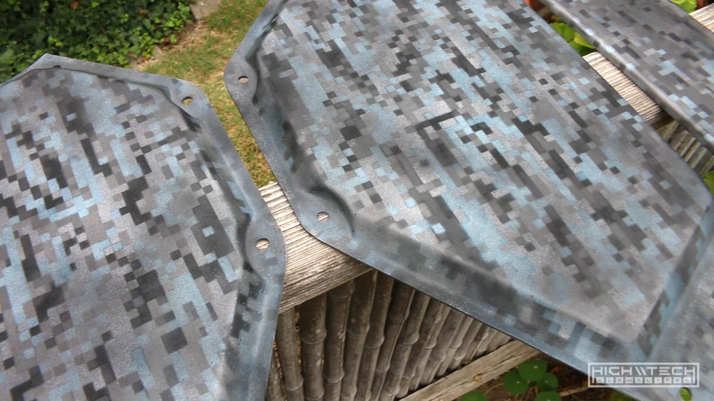

Painting took a really long time, but it was worth it in the end because I pulled off the look that I was going for. 

# Assembly 

Easily the most difficult part of this build, was literally building it (crazy I know!)... where do I even begin? 

## Headset + bearings (oh my god) + fork
 I bought another headset bearing set because I thought I didn't have one but not only did I have one from a previous build, but one was also included in the parts I bought, so now I had three sets. I first attempted to fit the headset (mind you I don't have a ton of experience building bikes...) and I was wondering why the bottom bearing wouldn't fit on the fork steering tube, there was this lip on the bottom and the bearing cup just wouldn't go down on it. It seemingly was aluminum so I didn't want to bash on it too badly, but after attempting quite a few um... "configurations" of bearings every which way I was stumped. Clearly it was supposed to rest down on the tube flush, but it wasn't going down, so I did some research and it turns on you have to smash down the cup over that little lip. You're supposed to use a special tool to not damage any parts, well, I didn't have that tool so I found a pipe that fit well enough and took a sledgehammer to it, and it fit with a bit of hammering. Success... or so I thought, even after fitting that cup finally on the stem, things still weren't working right, I put everything together which I thought was correct and I still had some play in my steering tube... what the hell!? 
 

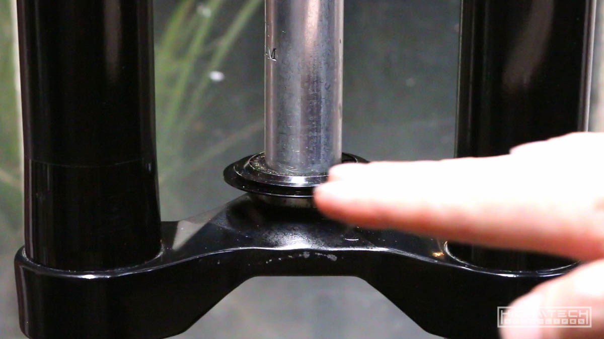
 
After calling it another night and sleeping on it, I did even more research and - what do you know, I was missing the lower bearing that goes into the cup! No wonder things were wobbling around. I also learned how the spacers go and why they're all chamfered with different angles, almost like they're supposed to go together that way to make things fit very tightly together, wow. I will claim some stupidity on this for not knowing how these things go together, but hey that's how you learn. The reference I had didn't quite tell me what size the bearings were so I ordered one bearing, and I figured if it's the top one, then I'll just replace that and buy "the other one", of course right after I place my order I had the genius idea to measure the bearings I needed (priority of sequence kids, remember it, of course I ordered the bearing I already had, so I then ordered the one I needed. Ok I might have painted the bearing that was in there and yeah I'll admit it was a bit scratchy feeling after attempting to assemble the fork on the frame, but I'm not taking full credit because I'm sure that bearing wasn't smooth as glass as it was received. No big deal, I'll just replace the top one too. 

I got my top bearing in the mail first so I was a bit eager to work on the bike after waiting a while, there was actually a split second where I second guessed myself and thought "hmmm, is it even worth it? just leave it in there, just keep the extra *just in case*. Well, I should have listened to my gut because after attempting to remove the top bearing I instantly felt regret for my decision haha. I thought it would be so easy to just pop that bearing out from the other side of the frame, whack and done. No, no no no. The bearing did come out, but... in pieces. Oopsie. Turns out there is a lip that holds the bearing like a shelf and I was partially slamming on that with the hammer, and then partially on the bearing, but man was that bearing race stuck in there. I'm sure it was pressed in there with a bearing press or just hammered very hard into there. After nearly giving up a few times trying to get this race out of the cup, I kept slamming and chipping until I finally bent it enough to yank it out of there, only very minimal damage to the cup... ok cool, finally. I went to go put the new bearing in and guess what, it didn't fit, at all. It was so off that I had to go recheck my order to make sure I bought the correct bearing, I borrowed my calipers from work and could measure - the inner cup was 38.6mm and the OD of the new bearing was 41.87. There's no way this is going in there, not even with a hammer. 

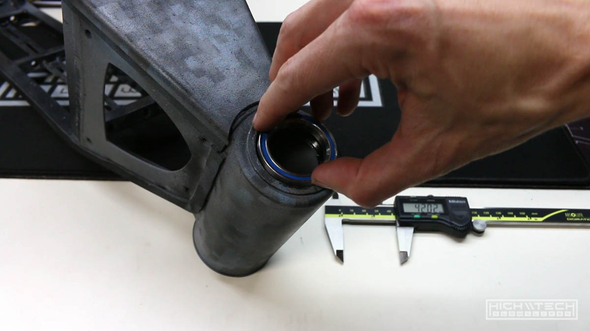

The bearing I pulled out said "42mm" on the side... ok? The new bearing I bought said "42mm" on it, these bearings were not the same size, you wouldn't even need a tool to see that - side by side stacked on top of each other, the new bearing was clearly bigger. I really didn't want to attempt to smash this even bigger bearing into the cup because the smaller one barely came out, barely. I also didn't want to buy another "42mm" bearing, how many interpretations of 42mm are there??? I didn't want to find out. After the new bottom bearing came, it slipped right in the bottom cup no problem, isn't this how all the bearings should fit? That also explains why my parts were missing this bearing, because it can just fall right out of the cup. After seeing how this bearing fit, I thought I'll just dremel out the cup to make the new top bearing fit. I thought this was going to be quite a pain, but it really only took me about 10 mins going slowly round and round with a sanding bit, taking off material, checking fitment, going around again, checking fitment again until I could finally slide the bearing in and out without issues. Finally, all that just to fit the headset... this was not the last of my troubles. I also realized why it's always better to pay more for a new kit, generally the amount of money you save from someone's abandon project isn't worth the time (and sometimes money) to get new parts that are missing, or parts that just don't fit. I'm ok with it because it's part of the fun, that sweet fun of frustration. 

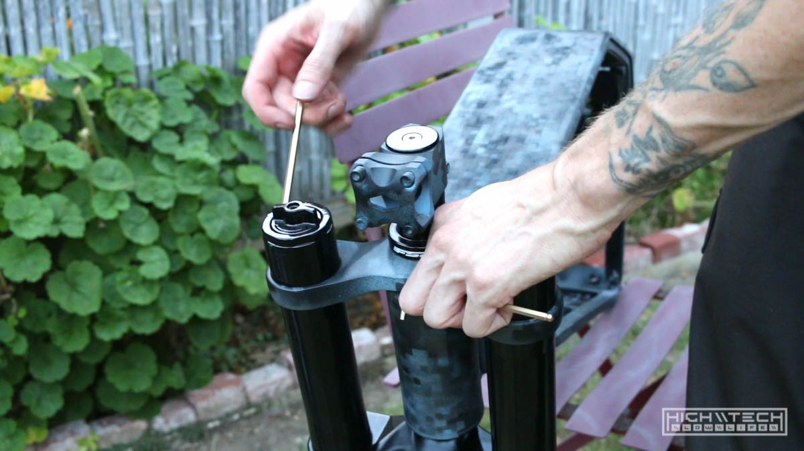

I was pretty happy to finally be able to assemble the headset on the steering tube and mount the fork on the frame, although now getting the parts all in order correctly on the steering tube I had a new problem. I didn't have enough spacers to have the headset clear the steering tube to provide compression, my options were to buy more spacers, or cut the tube. I opted to just cut the tube. I didn't want to have the headset sticking up so far. I saw that the tube was originally cut by what looked like a pipe cutter, this seemed like a good idea but man was that steel tough... that took forever to cut through, hindsight 20/20 I would have just hacksawed it off in 1/10th of the time and then filed it flush, all in all it did provide a clean cut that was nearly as flat as possible, so ok it was a nice finish, but that was a lot of (extraneous) work. After that just redo the thing I already did 3 times incorrectly and I fit all the parts and spacers and tightened it up and it was as smooth as glass and fit very tightly, no wobbling, it actually looked good too. 

Finally.. FINALLY I had finished the front fork / headset / handlebars. Finally, I'm only done with the front of the bike, and not even the entire front part!

## Swingarm + motor

The motor already came with a freewheel, but they're easy to install. Just be careful not to crossthread this, you really really don't want to do that, and it's kind of easy to do. 

You know... I thought this part at least was going to go smoothly because part of the beauty of this smaller 5KW motor was that the axle wasn't too ginormous (my other bike is 8KW, with a huge axle). Since I had to fit my other bikes swingarm I thought this would be a pleasant surprise knowing that the shaft would just fit in the dropouts without any modification, but I was wrong. They "almost" fit, (just like that steering tube bearing "almost" fit...) but almost isn't a fit. 

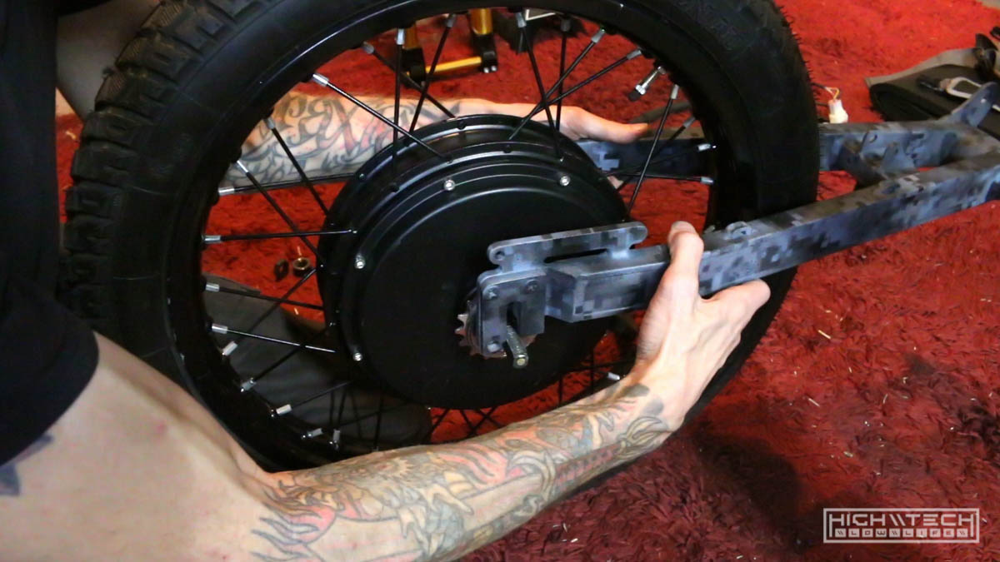

I thought it was because the swingarm wasn't spread apart wide enough to accept the hub, but after trying to pry it with a hydraulic jack (I did this on my other bike and it worked...) this steel was very... springy. No dice. I figured the angles of the dropouts what were causing it not to fit, but either way this swingarm was not bending, and it needed to be enlarged. 

So I fit up the arm in a vise and took the angle grinder to the dropouts, they just needed a tiny bit to fit, that tiny bit ended up being quite more than I had anticipated, so cut, remove, check fitment, repeat repeat repeat until it finally slid in on both sides. Ok not too bad, it didn't take that long to give each side a few passes with the grinder. On to the next thing!

## Front wheel + mating of swingarm and frame

Putting on the front wheel was very easy, I actually remembered to put on the disc brake before mounting the wheel, so that was nice of me (pats myself on the back, good job). I also mated the swingarm to the rear of the frame without much effort, just align the parts, slide the large bolt through and tighten, done. Does that mean all of the rest of the assembly is going to as smoothly?? No. Next up; 

## Rear shock

This shock was definitely not set up to work for this frame, the bottom was not wide enough and the top was too wide, so either way it would not fit. I figured instead of trying to hammer out the bushing, I'll just cut it on the shock. I harkened back to the nightmares of attempting to slide the bearing out of the cup, and thought, no... just leave it, and cut it here, you will be happier. Thinkin' smart now. 

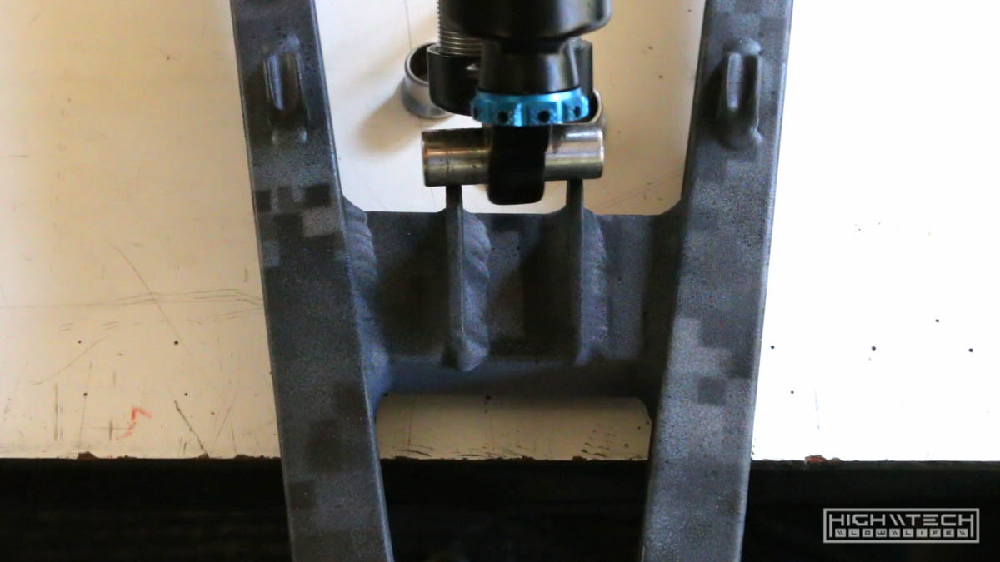

I measured the amount I needed to cut, threw the shock in the vise and hacked away with the saw, this steel was also very tough but my blade my was dull also, so that really didn't help. Fresh blade for the other side and it went a lot faster. Not perfectly flat, but a bit of filing and I was ok. It fit in the spot it needed to go so I was happy. For the bottom I just took up the slack with some thick washers. Long 8mm bolts for each side and all was golden. 

## Progress so far (frame assembled)

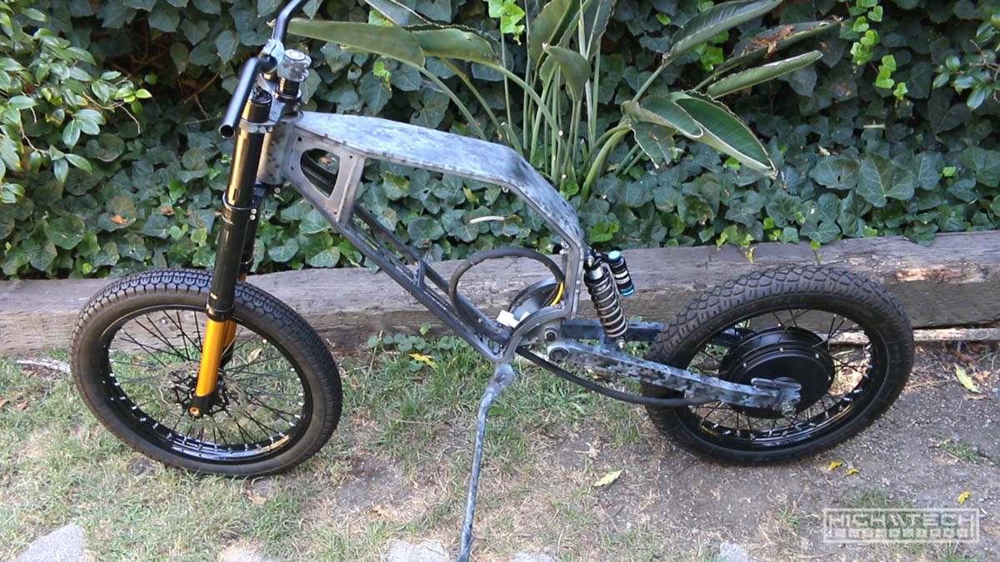

Seems like a lot of work just for a skeleton of a chassis but it was fun so far, let's keep going! 

# \\\ Ebike [3.0] - The Build - Part Deux [that means 2 bro] - \\\

<iframe width="1024" height="576" src="https://www.youtube.com/embed/YqxQn0V6fvQ" title="YouTube video player" frameborder="0" allow="accelerometer; autoplay; clipboard-write; encrypted-media; gyroscope; picture-in-picture" allowfullscreen></iframe>

## Front LCD screen

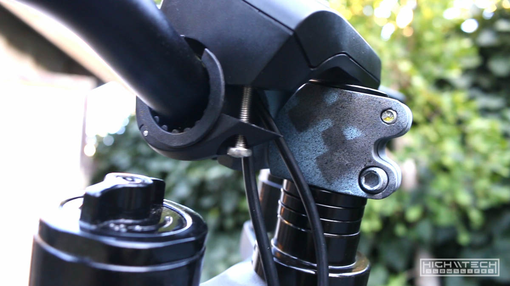

Now that I've swapped out the Sabvoton SVMC7280 for the larger and more powerful SVMC72150 I was able to get a display (which was the main reason for making this swap). I sold the 80A controller and barrowed the 150A with the LCD from my 2nd ebike. This screen did not fit the handlebars very well and I didn't like the angle at which it sat at even with the longer screws. 

So after sitting on it a while I came up with the solution of using a carbon fiber handlebar extension. Which definitely did the trick! With this standoff I was able to mount the screen at the exact angle I wanted.

## Brakes

You need to be able to stop the bike, especially one that can go very fast. I had a few sets of hydraulic brakes from an older build but as I went to mount the front caliper I realized that I had 4 or 5 mounting brackets that were all the same size. I'm using some big 203mm rotors and you need a specific bracket to hold the caliper at the right distance. After trying a thousand combinations of flipping brackets around I realized I would just need to purchase the right bracket. It finally arrived in the mail and it worked, I finally had a front brake. 

I'm not running a mechanical rear brake because I'm using regenerative braking which uses the motor as a brake, this is not advised because in case of electrical failure, you will not have a rear brake. It's always better to run a rear brake just in case, so again do what I say not what I do. I tried to run a rear brake on my last build and for some reason I could never get it to run right, it was either partially engaged, or not engaging enough, after trying a bunch of different parts I finally just gave up and didn't run a rear brake. 

Because there is no rear brake cable the lever will get stuck without the tension of the cable to allow it to retract, so I had to fix that problem by removing that captive part. 

It does make for a slightly cleaner looking build because you have one less line going to the back, but really you should run a rear brake. With that being said the regen brakes are adjustable and you can easily get them to lock the rear wheel, they are as powerful as the motor is, which is very very powerful. Most of the time riding I will only use the regen, this gives you a little power back to the battery, and saves your pads. You should note that you can't only use regen to brake, the regen cuts off at about 3mph, so you're still rolling, without any type of mechanical brakes you will not be able to fully stop, which if you're maneuvering around people, you will run them over, sure it's only 3mph, but they will not like you at all. 

## Seat

Because I bought most of these parts used, I figured the seat could use a refresh and a good cleaning - it looked a lot better after that. 

## Kickstand woes

Now that the bike was standing on its own two wheels suspended by the fork and rear shock I needed a way for it to not fall over. They included a kickstand... awesome. But it didn't fit... not awesome. They made a cool little hole on the frame with a nut welded on the inside and everything, almost like they engineered it to work, but the engineers took a day off and put that hole on the wrong side. 

With it on the left side, the kickstand comes out way too far and interferes with the pedal... you guys did put pedals on when you engineered this right? I don't think they did. Anyway, it wouldn't fit and it was wrong, so I realized that if I made my own hole on the other side it actually would work, so I took a drill, made a hole and just put my own nut and bolt through and cinched it up. 

Also I will mention that nearly all the bolts on this bike are 8mm, the kickstand of course uses a 10mm bolt which I didn't have, so I ordered some nice 10mm bolts only to realize that the 10mm bolt head is too large for how the kickstand is designed... almost like it was really designed for an 8mm bolt... so this is another fail on the kickstand design. The bolt fits flush as 8mm, so in my new hole it got an 8mm bolt and nut. The bike now stood and didn't fall over, it was beginning to look a lot more like a real bike. 

## Charge port + buck converter

We need a way to get juice in the pack from outside the frame so I picked up a fancy port that screws into a flat plane much like a bulkhead port. It's a premium piece (expensive for a charging port...) but it looks very finished and I already had one on my other bike so my charger was set up for this plug. 

I'm not a huge fan of putting the port right in the middle of the top of the frame, but it makes the most sense as it's the easiest to access this. On my other bike I could put it on the side because the side panels don't go the full length of the frame, if I did the same on this frame I would have to have the port attached to a panel that could be detached, so I would have some wires hanging and that's just annoying. Measured, cut the whole, fitted the port, marked the mounting holes, used 4mm bolts and nuts to secure the port.  

I had to remove the port again to wire it up. I'm also using a 72v to 12v buck converter which takes the 72v and brings it down to 12v to run all of the lights, if you hook up your lights directly to the 72v battery they'll be super bright for less than a second and then won't turn on anymore forever, they're not designed for that much current so you'll need this to bring down the flow. 

My circuit design is to start at the battery, go to the charge port, then to the 12v converter, this makes it easy to install both port and converter at the same time. I thought I was being smart this time by only having one XT60 connector going from the port and converter to the battery, but then when I tried to install it I realized why I put two connectors on my other bike, because the converter won't fit through the hole for the port (duh). Oh well, simple enough to add another connector. 

## Headlight failure No. 1

For the headlights I originally wanted to have two flashlights closer together on the handlebars and I really tried to make this work but for some reason I couldn't get the LEDs to light externally despite trying a bunch of things. I didn't test the flashlights with batteries before taking them apart, but they were so cheap it's possible they didn't work well from the start. I broke my rule of testing everything before modding/hacking... oh well, I really gave it a genuine effort, and I could get them to light sporadically, but I needed something robust, so I ditched that idea and went with a singular tri-light setup.

## Chainring, pedals, chain

This should be pretty straightforward right? How many low lives does it take to put a dang chain on a bike, more than one apparently. The chain part actually wasn't that bad, but the whole tensioner setup, not so great. 

The pedals were easy to thread onto the cranks and the chainring and cranks went on the bottom bracket with easy, just push on, and install the bolts. Presto. 

Ok so you should get this chain tool because it's a lifesaver and works very well: PARK TOOL CT-3.2 11 SPEED COMPATIBLE CHAIN REMOVAL TOOL

One tip is to not push the pin all the way out of the link, because it's near impossible to try to insert one after it's fully pushed out, so just push it out enough to remove the link, then shorten the chain, then push from the other side and it will go in easy. Make sure it's not binding while you're turning the tool or you will break your tool and be stuck with a half disassembled chain. 

The chain went on without much fuss and it looks good. Remove some links, make it somewhat the right size, reassemble (**on the bike**) and you're done. 

Now, the tensioner really sucks, but I already had it and it was cheap. I don't really think any of these single speed tensioners work all that well, you're better off just buying a derailleur and use that, they have two sprockets and hold the chain captive in a more robust fashion. 

The chain tensioner mounts into the swingarm using a 10mm bolt (the only other 10mm bolt on this entire bike) thankfully I had purchased some 10mm bolts for the kickstand which I really didn't need as you know, but these bolts were very long so I chopped one down with a hacksaw to make it fit better. There isn't much clearance at all between the bolt and the freewheel when fully tightened, definitely not enough space to put a nut on the other side. 

I took a ride on the bike and the chain skipped, turns out it was just hopping off of the tensioner under load. I went to rearrange the internal spring on the tensioner for more tension, and it started stripping threads in the swingarm... NO! I thought I had toasted this mount, but it turns out that with all the washers and spacers I put on to align the tensioner to the chain, with the new orientation I needed to remove some so that the bolt could thread in more to the swingarm, whew. I tightened it up and went for another ride and it didn't skip at all. I'm still skeptical on this tensioner design, but I will run it until it breaks or keeps skipping and I will replace it with a derailleur later if need be. 

## RGB LED madness 

The bike parts I bought did come with an LED tail light which would be fine but I had a vision of two LED strips running the length of the seat frame, I thought it would look cooler than a bulky light at the end. I was originally just going to make these red and then another strip right next to it that was RGB, but I figured this was overkill and that the lights didn't "need" to be red since this isn't a car, and as long as people can see you does it really matter what color the lights are? I can make my whole bike red if need be!  

I went a little overboard and ended up decking out the bike with 7 (or 8) custom made LED strips. It was a lot of work but it was worth it for how cool it came out!

I hacked up a ton of old USB cables to make the wires, I even sleeved them all with some cool navy blue 550 paracord. 

After wiring them all up I tested them with the RGB controller to make sure they all worked, only 1 had some faulty LEDs so I quickly swapped those out for a fresh strip, and then they all worked! 

Here they are all completed and sealed with a metric ton of hot glue. 

And finally all zip-tied up on the bike. -Whew- that was a lot of work and glad to have it all completed finally. 

## Test fitting the battery and controller

I'm using the battery from my other bike, it's 72v 30Ah, it's huge, weighs 20lbs. Thankfully the configuration I had it made in also fits in this slimmer frame, just barely. The controller however did not, it has these mounting tabs integrated in the sides of the housing that unfortunately stuck out just a bit too far, even with the extra room that the side panels provide, it's just a bit too much. No big deal, I'll just hack off the tabs with the angle grinder. 

Ok so I only had grinding wheels for my angle grinder and I really needed cut off wheels, so here I go with the hacksaw again. Cutting the tabs off was much more difficult than I had anticipated, so I switched to the dremel, which seemed to be faster, but still took a while. It's probably like 4 or 5mm aluminum but still, it's aluminum! After dremeling one tab nearly all the way off, I thought I'd try the hacksaw, this was much faster for me, and I finished the side and fairly quickly cut through the other tab. The cut wasn't as clean as I could have made it, but it fits now. 

## Wiring it all up

I padded the frame internally with some foam to protect the battery and controller, with the padding things were becoming a tighter fit, but everything did fit. I pulled the controller out enough to screw in the power wires and everything packed back in the frame neatly. 

Here is how it looks so far, not bad! 

I thought I was going to be able to finally test it but nope, ran into another issue - these throttle connectors were not going to work together! 

## Continued in [part 3 >>](https://hightech-lowlife.github.io/projects/008_digi_camo_ebike_part3/008_digi_camo_ebike_part3)

