# \\\ Ebike [3.0] - The Build - Part Deux [that means 2 bro] - \\\

<iframe width="1024" height="576" src="https://www.youtube.com/embed/YqxQn0V6fvQ" title="YouTube video player" frameborder="0" allow="accelerometer; autoplay; clipboard-write; encrypted-media; gyroscope; picture-in-picture" allowfullscreen></iframe>

## Front LCD screen

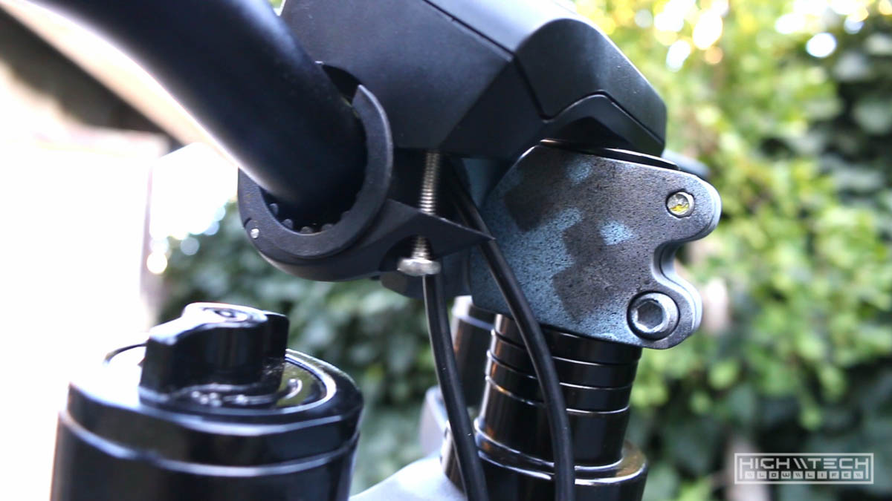

Now that I've swapped out the Sabvoton SVMC7280 for the larger and more powerful SVMC72150 I was able to get a display (which was the main reason for making this swap). I sold the 80A controller and barrowed the 150A with the LCD from my 2nd ebike. This screen did not fit the handlebars very well and I didn't like the angle at which it sat at even with the longer screws. 

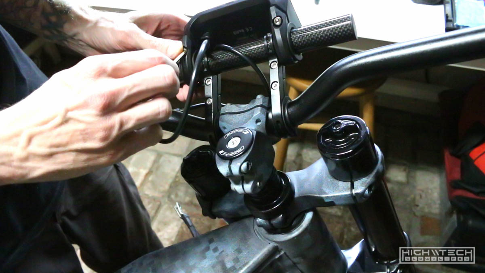

So after sitting on it a while I came up with the solution of using a carbon fiber handlebar extension. Which definitely did the trick! With this standoff I was able to mount the screen at the exact angle I wanted.

## Brakes

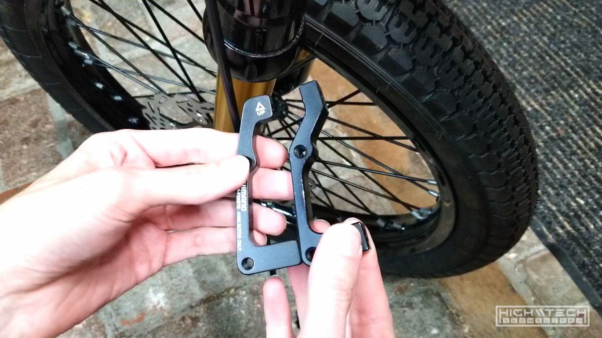

You need to be able to stop the bike, especially one that can go very fast. I had a few sets of hydraulic brakes from an older build but as I went to mount the front caliper I realized that I had 4 or 5 mounting brackets that were all the same size. I'm using some big 203mm rotors and you need a specific bracket to hold the caliper at the right distance. After trying a thousand combinations of flipping brackets around I realized I would just need to purchase the right bracket. It finally arrived in the mail and it worked, I finally had a front brake. 

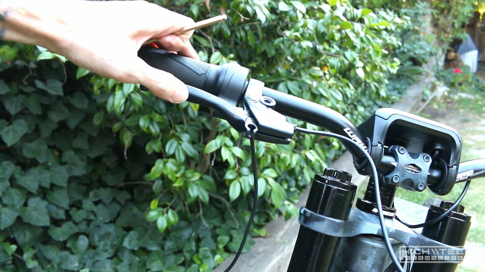

I'm not running a mechanical rear brake because I'm using regenerative braking which uses the motor as a brake, this is not advised because in case of electrical failure, you will not have a rear brake. It's always better to run a rear brake just in case, so again do what I say not what I do. I tried to run a rear brake on my last build and for some reason I could never get it to run right, it was either partially engaged, or not engaging enough, after trying a bunch of different parts I finally just gave up and didn't run a rear brake. 

Because there is no rear brake cable the lever will get stuck without the tension of the cable to allow it to retract, so I had to fix that problem by removing that captive part. 

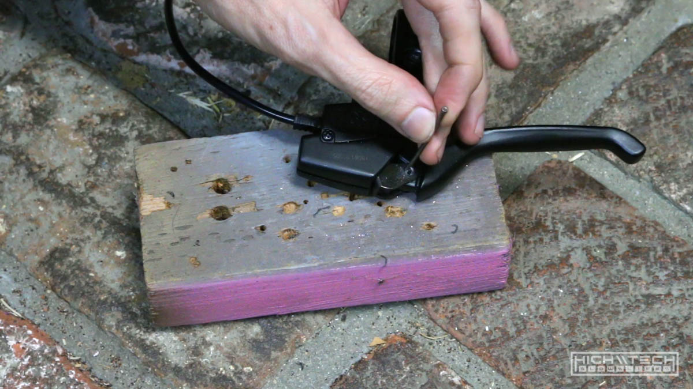

It does make for a slightly cleaner looking build because you have one less line going to the back, but really you should run a rear brake. With that being said the regen brakes are adjustable and you can easily get them to lock the rear wheel, they are as powerful as the motor is, which is very very powerful. Most of the time riding I will only use the regen, this gives you a little power back to the battery, and saves your pads. You should note that you can't only use regen to brake, the regen cuts off at about 3mph, so you're still rolling, without any type of mechanical brakes you will not be able to fully stop, which if you're maneuvering around people, you will run them over, sure it's only 3mph, but they will not like you at all. 

## Seat

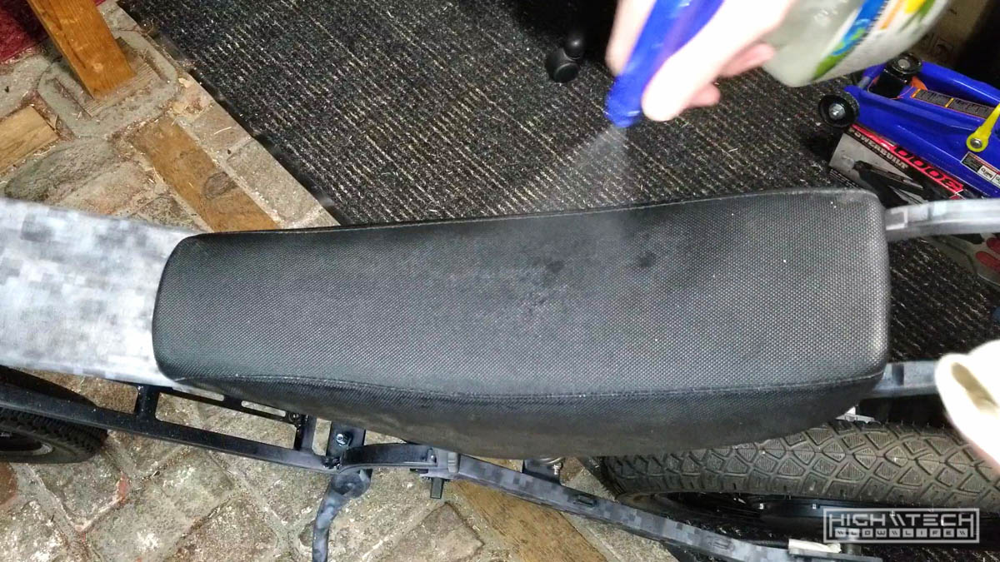

Because I bought most of these parts used, I figured the seat could use a refresh and a good cleaning - it looked a lot better after that. 

## Kickstand woes

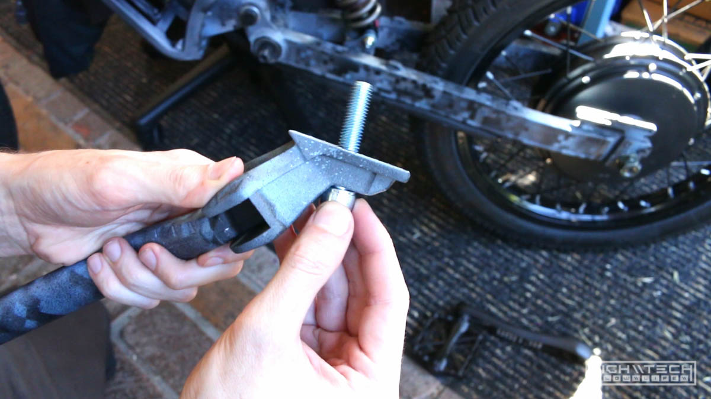

Now that the bike was standing on its own two wheels suspended by the fork and rear shock I needed a way for it to not fall over. They included a kickstand... awesome. But it didn't fit... not awesome. They made a cool little hole on the frame with a nut welded on the inside and everything, almost like they engineered it to work, but the engineers took a day off and put that hole on the wrong side. 

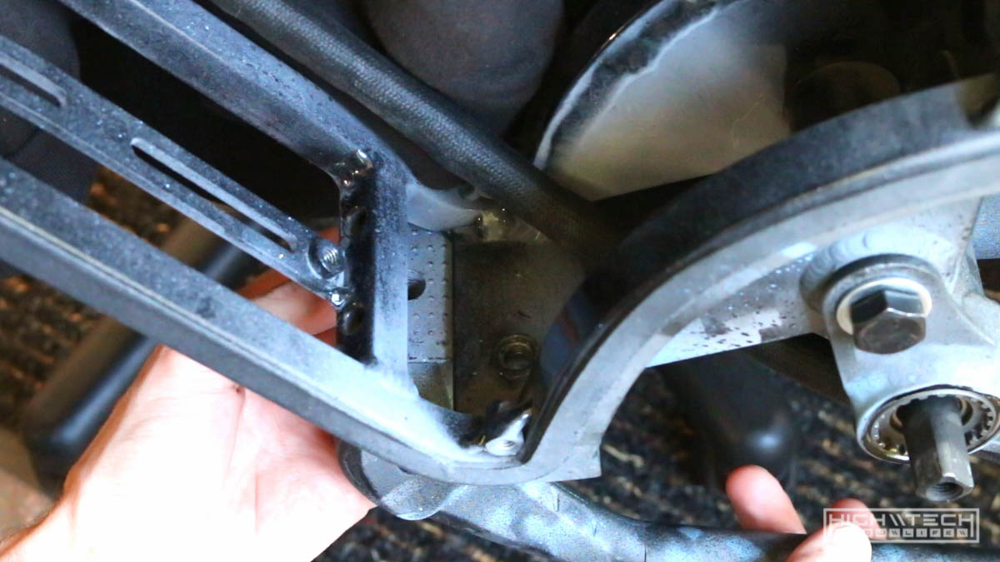

With it on the left side, the kickstand comes out way too far and interferes with the pedal... you guys did put pedals on when you engineered this right? I don't think they did. Anyway, it wouldn't fit and it was wrong, so I realized that if I made my own hole on the other side it actually would work, so I took a drill, made a hole and just put my own nut and bolt through and cinched it up. 

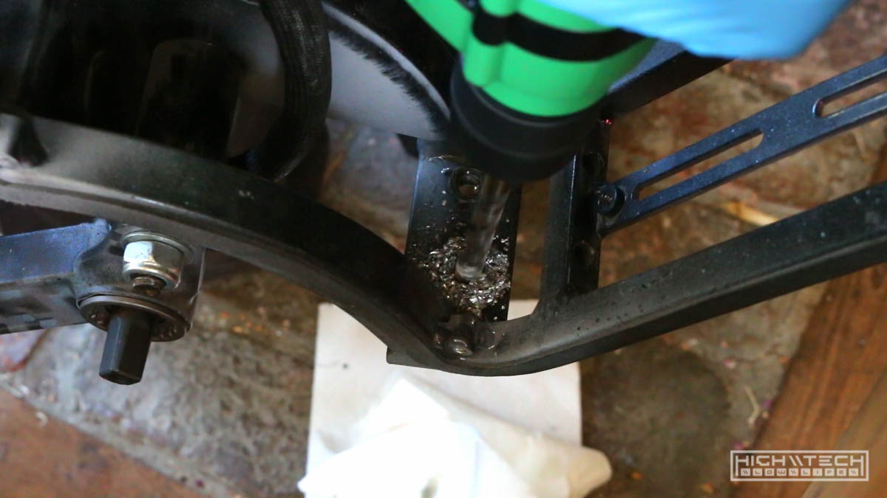

Also I will mention that nearly all the bolts on this bike are 8mm, the kickstand of course uses a 10mm bolt which I didn't have, so I ordered some nice 10mm bolts only to realize that the 10mm bolt head is too large for how the kickstand is designed... almost like it was really designed for an 8mm bolt... so this is another fail on the kickstand design. The bolt fits flush as 8mm, so in my new hole it got an 8mm bolt and nut. The bike now stood and didn't fall over, it was beginning to look a lot more like a real bike. 

## Charge port + buck converter

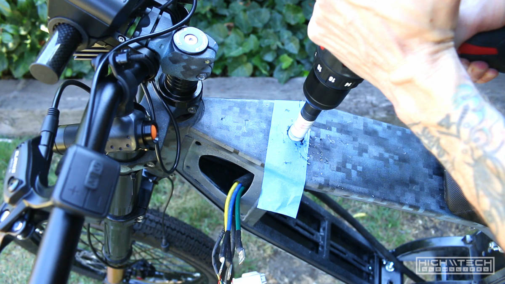

We need a way to get juice in the pack from outside the frame so I picked up a fancy port that screws into a flat plane much like a bulkhead port. It's a premium piece (expensive for a charging port...) but it looks very finished and I already had one on my other bike so my charger was set up for this plug. 

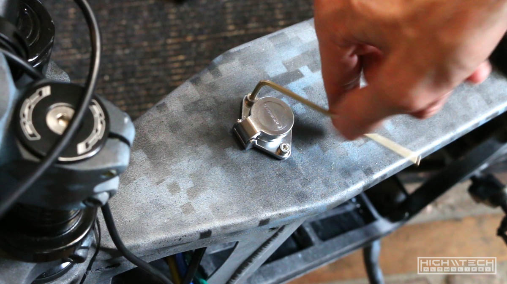

I'm not a huge fan of putting the port right in the middle of the top of the frame, but it makes the most sense as it's the easiest to access this. On my other bike I could put it on the side because the side panels don't go the full length of the frame, if I did the same on this frame I would have to have the port attached to a panel that could be detached, so I would have some wires hanging and that's just annoying. Measured, cut the whole, fitted the port, marked the mounting holes, used 4mm bolts and nuts to secure the port.  

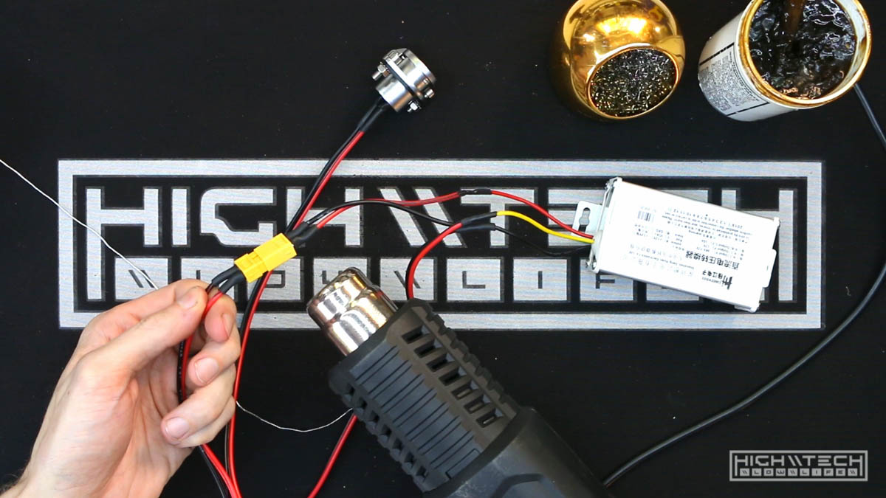

I had to remove the port again to wire it up. I'm also using a 72v to 12v buck converter which takes the 72v and brings it down to 12v to run all of the lights, if you hook up your lights directly to the 72v battery they'll be super bright for less than a second and then won't turn on anymore forever, they're not designed for that much current so you'll need this to bring down the flow. 

My circuit design is to start at the battery, go to the charge port, then to the 12v converter, this makes it easy to install both port and converter at the same time. I thought I was being smart this time by only having one XT60 connector going from the port and converter to the battery, but then when I tried to install it I realized why I put two connectors on my other bike, because the converter won't fit through the hole for the port (duh). Oh well, simple enough to add another connector. 

## Headlight failure No. 1

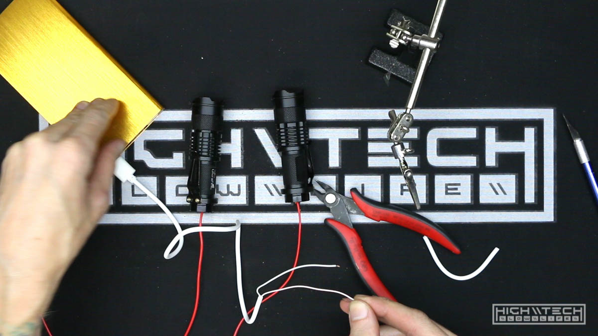

For the headlights I originally wanted to have two flashlights closer together on the handlebars and I really tried to make this work but for some reason I couldn't get the LEDs to light externally despite trying a bunch of things. I didn't test the flashlights with batteries before taking them apart, but they were so cheap it's possible they didn't work well from the start. I broke my rule of testing everything before modding/hacking... oh well, I really gave it a genuine effort, and I could get them to light sporadically, but I needed something robust, so I ditched that idea and went with a singular tri-light setup.

## Chainring, pedals, chain

This should be pretty straightforward right? How many low lives does it take to put a dang chain on a bike, more than one apparently. The chain part actually wasn't that bad, but the whole tensioner setup, not so great. 

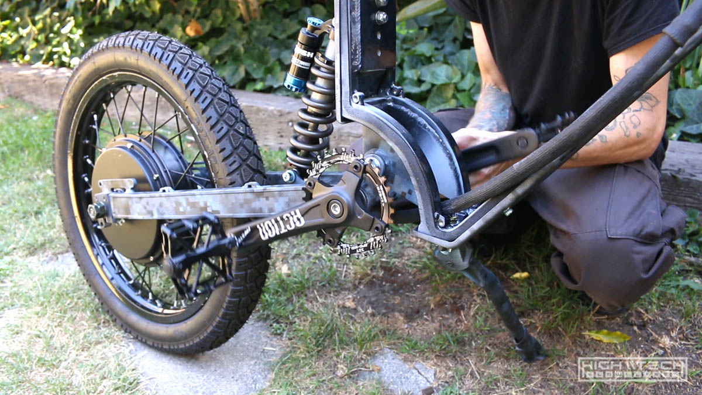

The pedals were easy to thread onto the cranks and the chainring and cranks went on the bottom bracket with easy, just push on, and install the bolts. Presto. 

Ok so you should get this chain tool because it's a lifesaver and works very well: PARK TOOL CT-3.2 11 SPEED COMPATIBLE CHAIN REMOVAL TOOL

One tip is to not push the pin all the way out of the link, because it's near impossible to try to insert one after it's fully pushed out, so just push it out enough to remove the link, then shorten the chain, then push from the other side and it will go in easy. Make sure it's not binding while you're turning the tool or you will break your tool and be stuck with a half disassembled chain. 

The chain went on without much fuss and it looks good. Remove some links, make it somewhat the right size, reassemble (**on the bike**) and you're done. 

Now, the tensioner really sucks, but I already had it and it was cheap. I don't really think any of these single speed tensioners work all that well, you're better off just buying a derailleur and use that, they have two sprockets and hold the chain captive in a more robust fashion. 

The chain tensioner mounts into the swingarm using a 10mm bolt (the only other 10mm bolt on this entire bike) thankfully I had purchased some 10mm bolts for the kickstand which I really didn't need as you know, but these bolts were very long so I chopped one down with a hacksaw to make it fit better. There isn't much clearance at all between the bolt and the freewheel when fully tightened, definitely not enough space to put a nut on the other side. 

I took a ride on the bike and the chain skipped, turns out it was just hopping off of the tensioner under load. I went to rearrange the internal spring on the tensioner for more tension, and it started stripping threads in the swingarm... NO! I thought I had toasted this mount, but it turns out that with all the washers and spacers I put on to align the tensioner to the chain, with the new orientation I needed to remove some so that the bolt could thread in more to the swingarm, whew. I tightened it up and went for another ride and it didn't skip at all. I'm still skeptical on this tensioner design, but I will run it until it breaks or keeps skipping and I will replace it with a derailleur later if need be. 

## RGB LED madness 

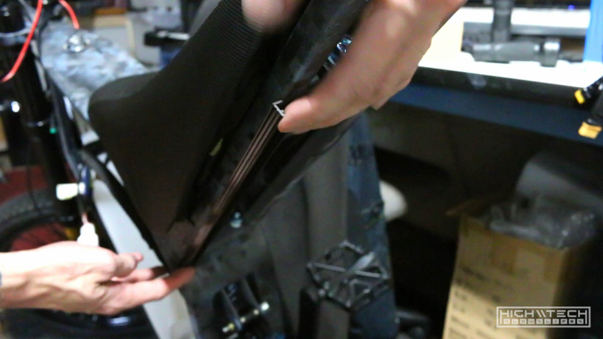

The bike parts I bought did come with an LED tail light which would be fine but I had a vision of two LED strips running the length of the seat frame, I thought it would look cooler than a bulky light at the end. I was originally just going to make these red and then another strip right next to it that was RGB, but I figured this was overkill and that the lights didn't "need" to be red since this isn't a car, and as long as people can see you does it really matter what color the lights are? I can make my whole bike red if need be!  

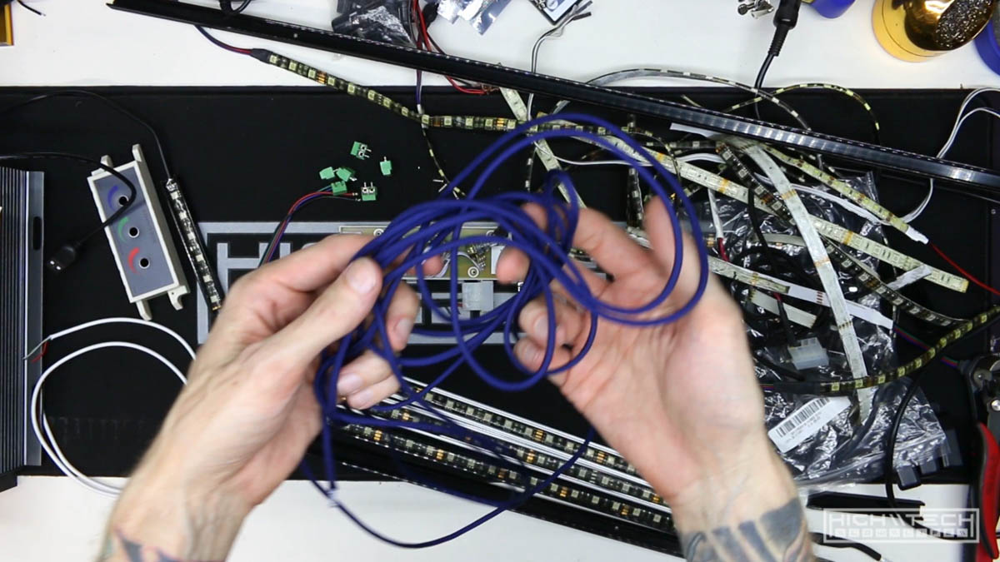

I went a little overboard and ended up decking out the bike with 7 (or 8) custom made LED strips. It was a lot of work but it was worth it for how cool it came out!

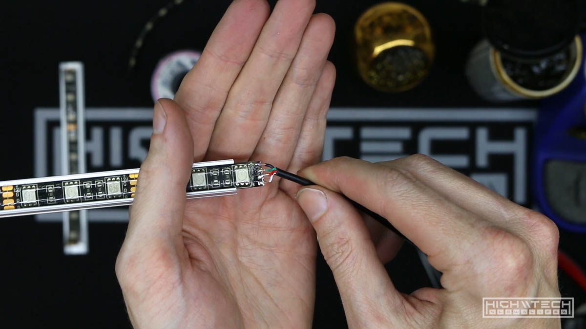

I hacked up a ton of old USB cables to make the wires, I even sleeved them all with some cool navy blue 550 paracord. 

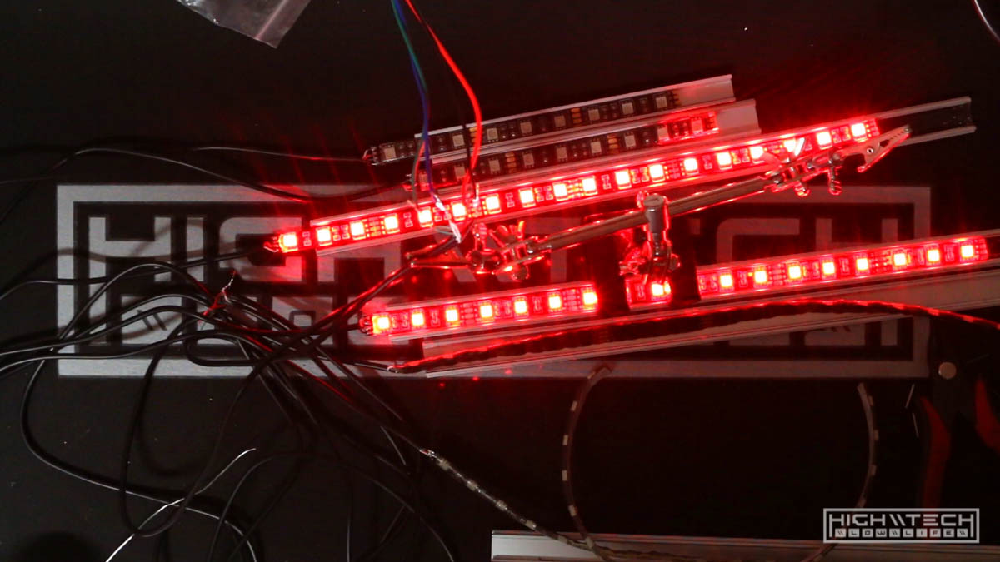

After wiring them all up I tested them with the RGB controller to make sure they all worked, only 1 had some faulty LEDs so I quickly swapped those out for a fresh strip, and then they all worked! 

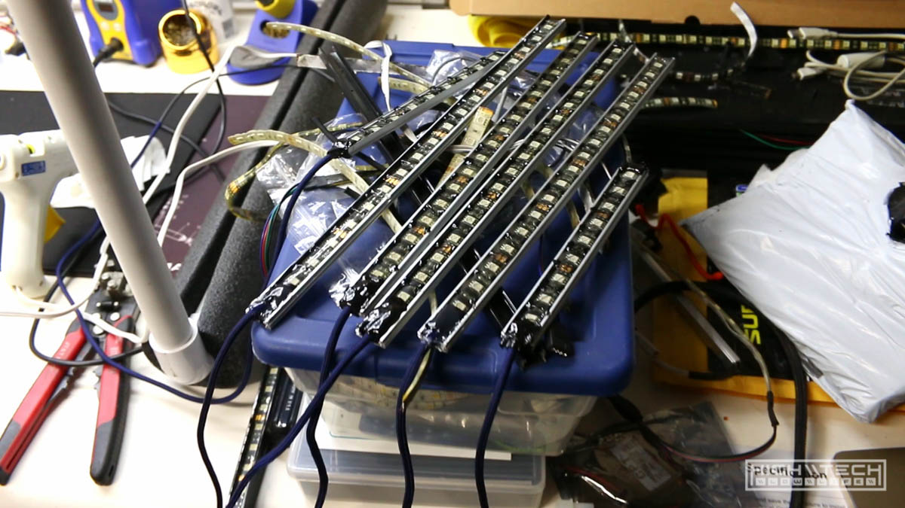

Here they are all completed and sealed with a metric ton of hot glue. 

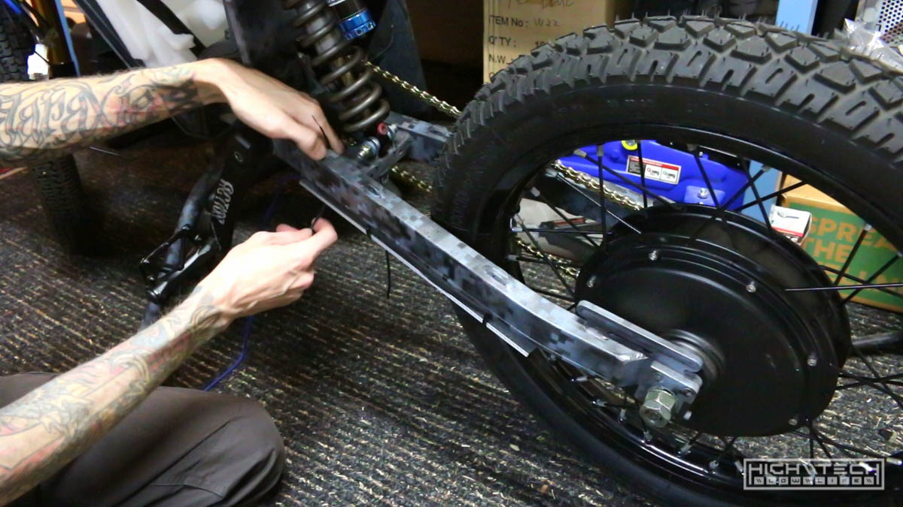

And finally all zip-tied up on the bike. -Whew- that was a lot of work and glad to have it all completed finally. 

## Test fitting the battery and controller

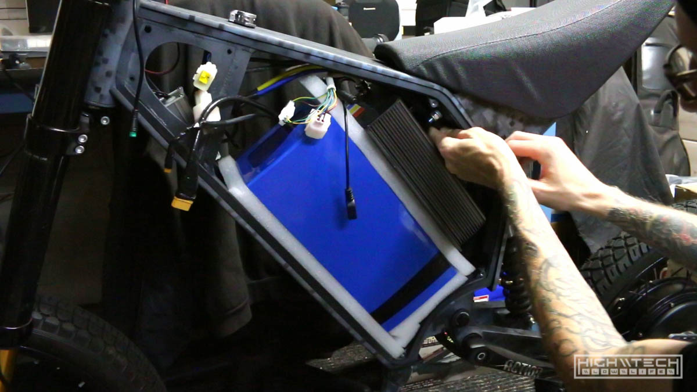

I'm using the battery from my other bike, it's 72v 30Ah, it's huge, weighs 20lbs. Thankfully the configuration I had it made in also fits in this slimmer frame, just barely. The controller however did not, it has these mounting tabs integrated in the sides of the housing that unfortunately stuck out just a bit too far, even with the extra room that the side panels provide, it's just a bit too much. No big deal, I'll just hack off the tabs with the angle grinder. 

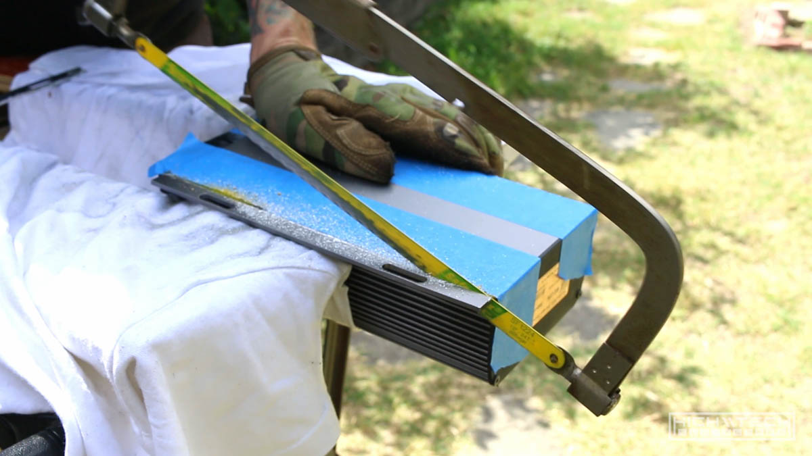

Ok so I only had grinding wheels for my angle grinder and I really needed cut off wheels, so here I go with the hacksaw again. Cutting the tabs off was much more difficult than I had anticipated, so I switched to the dremel, which seemed to be faster, but still took a while. It's probably like 4 or 5mm aluminum but still, it's aluminum! After dremeling one tab nearly all the way off, I thought I'd try the hacksaw, this was much faster for me, and I finished the side and fairly quickly cut through the other tab. The cut wasn't as clean as I could have made it, but it fits now. 

## Wiring it all up

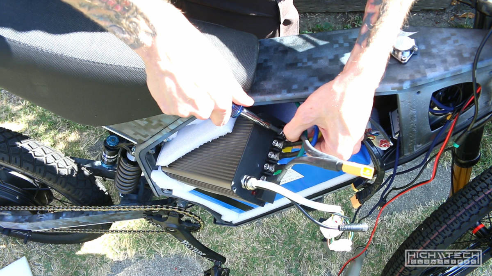

I padded the frame internally with some foam to protect the battery and controller, with the padding things were becoming a tighter fit, but everything did fit. I pulled the controller out enough to screw in the power wires and everything packed back in the frame neatly. 

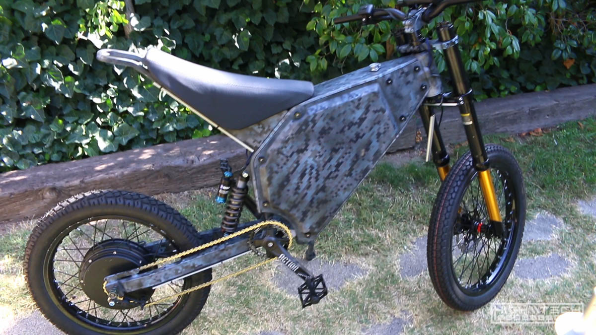

Here is how it looks so far, not bad! 

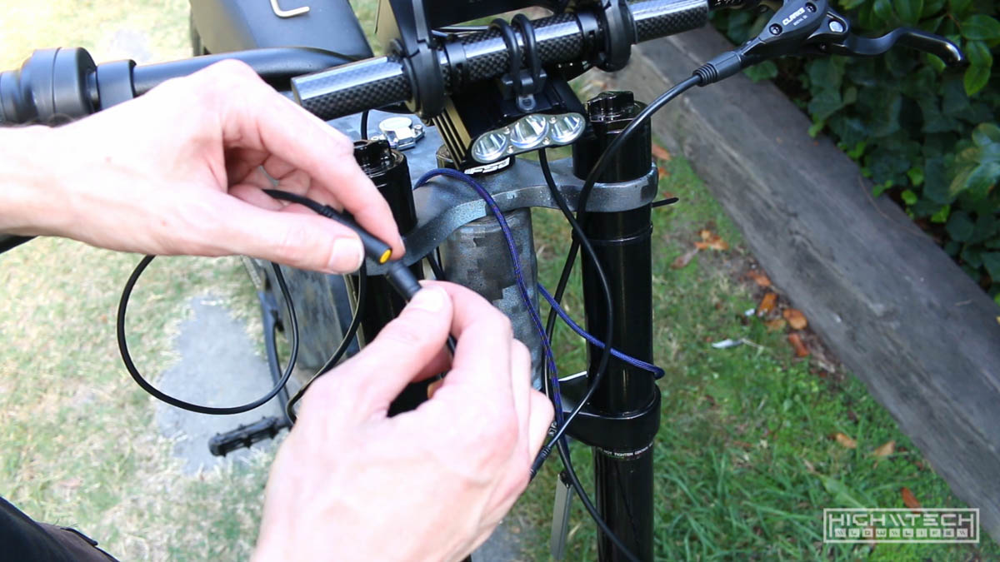

I thought I was going to be able to finally test it but nope, ran into another issue - these throttle connectors were not going to work together! 

## Continued in [part 3 >>](https://hightech-lowlife.github.io/projects/008_digi_camo_ebike_part3/008_digi_camo_ebike_part3)
