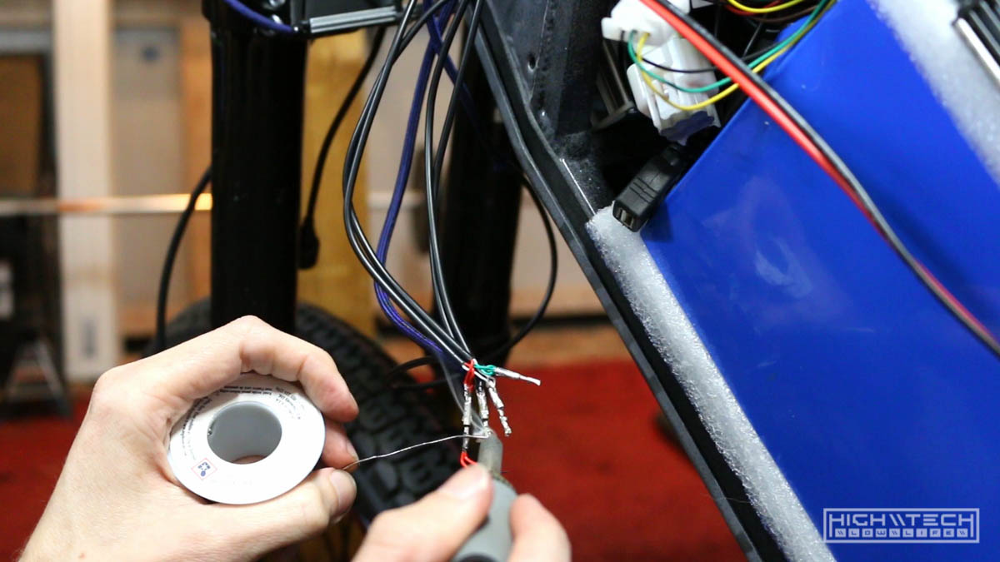
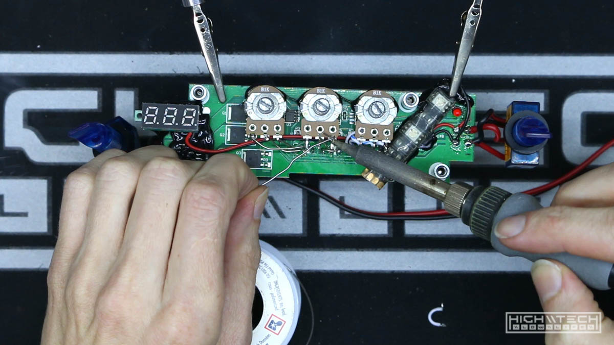
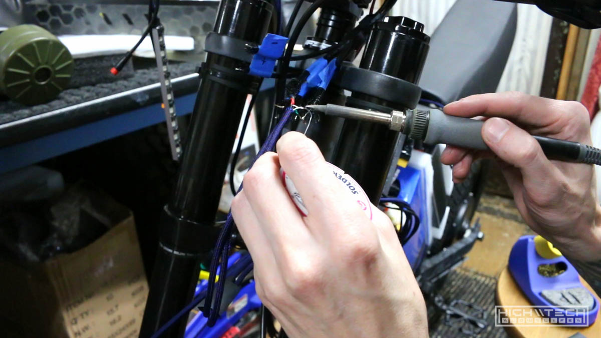
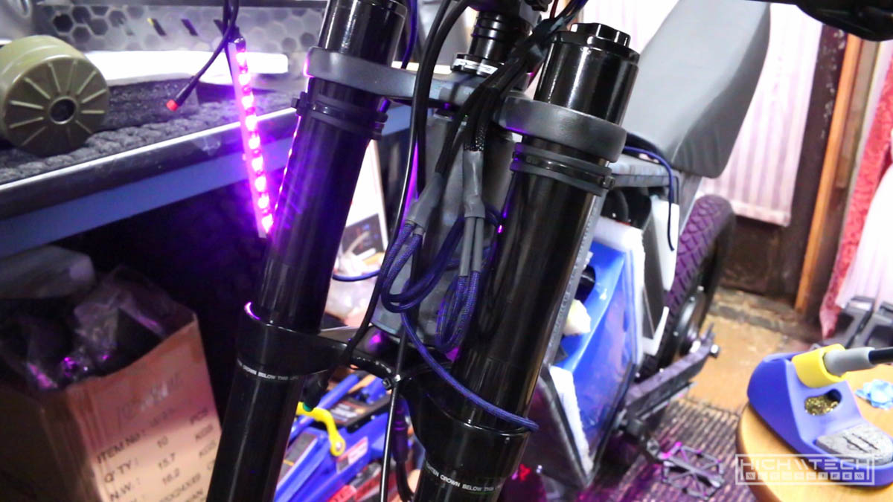

# \\\ Ebike [3.0] - The Build - Part 3 - \\\

<iframe width="1024" height="576" src="https://www.youtube.com/embed/AwfnyICYAkE" title="YouTube video player" frameborder="0" allow="accelerometer; autoplay; clipboard-write; encrypted-media; gyroscope; picture-in-picture" allowfullscreen></iframe>

In this episode we tackle trying to figure out what is going on with this throttle, and also designing and building the edge-lit acrylic LED controller dashboard. 

## Throttle woes (part 2)

At the end of the last episode I had some issues with the new throttle I bought having a 'female' connector and then realizing that the controller also has a 'female' connector and that's not going to work out. I had some connectors left over from trying to add a display to the 80A controller and that didn't work, so I spliced on a 'male' connector and then tried it out and it didn't work either, so I was kind of stumped as to what was going on. Everything seemed to be working fine when reading it with my multimeter, stumped for now but I will figure it out later. 

So on to the next thing...

## LED strips

After making so many LED strips I had to tie them all together so that I could get 7 (x4) wires and deduce them down to 4 (x4). It was a lot of soldering but I got it done! 

## Acrylic dashboard

Now to start the design and prototyping of the edge-lit acrylic dashboard. I reused some assets from my previous dashboard I had made (mainly switches and LED holes). I also incorporated some of the design cues from the paint job by reusing the stencil 'digital' elements. You can see the progression from the rough draft, to further refinement from top to bottom. 

After engraving and cutting the protoype out of acrylic, it is looking good and all of the holes do appear to be correct. 

I'm making the dashboard modular so that I can just unplug one connector and two bolts and remove the dashboard completely. I had a PCI-E extension cable that worked well for implementation, as it has 6 pins which would account for power, ground, and then the 4 RGB channels (red, green, blue and Vcc). Because these wires are all black, I'm just labeling them so I don't lose my mind later. 

Continued wiring on the dashboard, just soldering the power wires so I could run a test with power to it. 

Running a test with the dashboard LEDs and connecting a 12v voltage readout. This wasn't necessary at all as I don't forsee a reason to monitor the low voltage circuit, but it does look really cool on the dashboard which is the real reason for having it there. 

I took a detour when wiring up the headlight switch to test the headlight. This is headlight #2 due to my first headlight idea being unsuccessful, I ran into another issue with this headlight because it has a 'soft switch' meaning that when power is applied to it, it will not turn on automatically. You must then hit the power button to turn on the headlight and cycle through the brightness modes. I wanted my headlight to be on a mechanical toggle switch so this would not work for my setup. Instead of just giving up on this light I figured I would at least try to rewire it to work how I wanted. This actually did work, however only for a brief moment. My first attempt was to just jump the pins on the 555 timer to trick the circuit to come on immediately when power was applied, but this didn't do anything. My next attempt was just 'hot wiring' the power wire to bypass the timer altogether so it was supplying power directly to the light. This did work, but only for a second until it burned out and then didn't ever turn on again. So this was a failed attempt #2! Oh well, time to get even another headlight! 

Back to the dashboard build...

After getting things where I wanted finally, I was able to tack everything down and protect it with some hot glue. Because I refined the wiring so much I wanted to do even more cleanup of the wiring so I decided to try and tackle the little white wires that went to the RGB potentiometers. 

I needed to tack down the pots with hot glue so they wouldn't be flopping around everywhere when I was trying to solder them. 

I tried my best to clean up these wires and make them shorter, but they were so cheaply made that they kept breaking as I was manipulating them. I would make one short and then when I tried to strip the end it would just end up breaking off... too short, so then I had to try and get another strand going and then I just was getting frustrated because it wasn't the easiest to work with these wires. 

I decided to try going with some rigid solid-core wire and without insulation, it looks really cool and I'd be basically just using air as the insulator, as long as the wires had some gaps and weren't touching everything would be a-ok. This not only looked much cleaner, but also a lot cooler! 

Check out the final wiring! It looks really clean. 

Now after putting the dash back together it's time to try it on the bike, it fits very well! 

Just cleaning up and organizing the LED wires that are going to the 6-pin connector to connect the dash, once we have this wired up we can give the LEDs a test with the dash! 

Success! With everything wired up, all of the LED strips are working with the dash controller, so cool! 

Here is the full prototype, all wired up and working, it was a lot of work to get it to this state but it was worth it. 

We still have a lot more to go so check out the next part! 

## Continued in [part 4 >>](https://hightech-lowlife.github.io/projects/009_digi_camo_ebike_part4/009_digi_camo_ebike_part4)

