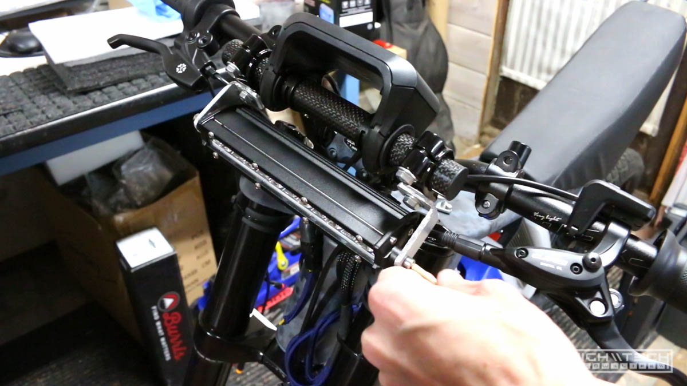

# \\\ Ebike [3.0] - The Build - Part 4 - \\\

<iframe width="1024" height="576" src="https://www.youtube.com/embed/CDnshKJIRDc" title="YouTube video player" frameborder="0" allow="accelerometer; autoplay; clipboard-write; encrypted-media; gyroscope; picture-in-picture" allowfullscreen></iframe>

In this episode we finally land on a headlight solution, and also figure out what was going on with the throttle! We also fully complete the edge-lit acrylic dashboard and it came out awesome! 

## Headlight (part 3) - third time's a charm

I finally got a headlight that will work with my toggle switches because it's just a 12v light! This is a 15W 7-inch LED light bar, the kind used for off road vehicles, it's super bright and is better than a regular 'bike' light. I didn't have a connector so I built my own using a 4-pin molex connector and some hot glue. 

## Throttle woes (part 3)

I finally figured out the throttle issue, it's because the waterproof connector I soldered one while it was a male to female, it must have been made by a different manufacturer. The reason is because for one the yellow they used was not the same as the controller yellow, but also that the internal pins did not reach far enough to make contact with the other connector. So even though it seemed like it fit, there was no contact going on which is why it didn't work. I finally figured this out by fitting one of my cut off connector ends and testing the leads and nothing was happening on my multimeter, to me the only reason this could be is if the connection actually wasn't being made. After getting a new connector that actually fit (and touched contacts) did it work! 

## Mounting the headlight

Because the brackets that came with the light were not long enough I had to do some modifications to them. The 8mm bolts for the handlebar clamps I had would not fit through these holes so I had to make them bigger. 

I also needed to extend the light away from the bars and the only real way to do that was to create my own extension brackets. I just used some scrap piece of aluminum and made two angled pieces. 

After cutting them up I used the angle grinder to finish them off and also the hammer to pound the 90 degree angles into them! 

I had so much weight on the handlebar extension now that it started to slip and sag, no matter how hard I tightened it. I fixed this by wrapping the bars with some electrical tape to make them larger. If they had supplied rubber gaskets then it probably wouldn't have slipped, but this hard plastic slid too easily on the hard aluminum bars. I cut notches into the gaskets to help them dig into the tape as well like teeth. After that they didn't slip at all. 

With all of my mods and custom brackets I was finally able to mount the headlight! 

## Finalizing the edge-lit dashboard

Now that the prototype was working and fitting as it should, it was time to recut the acrylic but this time in the fancier 'cast' acrylic. The cast acrylic engraves with a much higher contrast. 

I was very happy with how it turned out after peeling off the protective layer to be able to see it. 

Here is a side by side comparison from the cast (top) with the extruded (bottom). You can clearly see the difference between the engraved graphics being much clearer and pronounced on the cast acrylic. 

I decided to make the LED strip that is going to be providing the edge lighting to the dashboard actually part of the dashboard wiring. This is so I don't have another connector I need to install and take off whenever I want to remove the dash from the bike. This RGB controller is so cool because it has so many pads to add more and more LEDs to it. 

I didn't want this little 3-led strip blinding my eyes and detracting from the dashboard, so I muted and diffused the light by giving it a coat of blue sharpie. I also coated the shiny bits on the pots because it made the text above them easier to read. 

One of my little 12v readouts didn't survive all of the hacking, so I had to swap it out with a different unit. Good thing these things are only like 25 cents! 

Finally zip tying up the LED strip and cleaning up the final bit of wiring and it's good to go! 

Here it is fully completed and in all its glory, I think it came out great! 

A shot of the backside, it's not perfect but definitely much cleaner than it was. 

Ready to be mounted on the bike! 

We only have a small bit left to go so check out the final part next! 

## Continued in [part 5 >>](https://hightech-lowlife.github.io/projects/010_digi_camo_ebike_part5/010_digi_camo_ebike_part5)

