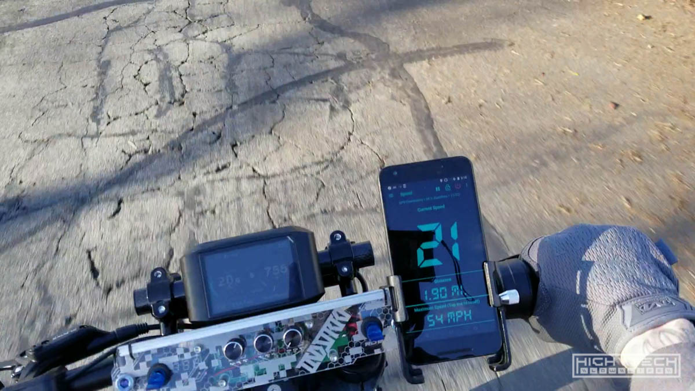

# \\\ Ebike [3.0] - The Build - Part 5 - Final \\\

<iframe width="1024" height="576" src="https://www.youtube.com/embed/EzwQQsD23RA" title="YouTube video player" frameborder="0" allow="accelerometer; autoplay; clipboard-write; encrypted-media; gyroscope; picture-in-picture" allowfullscreen></iframe>

This is the final episode! We finally mount the fully completed dashboard , and the headlight! After that we take it out on the road and give it some high speed runs! 

## Dashboard - fully completed

I finally got a headlight that will work with my toggle switches because it's just a 12v light! This is a 15W 7-inch LED light bar, the kind used for off road vehicles, it's super bright and is better than a regular 'bike' light. I didn't have a connector so I built my own using a 4-pin molex connector and some hot glue. 

## Headlight - finally mounted

I finally got a headlight that will work with my toggle switches because it's just a 12v light! This is a 15W 7-inch LED light bar, the kind used for off road vehicles, it's super bright and is better than a regular 'bike' light. I didn't have a connector so I built my own using a 4-pin molex connector and some hot glue. 

## Buttoning it up

This is the final time I had to screw on the side panels and it sure felt nice.    

## Literally the 'final touches'

I did have some trouble with the front forks even after I had painted them, so they got slightly scuffed up, nothing a bit of touchup paint couldn't fix. Oh and the back wheel had some pretty deep gashes, so I covered those up as well.    

## Paint admiration

It's the not the most incredible paint job, but I do thing I did a pretty good job of emulating this subdued urban digital camo pattern. Mine has a bit more blue and less dark gray, but still it came out quite well! 

## Speed runs!

It's literally stupid to go this fast on a 'bicycle' but I know a lot of people would probably ask 'what's the top speed' so with this configuration it topped out at 54MPH on the GPS which is incredible! The bike is really only limited by the battery BMS at this point with a limit at 50A, if I install a different battery with a higher rated BMS I'm certain this bike could go much faster, but there really isn't much of a point to it as going this fast is terribly scary enough.  

## More riding and some glamour shots

The suspension feels very good and the seat is also very comfortable. This bike is a joy to ride. 

This is probably only going about 35MPH but it feels like you're going 1000! 

The dashboard looks so cool, especially when lit up! 

The edge-lit acrylic pieces really make it stand out a lot at night, I'm not a huge fan of RGB but when paired with acrylic it does look extra cyberpunk and it's because of that I cannot resist adding them to my projects

It was a very long journey but it was worth it in the end. It looks amazing and rides very well I couldn't really be any happier with how it came out and I learned a ton a long the way. It wasn't one of those projects that just flew together easily, but with each little hurdle that was surpassed it really was enjoyable to build. 

