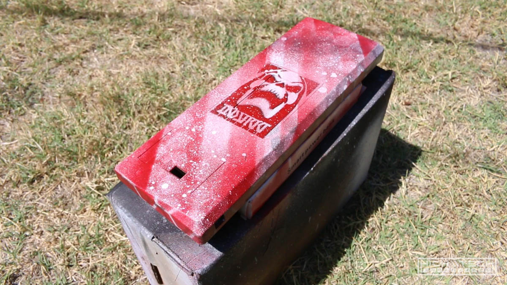
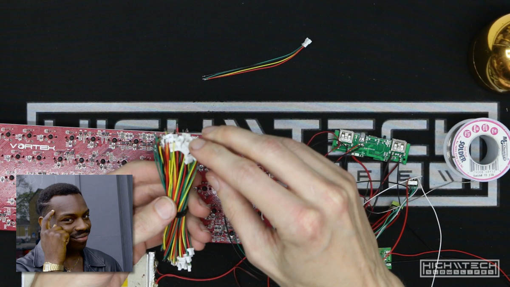

<div class="video-container"><iframe width="1024" height="576" src="https://www.youtube.com/embed/2Df7Dh3-3o0" title="YouTube video player" frameborder="0" allow="accelerometer; autoplay; clipboard-write; encrypted-media; gyroscope; picture-in-picture" allowfullscreen></iframe></div>

# \\\ WASD CODE VP3 (or Vortex Pok3r if you're nasty) 60% Wireless Keyboard Conversion \\\

👏Here👏we👏go👏again👏 

I already did a wireless mechanical keyboard build a tiny bit back, but here is another one in an even smaller package. To me, this makes more sense to convert to wireless because when I think of wireless keyboarding, I think of on-the-go, throwing your little snack sized keyboard in your backpack and then deploying it quickly and easily to pair with your laptop or phone. 

If you want a more in-depth tutorial please check out the one I wrote here: [Wireless Conversion Tutorial](https://hightech-lowlife.github.io/projects/004_wireless_keyboard/004_wireless_keyboard)

This isn't really a tutorial because it's basically the same overall theory/implementation of the wireless build in the TKL, but this was quite a bit more challenging than my previous (larger) mech keyboard to wireless build. It's not impossible, but the difference in difficulty compared to the larger board is levels above, so don't say I didn't warn youuu! 


# \\\ Build \\\

## Case Modifications


I made things more difficult for myself because I wanted to shove the biggest battery I could into this tiny little case. To do that I had to hollow out some of it, remove some supports, and in general just dremel my way into making room. 


I shouldn't have started with case modification before even finding out if I could pull off the wireless conversion, but hey I'm doing it! 

It's not 'perfect' but I think it came out pretty good, I was much looser with my painting on this one. I'm not particularly fond of red, but I had a lot from a future project so I decided to use some of it up here. 


Need to make a hole for the power button.

## Wireless Conversion

Here comes the hard part! I first wanted to attempt just attaching the wires to the USB port to see if this was even feasible. The Mini USB ports have 5 pins, but one is the ID pin which is ignored. The white data line is further inside the connector for this pin, so I'm now attempting to go at it from the top of the PCB, this was hard because the pin is between the PCB and the top plate. My giant soldering iron wasn't easy to get into this spot. 

I knew I only needed one good touch to get it to solder correctly and after many attempts I finally got it! 


After getting that wire soldered, I needed to thread it through the PCB to route it down and near the other wires. 


Hooking up the other 3 wires was pretty easy in comparison. Time to test and see if this will even work. 


Wiring up the BT-500 to test out if I can hook this up wirelessly and my test worked! Ok so even though it technically works, this is not possible to use because there is no way to charge the battery because the pins are always directly contacting the keyboard. They wires for power and ground need to be separated so that it first gets passed through the charge circuit, and then goes into the keyboard. 

This is illustrated in my infographic, see panel 1 and 2: 

[(use the pdf to zoom)](infographic.pdf)


I'll have to clip the wires at the back of the USB port so I can intercept these. 


After some more soldering, now we power and ground leads coming and going from the back of the USB port. 


After some more soldering, now we power and ground leads coming and going from the back of the USB port. 


Now that I got those working I decided to challen myself even more and set up splits for the data wires now - (check back with the infographic) Now we have 7 wires to the back of this Mini USB port (1 wire on the topside of the PCB). This will allow me to switch from wired to wireless mode! 


Those wires are going to allow us to control the relays off of the single power switch by hijacking the 'flashlight' LED function of this charge circuit PCB. 


With everything in this state it was time to make sure everything worked, now we use the keyboard wired and wirelessly and also charge both wired and wirelessly! 



Because the PCB is connected to the case now I was thinking smart by getting some small blade connectors to make it so I could detach the case from the PCB more easily. 


The seller on eBay sent me some mismatched pairs though so the connectors wouldn't connect together! I couldn't continue without the matching pair so I decided to forego this connection and just hard wire them together. 


I forgot to add the LED holes to view the state of charge on the charge circuit PCB, so I'm adding them now. I didn't quite make them perfectly straight so I tried to compensate by elongating them slightly, it came out decent. 


Cleaning up and tacking everything all down. 


Buttoning up the case and reinstalling the keycaps! 


Buttoning up the case and reinstalling the keycaps! 


Testing it out and everything works as it should.


It was quite challenging but after a lot of effort everything works and it looks pretty cool! 


Some recommendations:
- I'm sure these links will break so it helps to know what to search for. eBay or AlieExpress will net you what you want, most likely Amazon will as well but I haven't sourced from there personally. 

Charge Circuit: 
- [This most likely will work](https://www.aliexpress.com/item/1005001374265342.html?spm=a2g0o.productlist.0.0.5a3576a4JXtj7l&algo_pvid=686d729f-e1b9-42d4-9f35-9a1fd3cd6ced&algo_exp_id=686d729f-e1b9-42d4-9f35-9a1fd3cd6ced-22&pdp_ext_f=%7B%22sku_id%22%3A%2212000015851249830%22%7D)
"usb power bank pcb" or "dual usb power bank pcb". The only real requirement is that they can be turned off when a load is applied. 

- Another seller I recommend is [HengCheng](https://www.aliexpress.com/store/group/For-3-7v-li-ion-bms/812679_514736790.html?spm=a2g0o.store_pc_groupList.0.0.35864d21zn1ae1)
You can even use USB Type-C with PD for faster charging, like this board: [Quick Charge 3.0 Power Bank Part PD3.0 Li Ion Battery Pcba Supply Circuit Board PCB 5v2a 9v2a 12v1.5a Booster Module USB](https://www.aliexpress.com/item/33039428180.html?spm=a2g0o.productlist.0.0.370d60e2GiuXv0&algo_pvid=22170dc3-a98b-4dd0-a6c0-b5a95f3fad7f&algo_exp_id=22170dc3-a98b-4dd0-a6c0-b5a95f3fad7f-43&pdp_ext_f=%7B%22sku_id%22%3A%2267349461701%22%7D)

Battery:
- [This seller has some batteries](https://www.ebay.com/str/tesky12)
It's kind of hard to search by dimension (at least on eBay), using "3.7v lipo battery 3000mah" will get you some good results. If you start looking in the 3000-4000mah range it should be in the ballpark for the dimensions you need, just dig through them to find the largest pack that will fit. 

How to calculate your run time? 
Use a USB meter to see how much power your keyboard is drawing, then add 0.05a for the BT adapter (and maybe a little extra for charge circuit loss). 

Then input your values into this calculator [Mah-Hours Calculator](https://convert-formula.com/mah-hours)

Or you can do the math:
(mAh)/(Amps*1000) = (hours). For example, if you have a 3000 mAh battery that runs at 0.2 Amps (0.2Amps = 200mA), then the time that the battery will last for is (3000)/(0.2*1000) = (3000)/(200)= 15 Hours.

```
Battery: 3000mah (approx) @5V

104 medium brightness (brightness 3)
Full charge run time - 17 hours! 

87 medium brightness (brightness 3)
Full charge run time - 27.5 hours!

61 medium brightness (brightness 3)
Full charge run time - 25 hours!

Bluetooth adapter: 0.05 - 0.055a, manual says 40ma

--- 60% ---

CODE VP3 (60%) (Vortex Pok3r 61-Key)
amps: 0.089 (no backlighting)

amps: 0.094 (brightness 1)
amps: 0.099 (brightness 2)
amps: 0.110 (brightness 3)
amps: 0.121 (brightness 4)
amps: 0.139 (brightness 5)
amps: 0.158 (brightness 6)
amps: 0.185 (brightness 7)
```

I'm not done with this keyboard, this is not it's final form so please stay tuned for Part 2!
