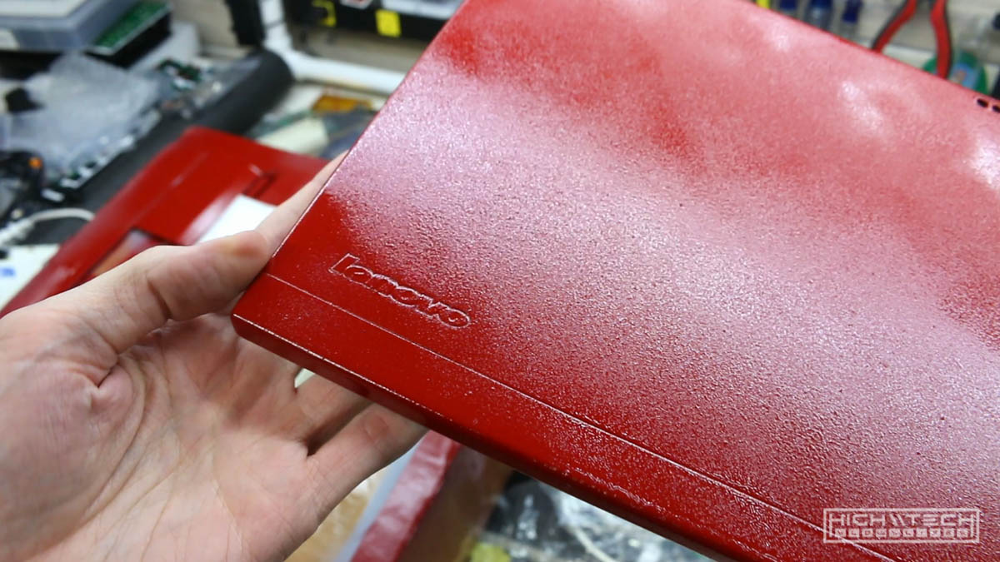

<iframe width="1024" height="576" src="https://www.youtube.com/embed/775l_xc7-ho" title="YouTube video player" frameborder="0" allow="accelerometer; autoplay; clipboard-write; encrypted-media; gyroscope; picture-in-picture" allowfullscreen></iframe>

# \\\ AKIRA (Kaneda's Bike) Thinkpad Lenovo X230 Laptop \\\

01:27 - Laptop disassembly
03:05 - Paint preparation
04:34 - Painting!
05:38 - Painting issues (part 1)
06:35 - Painting issues (part 2)
07:33 - Painting nightmare (part 3) 
09:56 - Printing preparation
10:38 - Printing!
14:56 - Kaneda's bike

After successful completion of my previous Lenovo Thinkpad W541 laptop painting project (you can [find that here](https://hightech-lowlife.github.io/projects/005_camo_w541_laptop_painting/005_camo_w541_laptop_painting)), I wanted to challenge myself some more with an Akira themed build. Akira is by far one of my most favorite cyberpunk anime films I have ever seen and there is nothing more iconic than Kaneda's bike! I have had this idea in my head for a very red thinkpad for a while now and I wanted to bring it to life. 

I took a regular Lenovo Thinkpad X230 I bought on eBay for about $100. The laptop was in pretty rough shape but I didn't care because I was essentially going to be refinishing it anyway. 

## Specifications

Here are the specs of the system:
Lenovo Thinkpad X230
- Intel i5-3320M
- 8GB RAM
- 256GB SSD
- 12.5" IPS display

## Disassembly

First up was disassembly the X230 so that I could separate the electronic parts from the casing so that when I painted the case it wouldn't affect the electronics. I guess you could get away with just painting it without separating, although it would take a lot of masking - I think it's just easier to disassemble it. I also was going to be adding some modifications and upgrades, so I had to take it apart anyway, but I'll get into those in the next part of the project. 

## Paint Preperation

After that it was time to prep for paint, this involves sanding down the pieces so that there is adequate texture for the paint to stick to. I then laid down some primer layers, and then got to spraying on the red. It was looking pretty good so far. 

## Painting!

Everything was going pretty smoothly but I had a *heck* of a time getting the top panel painted correctly. After many attempts and resanding I finally got it laid down smoothly. I think this was an issue with the rubberized coating on the top panel that maybe was deteriorating under the paint? I can't really think of any other explanation because the other panels came out pretty well, and it was the same conditions for the top panel. Same paint, same painting technique, same time of day, temperature, humidity, everything! The only difference was that it was a different panel.  

Initial painting was thought to be going well...

...oh no, that didn't come out well. Why is it so splotchy and textured?

I thought maybe if I just sand down the top layer smooth again and add another layer it would fix it!

And it did, for almost all of the parts, except for this darn top panel. 

Since 'adding more paint' fixed everything last time, I did that again and well, yeah worst run yet.

Time to start all over from scratch. This was hell to get through, easily 2 hours of scraping obscenely thick layers of paint off of this top panel, then even more time sanding. 

Finally success!

After all of my painting woes were finally over, I could move on to printing the graphics! 

## Printing

Setting things up digitally.

This was still going to be nerve-wracking but it was more fun than painting. I first did some outline prints by covering the pieces in cling wrap so that I could check the print for alignment, then after everything was good to go I hit the 'go' button and crossed my fingers in the hopes that everything would print correctly and it did! It came out incredible! 

## Kaneda's Bike Figure

Of course I had to justify purchasing this figure, you know, for comparisons... 

Not bad for an off the shelf Rustoleum "Regal Red" spray can! 

This this is nearly all metal die-cast, is super heavy and totally cool!

Good for health! 

That's it for this part, but check out the next part where I fully complete the build and add a bunch of mods!
