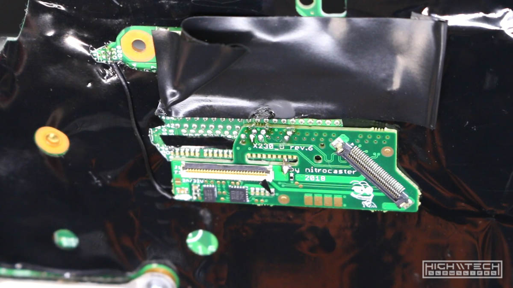
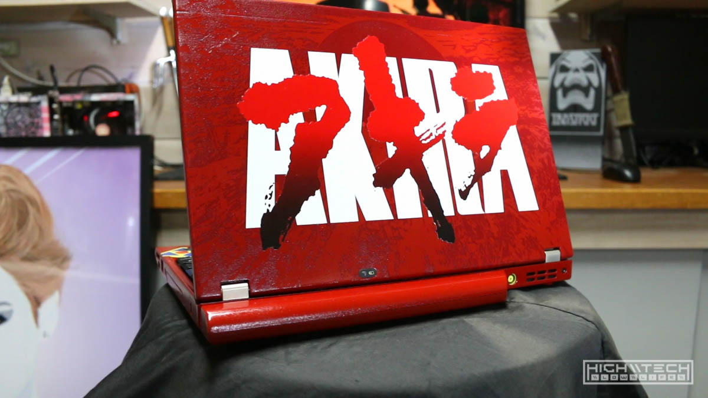

<iframe width="1024" height="576" src="https://www.youtube.com/embed/vVhLR11Bf6c" title="YouTube video player" frameborder="0" allow="accelerometer; autoplay; clipboard-write; encrypted-media; gyroscope; picture-in-picture" allowfullscreen></iframe>

# \\\ AKIRA Thinkpad Lenovo X230 Laptop - Part 2 \\\

This is part 2 of transforming my cheapo stock Lenovo Thinkpad X230 into an AKIRA themed iconic red machine (Kaneda's Bike)

In this final part we implement a really cool mod made by the Russian bada$$ Nitrocaster, you can pick up this mod here on his website: https://nitrocaster.me/store/x220-x230-fhd-mod-kit.html this mod allows you to stuff in a full HD panel into your tiny 12.5" X230, the panel I put in here (LG LP125WF4-SPB1) looks *incredible*!

Also on the dockett is upgrading from 8GB of mismatched *blechhh* ram, to 16GB of matching ram! We're also tossing in a 240GB MSATA SSD, I threw in a new 500GB SSD for data, and finally a Korean X220 keyboard!

## Reassembly Preparation 

Now I can start removing the masking tape since we're done with painting. 

## RAM Upgrade

The first thing I wanted to address was the RAM, this came with 8GB of RAM but it was mismatched so I opted to throw some new 16GB modules in there that are matched!

## Nitrocaster's FHD Panel Upgrade

After that it was time to upgrade the panel, I used [Nitrocaster's FHD mod](https://nitrocaster.me/store/x220-x230-fhd-mod-kit.html) to upgrade the panel to a FULL HD IPS panel, this was a bit tricky to install, but well worth the effort because the difference in panels is night and day. 

After following all of the steps in the instructions I was able to solder the daughterboard to the motherboard.

I then threw in the new panel, I had to (as per the instructions) chop some bits of the corner off of the new panel (amazing LG LP125WF4-SPB1) to allow clearance for the hinges. 

## Reassembly + MSATA upgrade

While assembling the motherboard into the casing, I also threw in a MSATA 240GB SSD for the boot (operating system) drive, and also later upgraded the regular SSD to a 500GB for storage. 

## X220 Keyboard Upgrade

After putting everything back together I dropped in a brand new keyboard, I should have gone with a *Japanese* keyboard to fit the theme, but I can't really type in JIS layout (too weird bro), and I found this cool Korean layout for 3$ cheaper than an English one, and it's ANSI to boot! 

I had to trim off the 'raised' sides from the older X220 keyboard to make it fit into the X230 case.

I had a *heck* of a time installing the keyboard, but after 6 tries I finally got it to work and the computer would finally boot. There are TWO flaps, both of which are transparent, and you have to 'weave' your flaps over one another to finally get the right sequence. Once you know how to do it, it's simple and easy, but if you're figuring it out for the first time, it's a bit tricky. 

## Build Completion

Here are the new **upgraded** specs of the system:
Lenovo Thinkpad X230
- Intel i5-3320M
- 16GB RAM
- 240GB MSATA SSD (OS) and 500GB SSD (DATA)
- 12.5" FULL HD IPS display

## Software Setup + Final Thoughts

After that all I had to do was set up the keyboard using [SharpKeys](https://www.randyrants.com/category/sharpkeys/). The X220 keyboard isn't correctly mapped for Page Down and Pause, so you will need software to remap them. Other than that it works as it should It's finally finished! 

Also had to add [this wallpaper!](https://hightech-lowlife.github.io/projects/016_akira_laptop_part2/akira_bg_1080.png)

Overall this was a lot of work in the end. I'm super happy with how it came out but there are a few things I would have changed knowing what I know now. For one, I would have gone with the i7 version of this computer, the performance may be negligable but I just feel with the amount of work invested this deserves top grade performance. Secondly, I wouldn't have spent as much time trying to make the red look 'perfect', I should have just artifically 'weather' the paint so that it looked worn, I think it ultimately would have looked even better and it would have saved me a ton of time. 

Because I ended up putting that darker red textured overlay on the back panel, all of my paint imperfections would have been hidden anyway, and the paint didn't even have to be super gloss because it's almost entirely covered in graphics, this is what I should have done, but I was trying to make it as perfect as I could. 

I think this computer looks amazing and every time I look at it I am inspired by its cyberpunk aesthetics. I couldn't be happier with how it turned out! 
