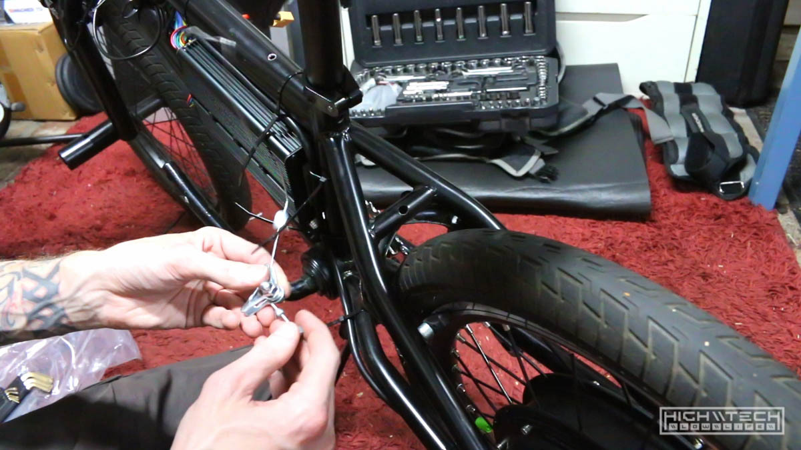

# \\\ 3000W BMX E-BIKE [4.0] PART 2 \\\

<iframe width="1024" height="576" src="https://www.youtube.com/embed/lXNw98zmL-Q" title="YouTube video player" frameborder="0" allow="accelerometer; autoplay; clipboard-write; encrypted-media; gyroscope; picture-in-picture" allowfullscreen></iframe>

# Introduction

I wasn't really planning on building another e-bike so quickly, but one of my coworkers just gave me this little BMX ebike. It's super cheap, he bought it at Walmart for like $90, it's actually not that bad! I was impressed for what you can get for $100, it even has one of those trick rotating rear brake couplers that allows you to do bar spins without binding up your cables ~ pretty cool. 

I started out this build just wanting to make a grocery-getter, something small that I could ride to the local grocery store on my break from work to pick up some food. I also was just planning on making it a beater so that if something happened to it, I wasn't going to be too upset about it. Of course I was planning on just throwing some parts at it and building it as quickly as possible, but it never turns out that way, so I ended up pouring way too much time into it and making it 'too nice'. 

## parts list

1. Bicycle ~ Walmart ~ I would link it, but of course they don't sell it anymore, it's a Walmart adult BMX bike, just look on their site for that and you'll find something comparable. 
2. Motor / Controller ~ [AliExpress](https://www.aliexpress.com/item/32268426912.html) This is a 72V 2000W kit, but I asked the seller for an IPS display and they said the only controller they had was upgraded to 50A, I was fine with that. This puts this kit at 3500W! Which is just crazy to bolt onto a tiny BMX bike
3. Battery ~ 72V 13.2AH ~ I don't recommend the pack I bought, you're better off just getting a 'full' pack instead of what I (unexpectedly) got, which is just a bunch of smaller packs jumbled together. 

I bought a bunch of other little parts to make this work, extra universal brake kits (front and rear), various nuts and bolts, etc. 

# Prepping the frame

I knew going into this project that the motor would not fit inside the 110mm dropouts on the tiny BMX bike. The axle width is 135mm, so I needed to stretch the dropouts about 20mm, which isn't too bad, that's just 1cm on each side. I have done this method a few times before on some other ebike builds, you just put a car jack between the dropouts and stretch. You will have to go over because the steel will rebound, so just go a little at a time until you get the right width. Do not do this with aluminum or carbon fiber, steel is much more forgiving, with aluminum and carbon you will probably crack or damage the metal beyond use. 

This actually went pretty well, and the only issue was that the right side crank was now hitting the frame, just barely. I'll have to address this later, other than that ~ pretty easy! I did try a few things to fix this (you can watch the video) but none of them really worked (sledgehammer, more stretching, etc...) 

Next up was removing the rear brake. When I got this bike from my friend it didn't come with a front brake, I was planning on adding a front brake, but removing the rear brake because I was going to be using regen from the motor to add braking power to the rear. I have done this on a few builds and it works very well. 

I also tore down the brake components from the front to clean things up a bit.

To fix the issue with the crank hitting the frame, I used the angle grinder to shave off about 4mm of material, there was extra steel here anyway, so it won't be affecting or compromising the strength of the cranks at all. With as much power as this bike will have, the foot pedals are basically just a place to rest your feet. 

I then wanted to remove the rear brake tabs on the frame here to allow even more room for the controller ~ I needed as much room as possible in the triangle for electronics. 

Now I needed a way to mount the battery pack to the top of the top tube. If I just rest it on there it's going to roll of the sides because it's a round tub, so I needed to fab a little 'shelf' for the batteries to sit on without them wanting to fly off the sides. I had this piece of aluminum that was originally the faceplate for an HTPC case (Silverstone) it was nearly the perfect size, just one more use for some trash ~ upcycling! 

Here you can see 'roughly' where it will sit. 

Just making the holes to mount it on the top tube. 

This is the upgraded 50A controller with the UKC1 IPS display (the only reason I went with the upgraded controller to begin with). 

This is where I want to put the controller but it's just a hair too big, I really want this here, so I will be slightly modifying the frame for it to fit. 

It was only a small amount that needed to be clearanced, so I just used a file and kept checking until I had the exact space I needed. 

And it fits!

Drilling and tapping the holes to mount the battery tray (the tray goes inside the bag)

And the tray and frame mods are pretty much completed, more to come in the next episode!
