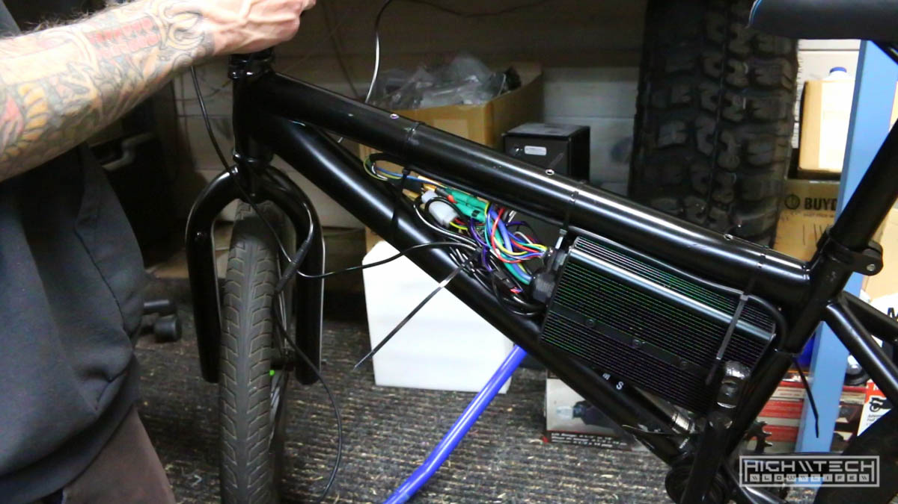
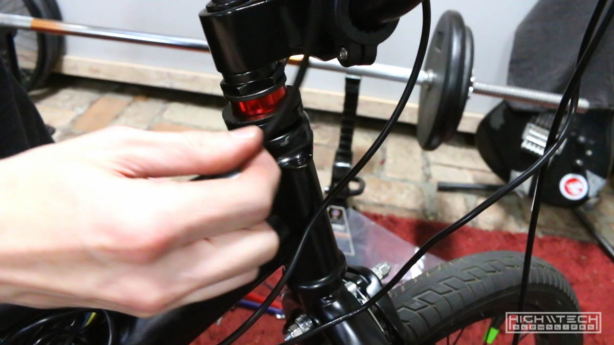

# \\\ 3000W BMX E-BIKE [4.0] PART 2 \\\

<iframe width="1024" height="576" src="https://www.youtube.com/embed/FbW5f8krzgM" title="YouTube video player" frameborder="0" allow="accelerometer; autoplay; clipboard-write; encrypted-media; gyroscope; picture-in-picture" allowfullscreen></iframe>

## Tires

In part two I start off by swapping the tire from the stock rear rim to the new motor rim. I also replaced the tubes in the front tire too ~ I swear by these 'green slime' tubes, they're much thicker and also have a 'run flat' type of liquid inside that if you get smaller punctures they will seal themselves. I now also use these plastic (nylon?) inserts that offer even better protection, after doing these mods to your tires you will no longer ever have flats! 

It's mounted!

## Batteries + Electronics

This is where a lot of my trouble started with trying to fit the batteries into the bag with the shelf I made in the last episode. These batteries barely fit in the bag just alone, so with putting the shelf/tray and then also the foam padding, the bag would not zip up, I'd have to figure out a way to remedy this. 

Once I got the motor mounted and clearanced the frame for the controller I started stuffing in all the electronics. 

## Battery Tray Modifications

I figured to remedy the issue with the bag not closing, maybe if I slim down my 'tray' so that the angle in which the bag has to overcome will give me a bit more wiggle room for the interior of the bag volume. I took a hacksaw and trimmed down about 10mm on each side! 

Even with my modified tray, they still don't quite fit! I realized that with the foam protecting the bolt heads, that I had to do away with the foam to make them fit, but this now meant that I needed bolts that were flush with the tray ~ so now it's time to get some countersunk bolts. 

This is with only one battery, and sitting flush on the tray ~ this is the way. 

## Brakes

I got some comments about my last build (digi camo) flaming me for not having a rear brake! My arguments that usually you want a larger bias towards front braking (70/30 split) and so I would only be using regen for 30% of my braking, in the event of failure I would still have 70% of my braking. Anyway, I'm putting on a front brake because this bike didn't have one. 

I tried my best to salvage the rear brake and setup my own system, but without the triangle tab to hold the outer sleeving, it just wouldn't work right. I really struggled to make it work so I wouldn't have to buy another rear brake, but c'est la vie, I had to order one ~ so I'm waiting on that to show up now. 

I actually got it to work 'kinda', but it would pull the handlebars slightly when applying the brakes, I definitely didn't want that happening. I did make it work, just not how I wanted. 

## Battery Tray Modifications [2]

Now that my new bolts finally showed up I had to countersink the tray to accommodate them. It was pretty easy! 

Flushhhhhhhhh!

Do the batteries finally fit? Well, yes... but also no, now I just need to clean up this wiring mess and then they will all finally fit, barely, but they will fit! 

The will fit! But now I noticed that the whole tray wobbles, a lot... so I will have to find a way to more securely mount this. I was skeptical of just threading into the top tube because the walls are very thin, but looks like I was right and it won't hold. I can just drill all the way through and use a nut on the other side. 

With the motor, electronics and battery just about mounted, it's getting closer to being able to test ride! Even more to come in the next episode!
