# \\\ 3000W BMX E-BIKE [4.0] PART 5 \\\

<iframe width="1024" height="576" src="https://www.youtube.com/embed/TcBWek1iFQ4" title="YouTube video player" frameborder="0" allow="accelerometer; autoplay; clipboard-write; encrypted-media; gyroscope; picture-in-picture" allowfullscreen></iframe>

# Reassembly

In part 5 we're continuing on with the reassembly now that all of the parts of painted up and ready to go. In this episode there is a lot to get through, including some additional printing as well as all of the acrylic engraving and cutting. 

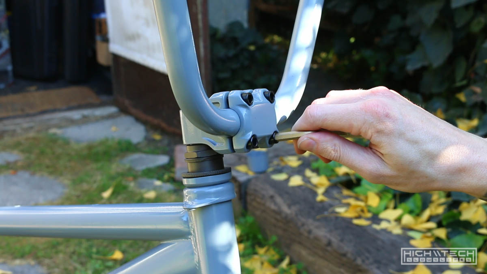
With all of the parts painting up I can continue on with the reassembly.

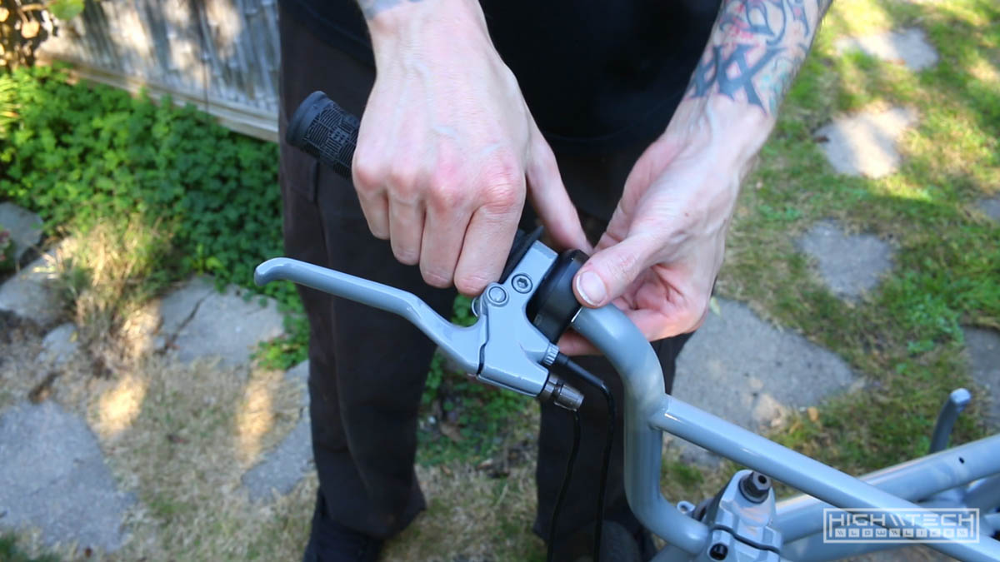
First up is the front end where I'm tackling the headset and putting on the brake levers and thumb throttle. When converting a regular bike to an ebike, you'll usually need to install more parts on the handlebars and the grips aren't really designed for this which can cause some crowding. You can remedy this by either cutting down the grips or if you have enough room, just arranging everything to fit while still retaining some ergonomics. 

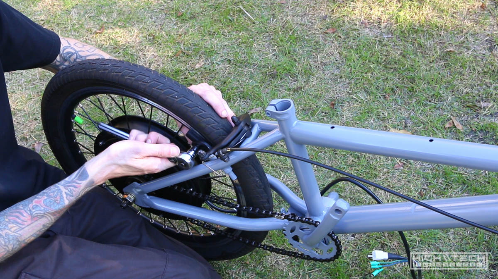
Just fitting up the rear brake back on the bike. 

Even though they're not adding to the function nor performance at all, I'm throwing on the front pegs purely for aesthetic reasons. 

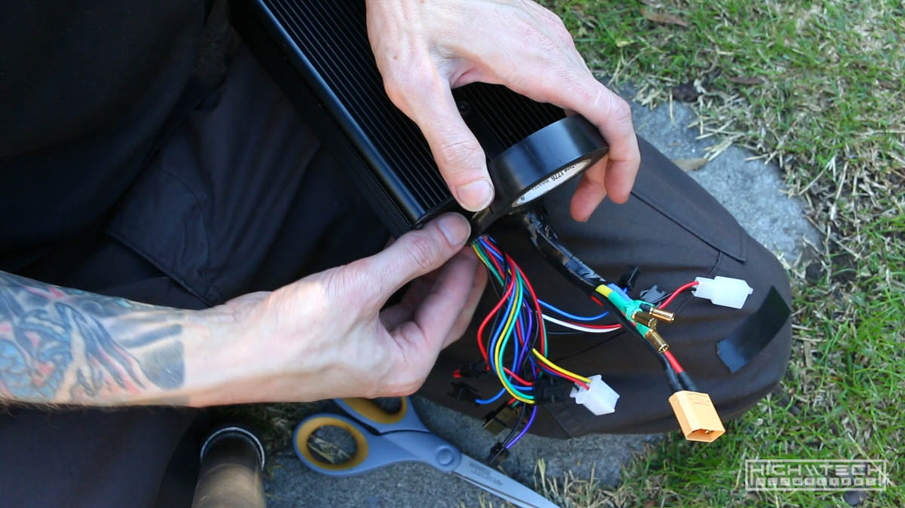
The multi-colored wires are very helpful for making electrical connections, but they aren't too sightly when you have a very muted build like this. I'm just covering the more exposed portions with some black electrical tape. 

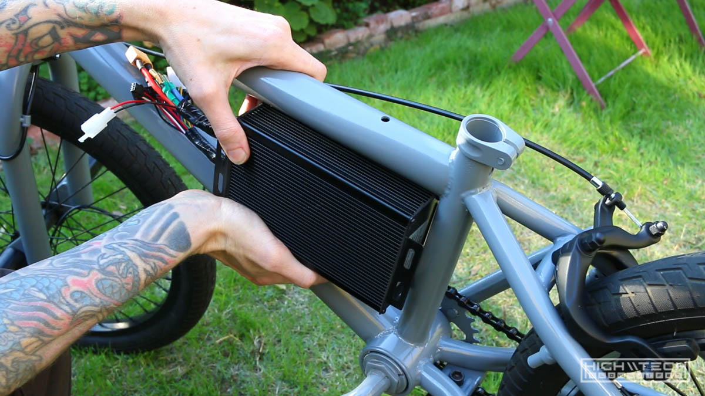
Fitting the controller back in the triangle.  

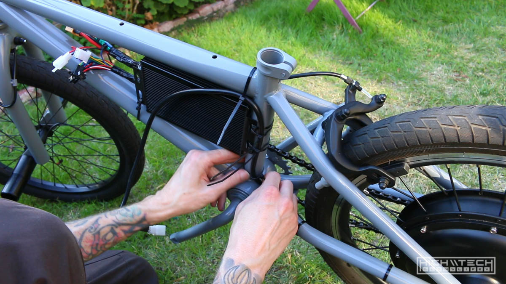
Getting started on the wire management. 

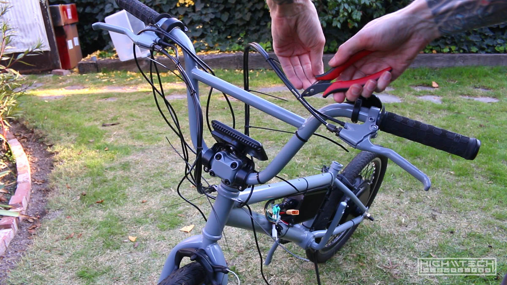
I do like to spend some time and effort in wire management and making things look clean, but personally I have found there is a diminishing return with becoming overtly obsessive with making your wires 'too tidy'. I shoot for a 6 or 7/10 job, when you thread and pull things too 'taught' then it can make repairs, maintenance, all that more difficult. 

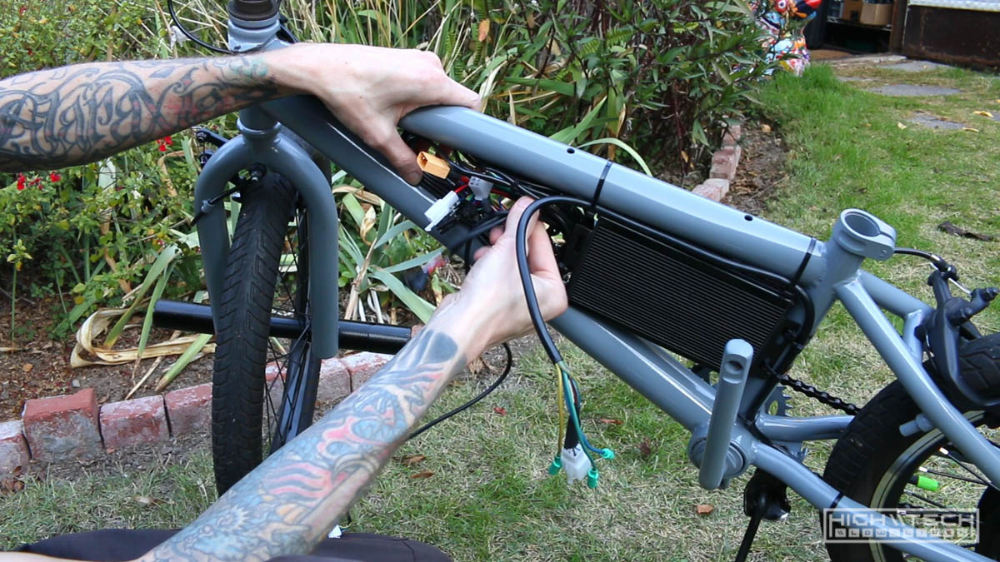
Here is a perfect example, I could have taken a lot more time to cut and splice these wires to cut down on the amount of wires I was trying to stuff in this area, but I did end up making it all fit, but man is it dense!

I kept losing the little metal endcap for the front brake wires, so I just made my own with some heatshrink. 

Another idea I had was putting some heatshrink over the grips of the levers. I wasn't quite sure how well the paint was going to hold up over time and use, and I felt that the heatshrink might protect it for a bit longer. 

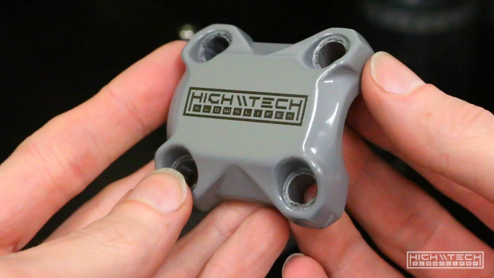
I also had the thought of doing a print on the headset, to me this came out excellent! 

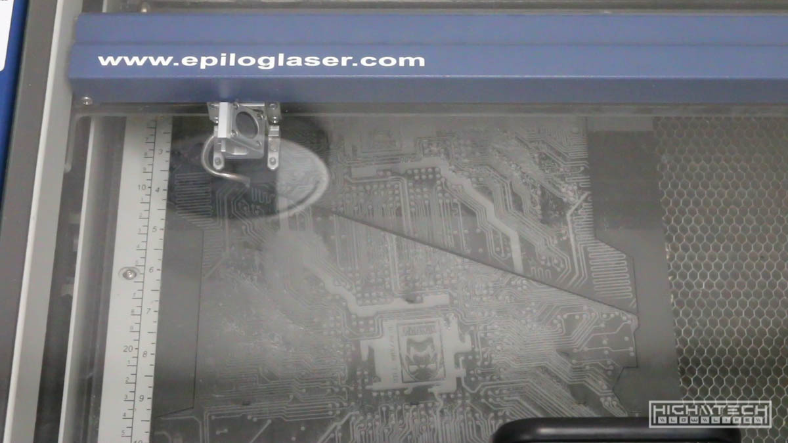
If you remember those cardboard panels I had mocked up, well here are the acrylic parts. This engraving took about 25 minutes per side! 

I thought this was going to be very low-contrast print because this was just some bargain-bin from TAP plastics, but how it came out engraved looks incredible! I was so happy to see the end result be this higher contrast, and it actually turned out gray, which matches the bike! Also the engraved portion is matted and the non engraved is very reflective, so there is just a lot of cool things going on.  

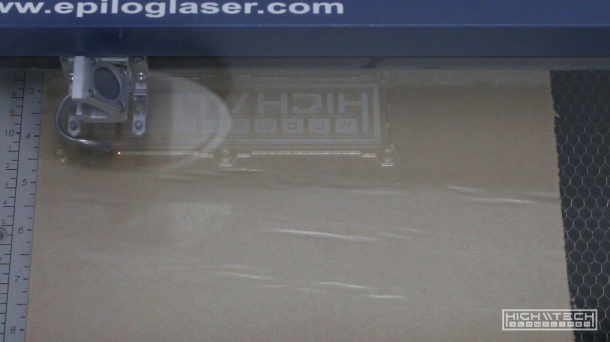
I also had this idea to print the front panel logo on a separate (clear) piece of acrylic and then mounting that to the front panel for more dimensionality.

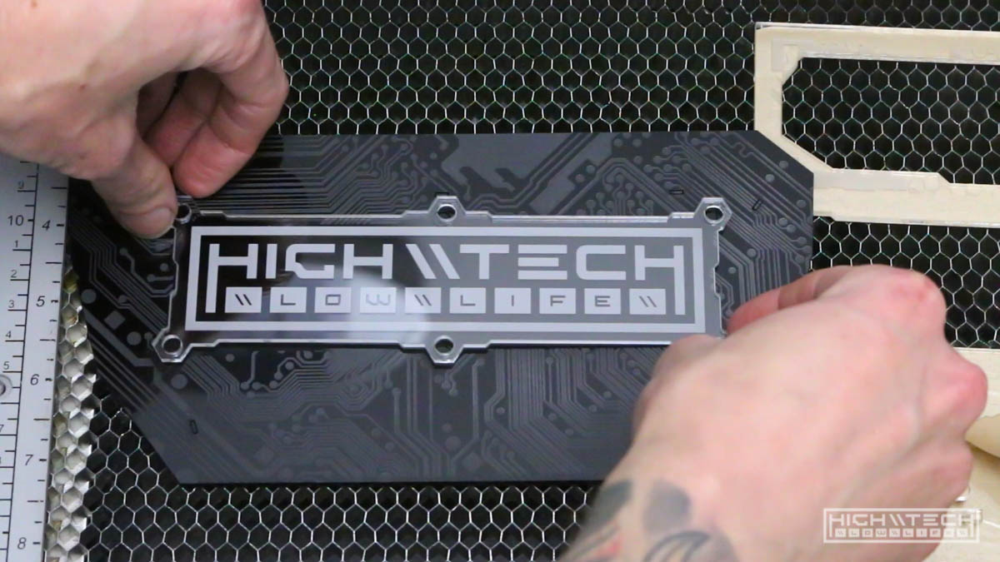
Here is what it looks like layered on top, pretty cool!

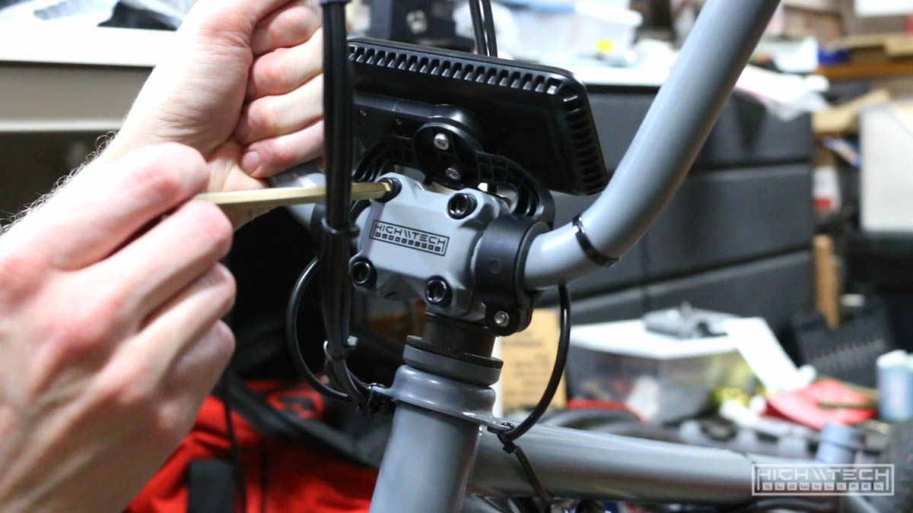
Reassembly after printing. 

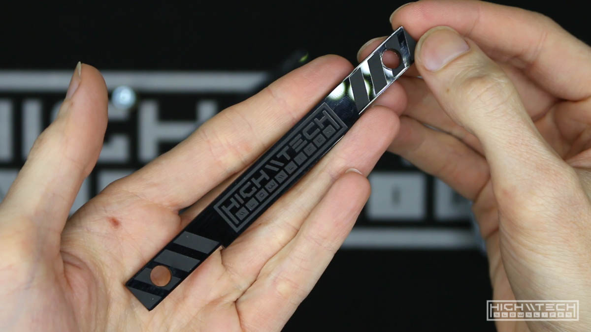
I had this idea to replace the 'reflector' with my own acrylic panel, I think it came out pretty well.  

Just heating the acrylic and then gently wrapping it around the pedal. 

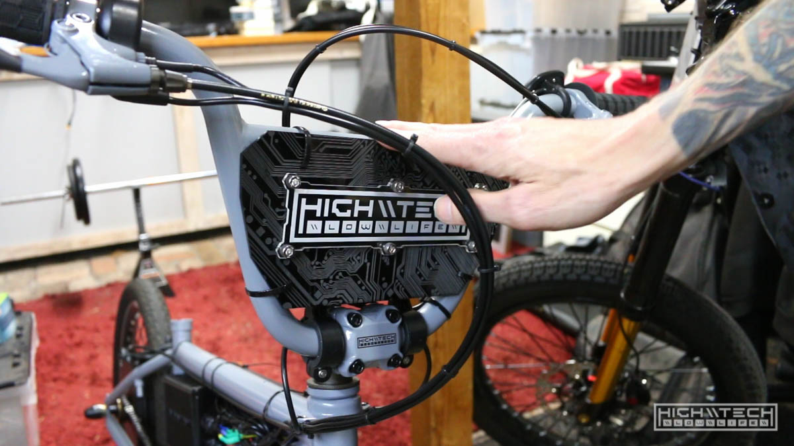
Installing the front panel with zip ties. I was thinking of just bolting this directly to the frame, but I figured zip ties would be much more forgiving not only on the frame but on the acrylic as well. 

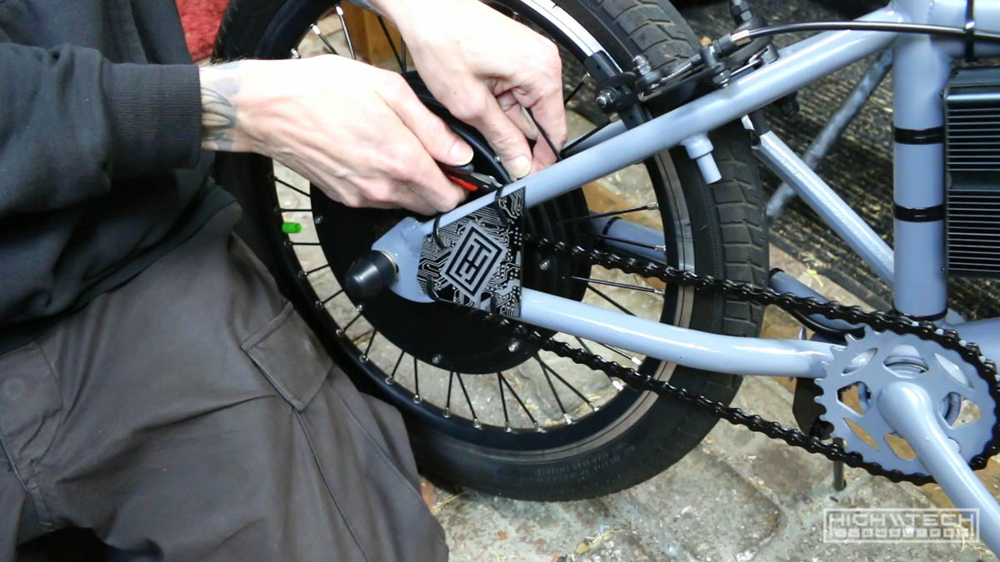
Throwing on the rear dropout panels. I was thinking of making this much bigger, but I think this smaller part breaks up and adds interest just enough, instead of being too overpowering. 

Stay tuned for the next episode where we finally complete the build and test it out with a high speed run! 
