# \\\ Mechanical Keyboard Cleanup + Modification \\\

<iframe width="1024" height="576" src="https://www.youtube.com/embed/6YhoZVnxJek" title="YouTube video player" frameborder="0" allow="accelerometer; autoplay; clipboard-write; encrypted-media; gyroscope; picture-in-picture" allowfullscreen></iframe>

My mouse died and I realized that my keyboard was disgusting so I cleaned it all up and did some modding and experimentation to try and get an even better typing experience. 

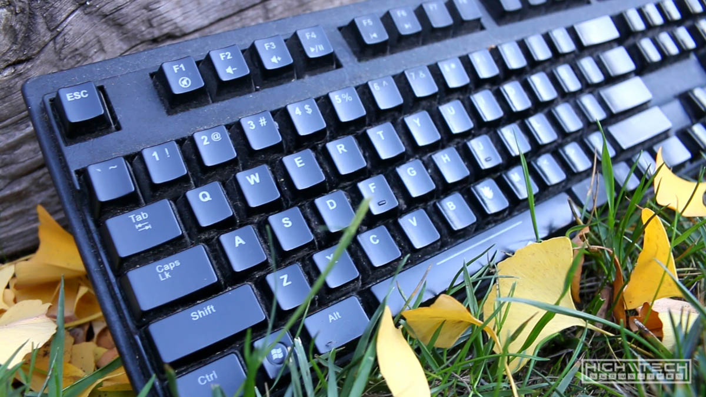

This keyboard is an X-Armor mechanical board with Cherry MX Blue switches that has shared tooling with many other "OEM" keyboards, and it's actually not that bad of a board design, obviously it has held up for a really long time. I got this board for free from my previous employer and it was just a retail sample, it's held up for more than 12 years now and it was time to give it a thorough washing and the keycaps were so worn that I figured it would be a good idea to just replace them instead of cleaning them up. 

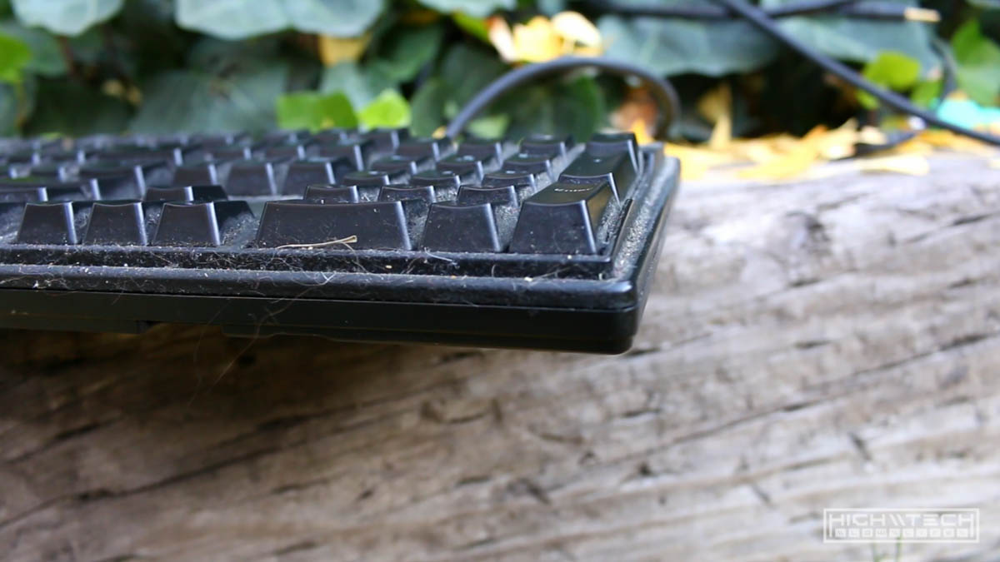

I've been thinking more about slim profile keyboards and realized that they might actually be more ergonomic, this was solidified when Zack Freedman posted a video of his board design which used low profile switches with also low profile keycaps, I figured I'd at least try to slim down this board and see how it felt. 

# Let's Get Into It 

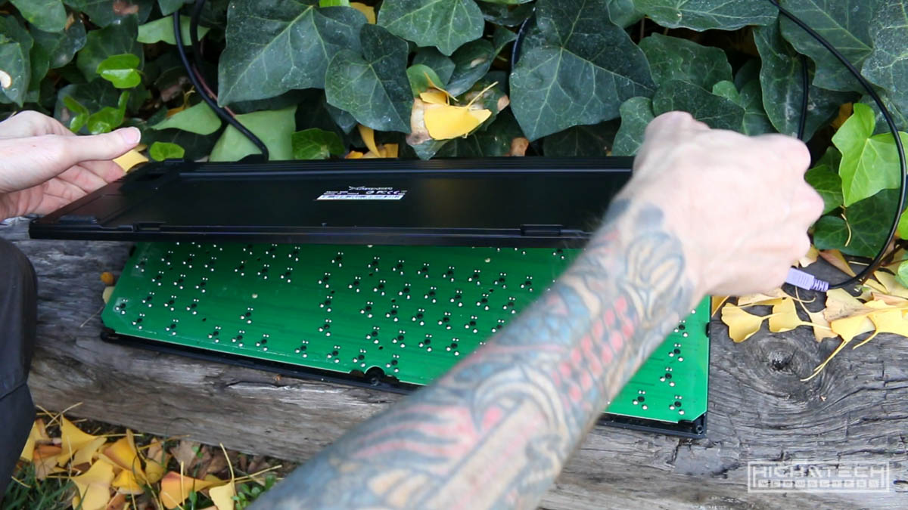
Disassembly was easy, just some screws on the bottom. 

# Cleanup On Row R4
After 12 years, things start looking pretty bad. Thankfully almost all of it came off without any solvents, just a paint brush for the big stuff, then a toothbrush for the nooks and crannies, oh and a ton of elbow grease. 

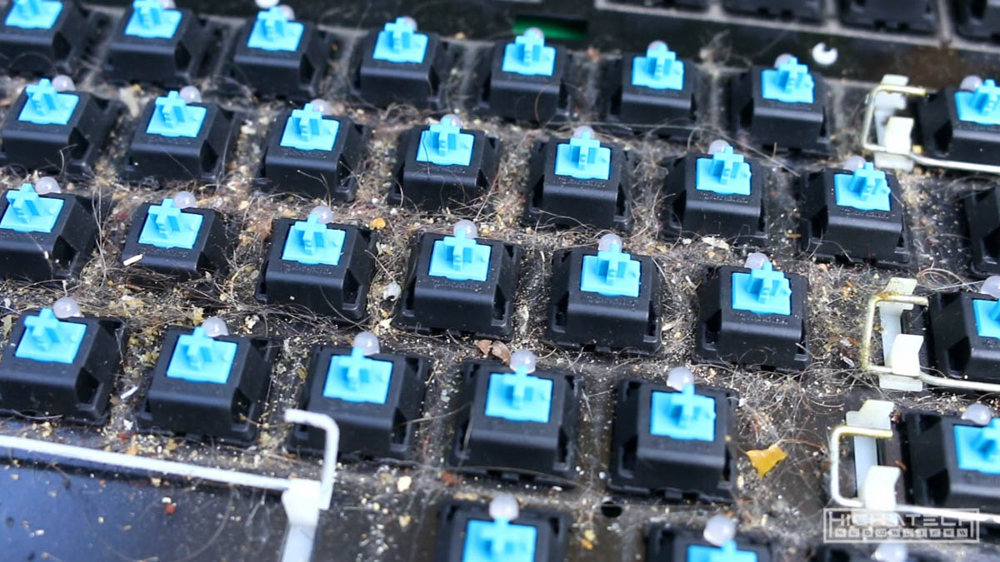

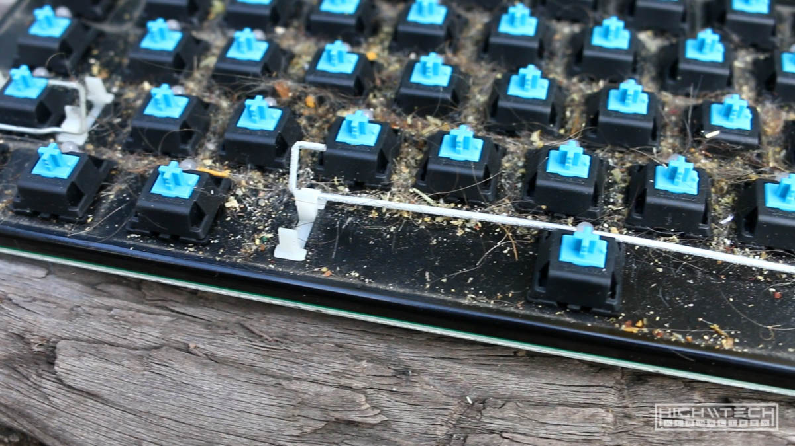

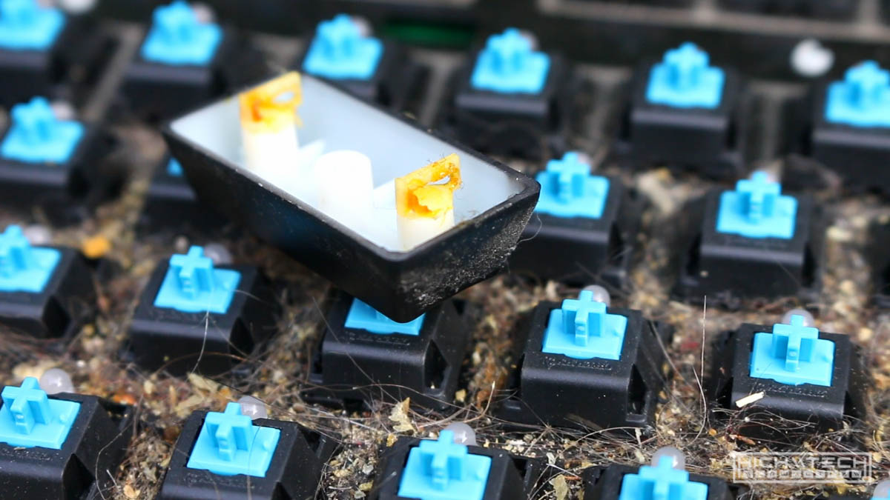
What stabilizer lube looks like after 12 years, ick. 

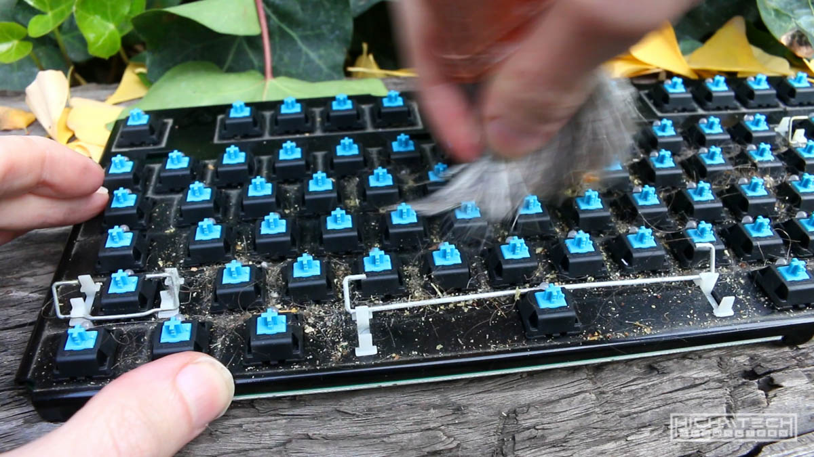

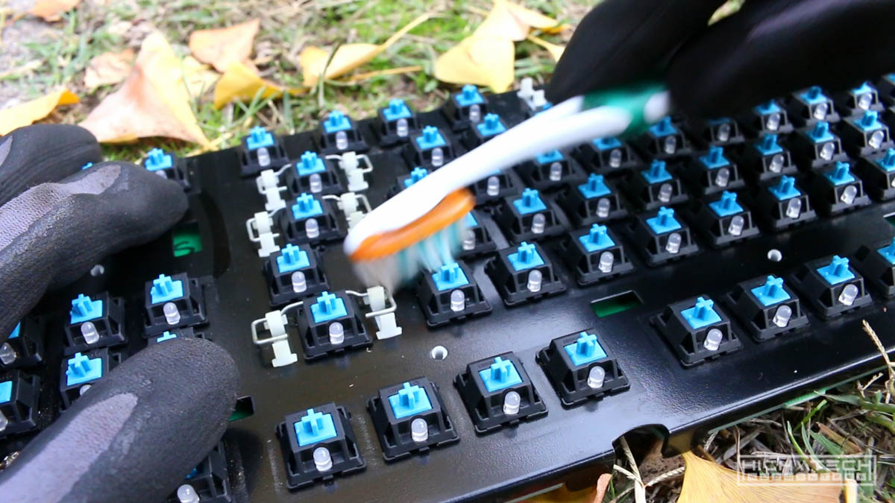

# Flatness Modifications
Ok so I wanted this board to be as flat as possible, so I cut off the metal support risers/tabs from the plate, this allowed me to drop things down another few millimeters, while also not having the plate scraping on my desk. 

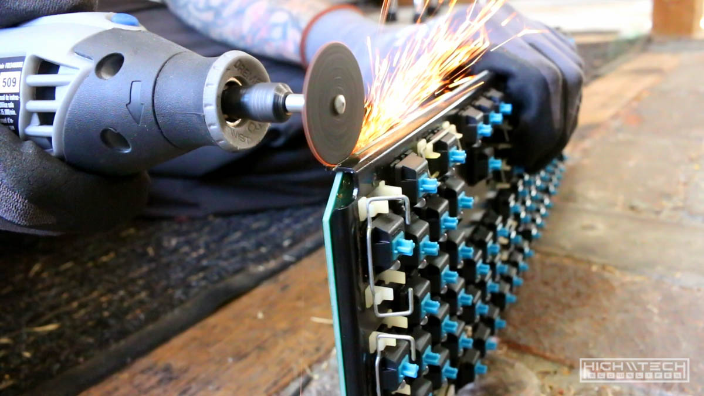
Dremel time. 

I don't want the pins resting on my desk so these cheap adhesive rubber feet will do, at least temporarily. 

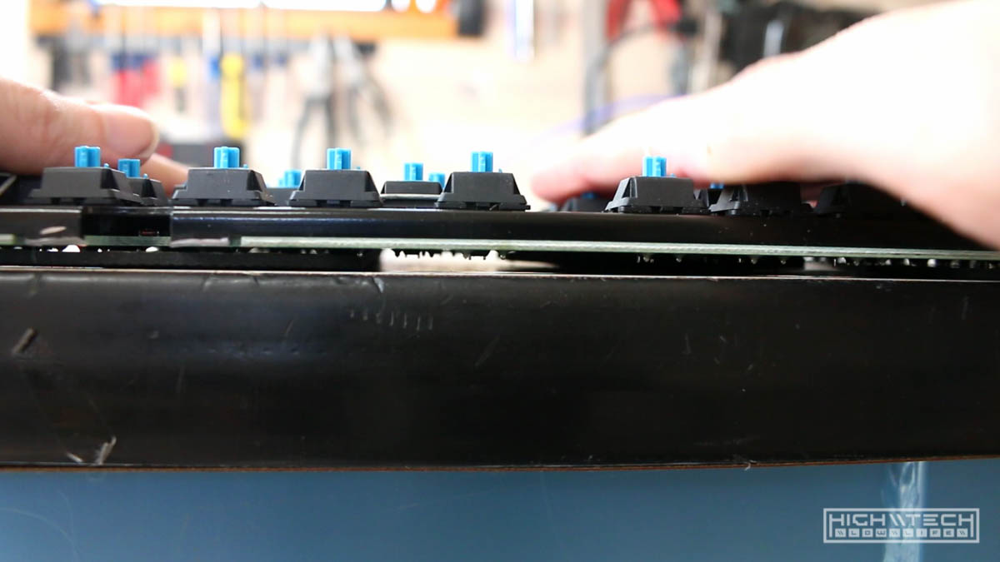
It's pretty flat! 

# Reassembly

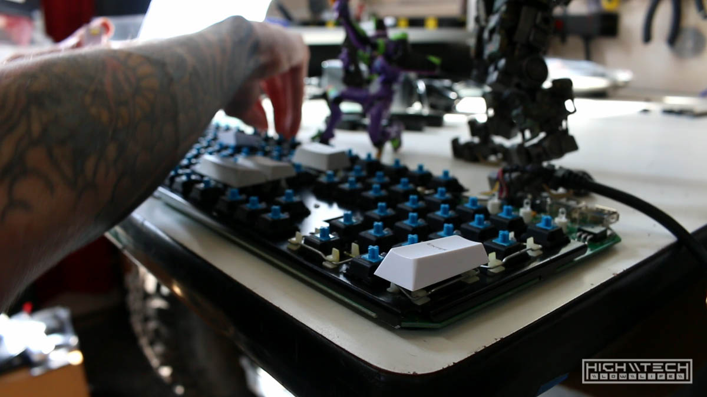
Fresh JTK doubleshot ABS set, it's cherry profile, so that's adding to the flatness cause. 

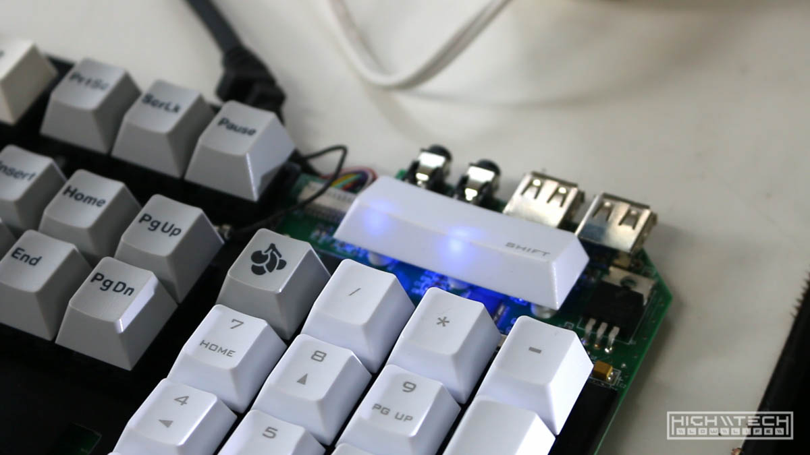
Because I'm not running a case anymore (or at the moment) these indicator LEDs would be blinding me, I just hotglued an extra keycap over them for diffusion, works amazingly well!

# Time To Test It Out

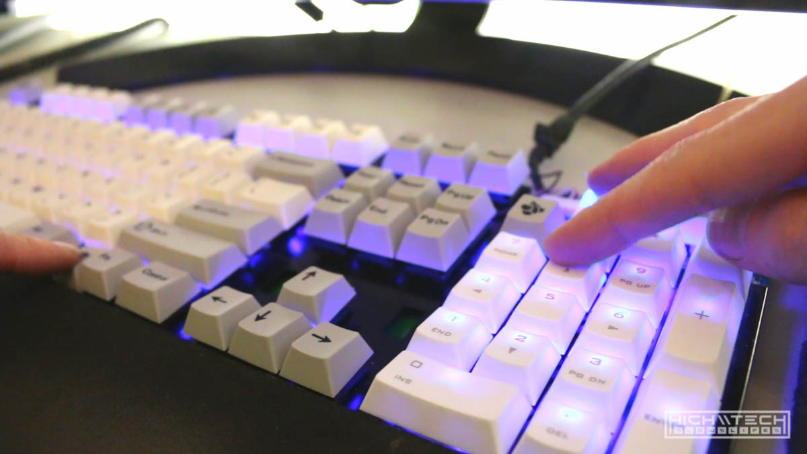
Still looks pretty cool with the blue LED backlights on! 

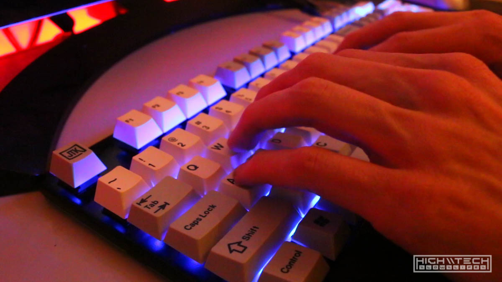
Feels pretty good! I think these switches may be a bit worn out by now, they honestly sound like "silent blues" as one viewer commented "switches so dirty they went from blue to brown" and that about sums it up. I do think the flatter board does feel better for me, but I really do need to upgrade these switches, I will probably do that in a future video. 
