# \\\ Wired Keyboard Detachable Cable Mod \\\

<iframe width="1024" height="576" src="https://www.youtube.com/embed/zvSa1-nTKV4" title="YouTube video player" frameborder="0" allow="accelerometer; autoplay; clipboard-write; encrypted-media; gyroscope; picture-in-picture" allowfullscreen></iframe>

Upgrade ANY USB Keyboard - DIY How-To Tutorial - This simple and easy mod will allow you to remove your USB cable. Perfect if your cable is already broken or not working, having a detachable cable allows you to use other cables, longer cables, more premium cables, makes your keyboard more portable and if you ever break your cable again it is easily replaceable. 

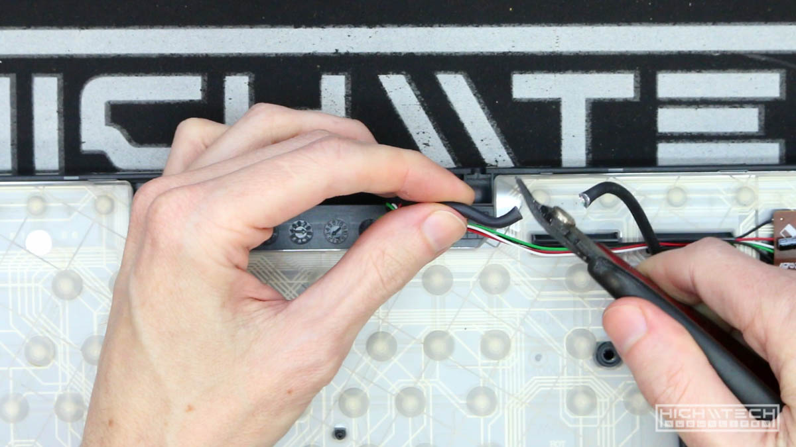

This tutorial will show you every step you need to take to upgrade your regular wired keyboard to one with a detachable cable. This mod allows you to not only choose which port you'd like (maybe you want a super strong USB Type-B!) or an updated or ubiquitous port such as Type-C, whatever you want this tutorial will show you how you can quickly and easily achieve it. 

I did this in about an hour or so, but depending on your board it may take less or more time. 

## \\\ Parts \\\

1. The Keyboard
A very cheapo crappy HP rubberdome, this keyboard could be found for free most likely at any computer recycler.

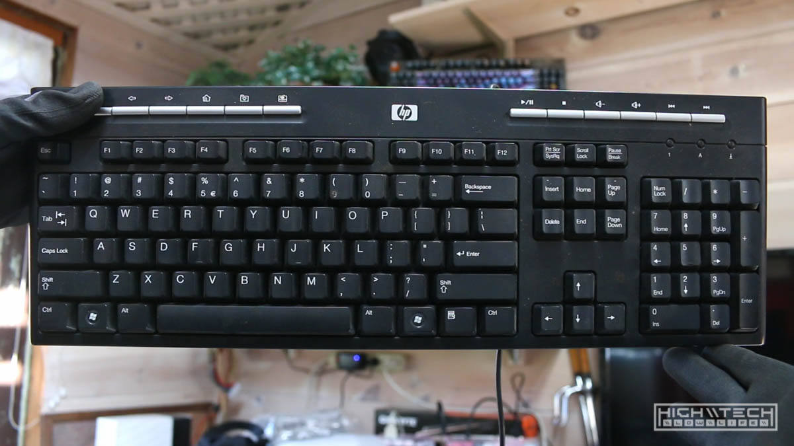

2. The port
I got these ports on AliExpress, they only came out to about a buck a piece, so it wasn't bad and they are high quality. You can get them at this link: https://www.aliexpress.com/item/1005003019611283.html?spm=a2g0s.9042311.0.0.6f454c4dbLsyoe 

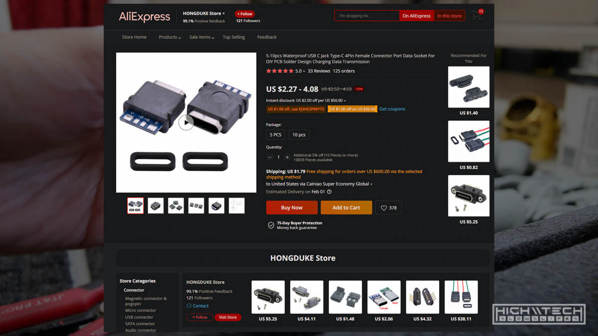

I saw a few other people doing this and I figured I would add it to my projects as I knew it could be useful to some people. I personally love wired keyboards more than wireless and it is handy to have a detachable cable for a number of reasons. 

The only real drawback with this modification is that the port is going to be the weakest link now and is a bit more fragile than just a permanently wired connection, however this is just about the only drawback and the pros outweigh the cons in my opinion. 

It's pretty straightforward and easy to do, honestly the hardest part is just opening the keyboard case. After that everything is pretty easy and depending on how aesthetically pleasing you want it to come out as, it can be done very quickly. 

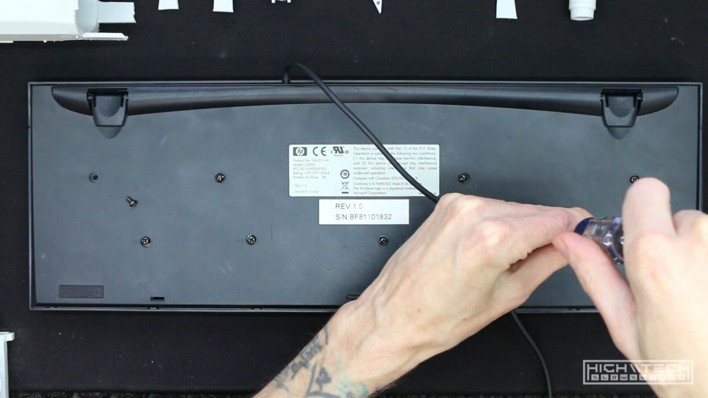
Start by getting into the case, usually they'll have at least 'some' screws on the bottom of the board (be sure to check under any stickers!)

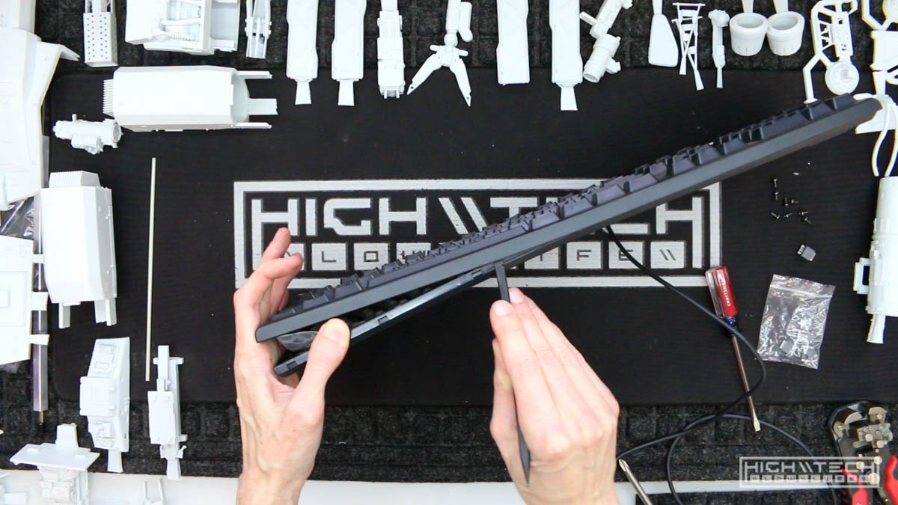
Once unscrewed you'll probably need to pry apart the clips holding the case halves together. 

Here is where we'll chop the cable, be sure to leave some length inside the case to allow to easier soldering of the port. 

Strip back the insulation and reveal the 4 USB wires, black - green - white - red. Also strip a small portion at the end of these wires and tin them. 

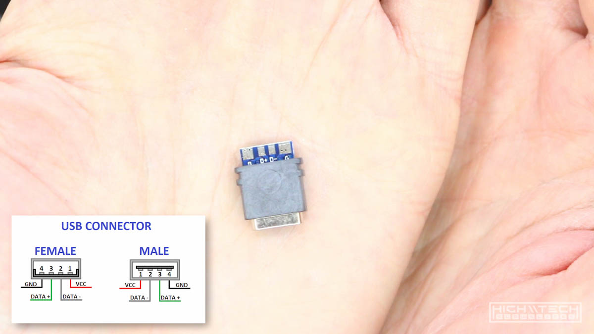
Here is the pinout for standard USB, just line it up correctly with the new port! 

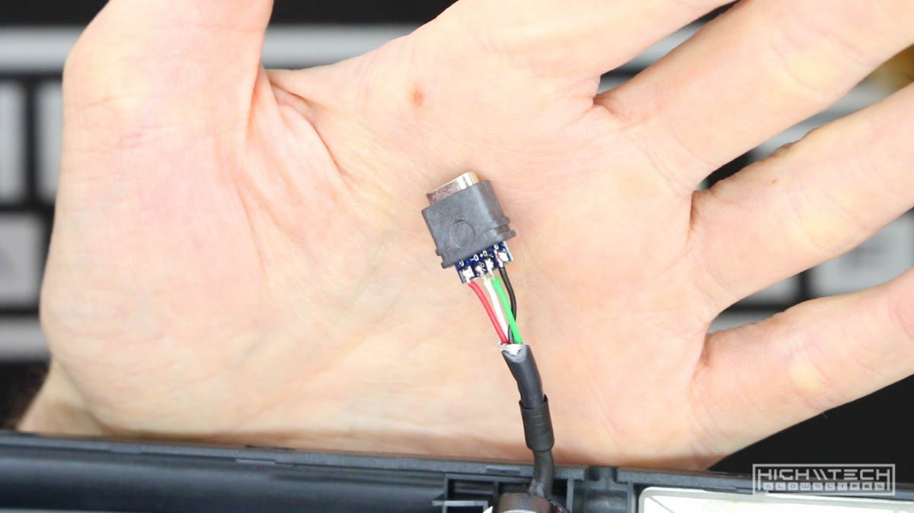
Solder the wires to the pads on the connector, so simple. 

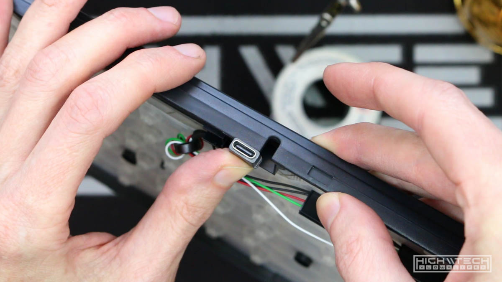
Now you'll have to make room for the connector, I utilized the stock location and just made it wider to accommodate the larger port. 

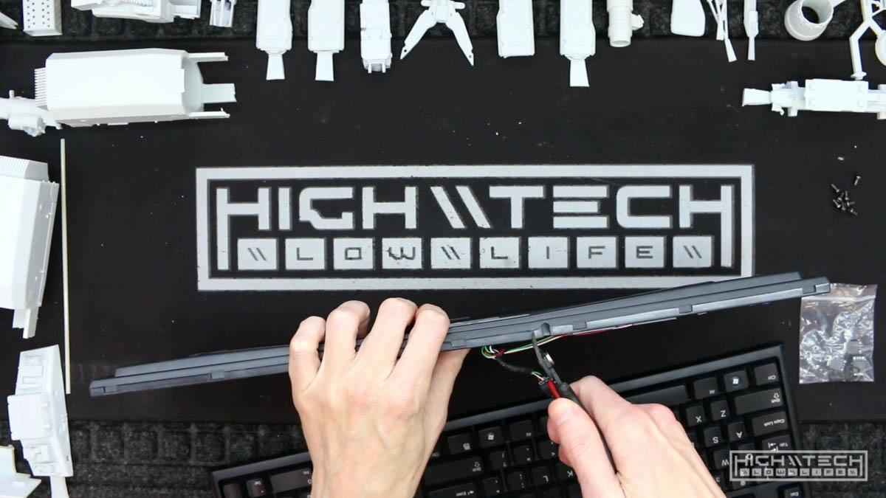
Using some flush cutters carefully I was able to do this pretty cleanly, it's not perfect, but very quick. If you want a better quality fit, cut less and file more. 

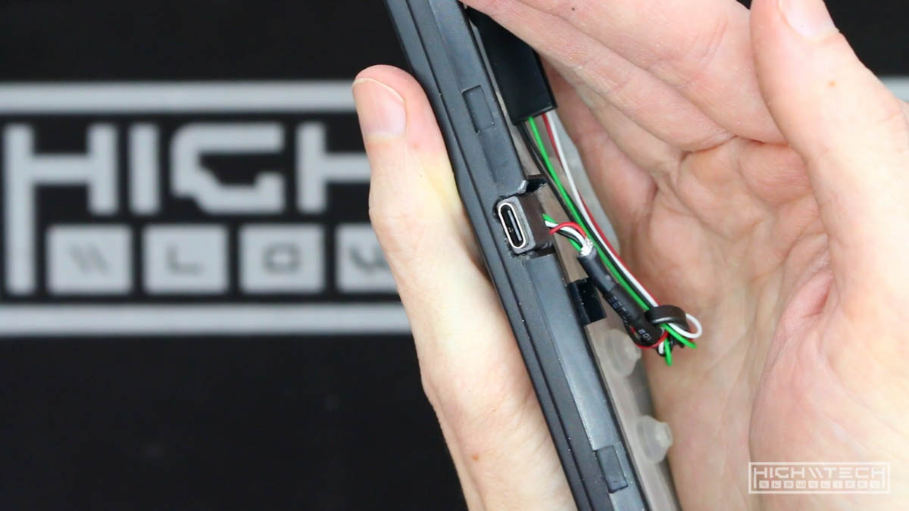
I did a good enough job so that the port is actually a tight fit, we're going to reinforce this anyway, but not a bad job for eyeballing. 

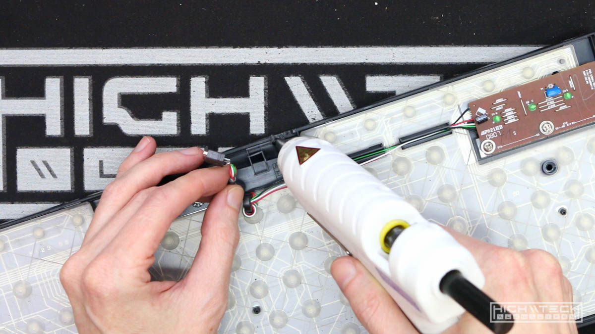
We're going to use liberal amounts of hotglue to make sure the port will not break loose at any time. Put down quite a bit, then put in the port, then cover it some more. I slammed the top half down while the glue was still hot to add some compression to it for an even tighter fit. 

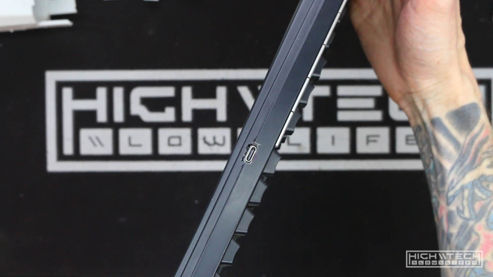
Here it is all completed, it looks pretty good!

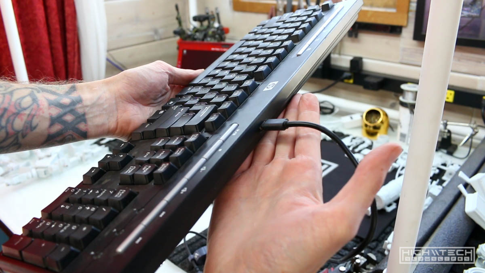
With the cable plugged in, the cable easily goes in and out without issues. 

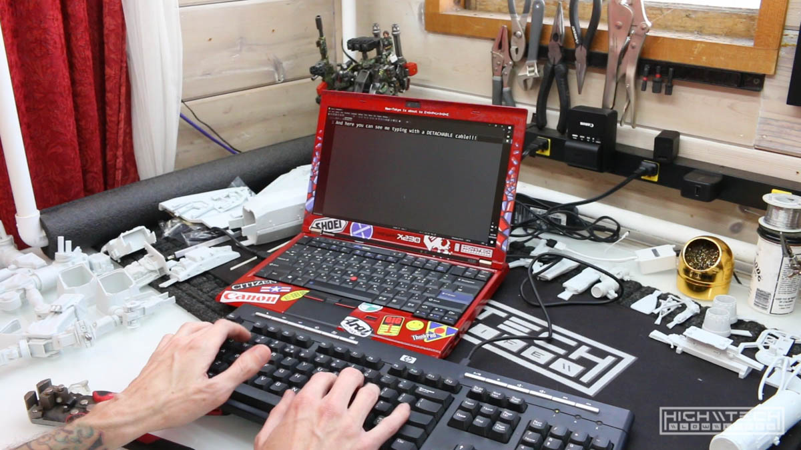
Testing it out, and it works flawlessly!

This could be done to basically any USB keyboard, whether it's a 5 buck cheapo rubberdome like in the example here, or a very expensive wired keyboard (do those even exist?) Maybe even an update to a vintage board where you want a newer port design. Maybe you already have a ton of cables and you'd like to take one cable with you to the coffee shop and don't need to have a bunch of different cables or even one flopping around in your bag still attached to your keyboard. 
