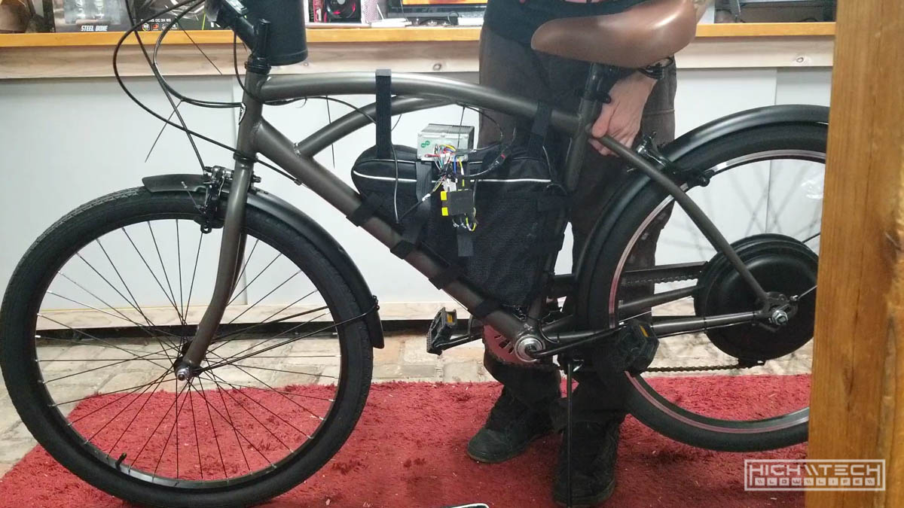

# \\\ 1000W Cruiser E-Bike Build Guide \\\

<iframe width="1024" height="576" src="https://www.youtube.com/embed/L0SnN9du-Ac" title="YouTube video player" frameborder="0" allow="accelerometer; autoplay; clipboard-write; encrypted-media; gyroscope; picture-in-picture" allowfullscreen></iframe>

Build a fast and cheap ebike in 2022! Anyone can follow this step by step how-to guide on how to make a hub motor ebike. This information should be applicable towards any hub motor ebike and help you choose and assemble your ebike conversion kit. This tutorial will cover all of the information you need to know, from choosing your components, electronics, connectors, batteries, and more! I am using a cruiser bike as an example but you could build a mountain bike, downhill, road bike, any bike really! 

This was just a quick and fun build for me, it really only took me a few hours from start to finish, I'm confident that anyone who has the desire to create their own ebike can do so and they should!

I've built many ebikes by now over the years (I think 15 or 16 so far), and I have some opinions and recommendations based on that experience. To me, the sweet spot in price/performation ratio is right around the 1000, to 1500 watt mark. 

With 1000W your top speed will be about 27MPH, 1500W will get you 34MPH and from there you need to bump up to 72V and 3000+ which is double the cost. To me it makes way more sense considering that 30+ MPH on any bicycle is probably too fast for most people to feel comfortable. I love big power as much as the next person but from ease of assembly, portability, and fun factor to me, these smaller builds are the best for everyone and anyone. 

## \\\ Parts You'll Need \\\

1. The Bicycle Frame - you can pretty much choose any frame you want, just be sure to check your dropout spacing as well as axle width - typical sizes are 135mm spacing, and 15mm diameter axles. Most kits will accommodate that, but it's always best to check. 

2. Hub Motor Kit
I can't find this exact kit on eBay anymore, but most generic 1000 or 1500W kit will do, I would recommend the 1500W because it's usually only about 20$ more for it, but if you don't care about going faster than 27MPH, then you don't need it. 

2. Battery
Most kits are 48V or 52V, I would recommend anything from 10 to 20Ah in capacity. 20Ah should get you about 40-50 miles of range depending. Make sure you measure your frame and depending on what battery you get make sure it will physically fit. If your frame does not accept a triangle battery, you might want to check out rack mounted batteries. I like the triangle batteries because they are super easy to install with the velcro packs they come with, you just strap it down and it's very sturdy. 

## Let's go - step by step!

Let's first remove the rear wheel and tire, we'll need to do that so we can put the old tire on the new hub motor wheel. 

Sometimes letting air out of the rear tire will help remove it if you have caliper brakes. 

 

Line up the tire valve on the new wheel and put the old tire on the new hub motor wheel. 

Reinstall the new wheel on the bike frame, be mindful of the washers. 

If the washers are not installed correctly the hub may rub on the frame causing binding.

Tighten up the axle nuts, again make sure nothing is binding. If you can tighten down the axle and things are spinning freely then you did it right! 

Check how the frame rolls now, pedalling and not.

Zip-tie the motor wires to the frame, out of the way of the tire and wheel. 

Install the throttle. If too many things are on your handlebars, try moving them to the other side. 

I modded my battery to add charge leads, this is optional. 

Depending on your kit and charger, you may need to conver the connectors on your controller to match your battery. 

Put the battery in the included battery bag. 

Fasten the bag to the frame using the velcro straps. 

Hook up the motor phase wires to the controller via the connection block.

Wire up the controller interface and zip-tie the wires neatly. Now power it on! 

Pick the back wheel up and apply some throttle, you should see the back tire spinning up!

Pack up the controller in the bag and affix it to the frame with the velcro straps.

Do some final wiring clean up with some more zip-ties. 

Check out your creation! You did it! 

