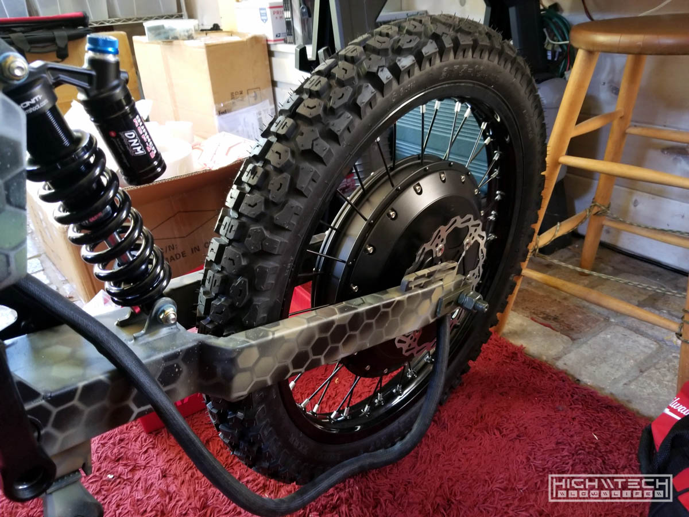

# \\\ Ebike [2.0] - Enduro Hex-Camo 8000W E-Bike \\\

<iframe width="1024" height="576" src="https://www.youtube.com/embed/lb-ncWgV2aA" title="YouTube video player" frameborder="0" allow="accelerometer; autoplay; clipboard-write; encrypted-media; gyroscope; picture-in-picture" allowfullscreen></iframe>

Taking it back (again) to (nearly) the beginning! This is the second ebike I had ever made and it’s a bit over the top (again). I learned a lot from my first ebike project and I wanted to make some changes on my second build.

More in-depth tutorial on how I do this hex camo paintjob: https://youtu.be/xF2ldzoYqH8

One of the major things I wanted to change was going with a full suspension bike. I realized quickly that when you're going over 20mph, that if you do not have a suspension the surface you're riding on no matter how smooth it seems can quickly become very bumpy due to how fast you're going. I wanted to remedy this by having not only a front suspension fork, but also a rear shock. My first ebike was rigid, had literally zero suspension, so that's one of the major changes I wanted to make or upgrade. 

The next upgrade or difference I wanted to make was going from a mid-drive to a hub motor. I was hesitant about running that much power through a traditional bike chain (let's face it they were only designed to deal with the forces of a human) having the power directly applied to the axle allowed me to not have to worry about that anymore so I could put as much power as I wanted! 

I also built this bike long before I ever thought I would ever be creating videos or content so I don’t really have any footage of the bike in action, but I did take a lot of pictures along the build. Maybe it will inspire you on your own builds.

01:36 - Assembly (suspension)
01:58 - Battery + Motor + Controller
02:47 - Lighting + wiring
04:02 - Custom dashboard
05:33 - Finished build
07:21 - Next time \ outro

## Frame Painting

 
This is a uber-cheap 'eBay' 'stealth bomber' knock-off frame from China. I thought all of these frames were basically the same but after building my 3rd ebike they are quite different. This frame is very heavy, made fully out of steel so compared to the other EEB frames out there, it's a lot bigger, wider, and heavier. I was ok with this because I knew I was going to be putting a lot of weight and power on the bike and I wanted a heavier and stronger frame to hold up to the additional forces. 

 

 
DNM USD-8 front fork set, not the cheeapest but also not the most expensive. 

 
I added some carbon vinyl wrap to the side panels, I figured this would break up the camo. 

Getting there with reassembly after paint. 

 
I made another mistake with the battery, this time the size was correct, but the BMS size was not. I got a pack that could handle the power because it's 72V and 30AH which is a pretty big pack, but when they were making my battery for me they asked me 'what size BMS' I really didn't have any idea of what it should or could be, so I just told them what my previous pack was, which is 50A, when I should have told them 150A!

The motor is the monster sized QS273 V3, which can handle 14KW+ (I've seen some doing 30+ KW!!!)

More assembly, after getting the tires put on the wheels. 

203mm front brakes with hydraulic calipers. 

Rear wheel mounted

This is the tried and true Sabvoton SVMC72150 which is 150A RMS power and also has a nice LCD display. This is one of my favorite controllers and has a lot of programmable parameters to tune and adjust the power. 

Custom edge-lit acrylic front placard with glorious INDSTRKT graphics.

Custom acrylic dashboard mocked up.

Testing out the dashboard LEDs in the night. 

Further dashboard refinements. 

Full dashboard wiring with USB powered ports, RGB controller, etc.

Dashboard completed and mounted!

And the bike is finally completed!

Considering this was only the 2nd ebike I had made, I think it came out pretty well. I never did a speed run on it, but I assume in the 55-60MPH range. 

