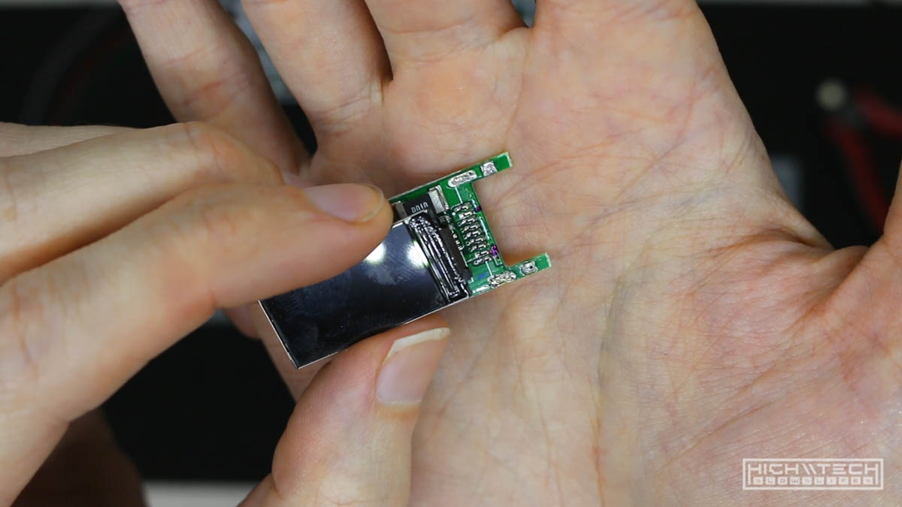
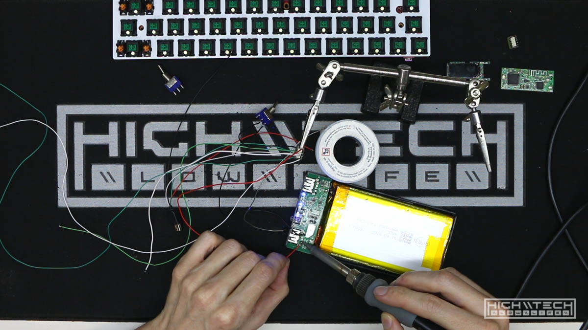

# \\\ Dual Battery Pok3r Wireless Conversion \\\

<iframe width="1024" height="576" src="https://www.youtube.com/embed/acPJI2IyBqA" title="YouTube video player" frameborder="0" allow="accelerometer; autoplay; clipboard-write; encrypted-media; gyroscope; picture-in-picture" allowfullscreen></iframe>

Part 1 of a mini wireless keyboard build with TWO batteries! What's better than one battery in your wireless board? Obviously two!

This all started back when I first made my wireless conversion mechanical keyboard. That build had a different end goal and that was to create a sleek and 'covert' wireless conversion where you couldn't really tell from the outside that anything was modded or changed. Because of that I was limited to the interior space of the original case and that didn't leave a lot of room for the battery. 

I was able to pack in about 3000mAh of battery life, and even though this was usable and decent, I thought about how if I didn't have the constraint of the case, then I could use a much larger battery. That's when I got the idea to just make my own custom case. If I have a custom case, that means I could make the case larger which would accept a larger battery, and I guess somewhere along the way I decided that one larger battery was not enough. Since I'm making a new case anyway, why not stuff two giant batteries into the case?  

I wasn't quite sure how to do that and I've read online that wiring two power banks in parallel is a no-no. I wanted to err on the side of caution so I figured what if I just have a toggle to where I can switch between the two batteries independently? I figured this would only be annoying for that second or two that you're flipping the toggle over to the next battery and waiting for it to reconnect. I figure this is a small price to pay for literally double the wireless run time!  

This isn't really a how-to or how to do guide or anything, but if you're looking for that please check out my first wireless conversion video, as I go over a lot of the components, what they do, and how I've wired them together in that video here: https://youtu.be/o-wbPVkkyWg

I also did a wireless conversion on another 60% mechanical keyboard, and you can check that out here: https://youtu.be/2Df7Dh3-3o0

If you watch those videos first you will be fully up to speed on more of the electronic side of things that I am doing in this video 👍

## Parts 

 
Quite a few parts here, a CODE 61-key (now discontinued) backlit 60% keyboard, but essentially just a Pok3r (made by Vortex). This will be the backbone of the project, but I still need quite a few other things. 2x Getihu 10000 mAh battery banks (6000 mAh at 5V), some giant 12mm LEDs, of course the trusted Handheld Scientific BT-500 bluetooth adapter, and a USB volt meter.  

Lots of power! Two pretty big battery banks. 

 
The first thing I wanted to do was just to figure out where I was going to put these batteries. 

 
I really tried a bunch of different combinations before settling on something I thought would be the best. 

Another thing I had to contend with was the dipswitches on the bottom of the PCB, I couldn't just place the batteries anywhere underneath because I need to leave room or access for this set of switches.

## Deconstruction + Test

 
I started the build by chopping down the BT-500 module, I need all the space I can get so I lopped off the USB ports as I will be directly soldering these connections. 

Much better, and flatter. 

Always mark your PCBs for polarity, after the 2nd time of looking it up, you'll want a label. 

I'm using my trusty tiny relays to perform the switching for these tests, but I will be moving on to actual hardware toggle switches for this build. I'm just trying to make sure everything works. 

I've never used two batteries on a keyboard before, so I wanted to make sure it was going to work how I thought it would. 

I really wish they had 3P3T slide switches, but the smallest package I have found for that are these mini toggle switches, still a bit big, but they will do. 

## Custom Placard and Dashboard 

What do you know, it all works, even the volt meter! 

You'll have to check for next time when we start the process of creating the custom case. 
