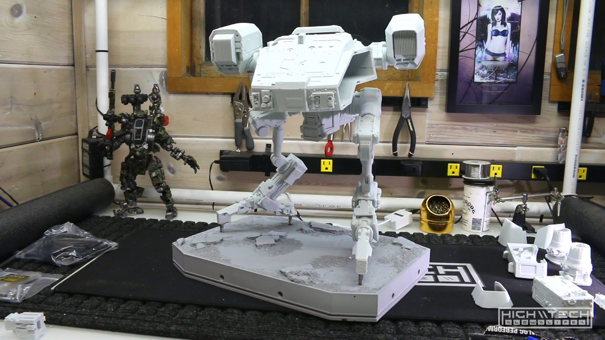
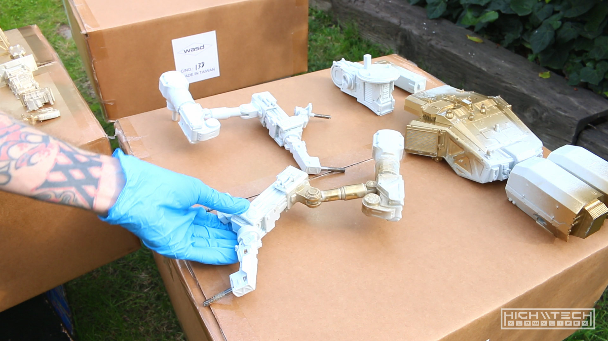

# \\\ THE MOOSE - CHAPPiE - Model Resin Kit - Part 2 \\\

<iframe width="1024" height="576" src="https://www.youtube.com/embed/mx8ZMeH69e4" title="YouTube video player" frameborder="0" allow="accelerometer; autoplay; clipboard-write; encrypted-media; gyroscope; picture-in-picture" allowfullscreen></iframe>

Before I had merely broken it, now I have ruined it with paint!  

First I had to do some 'partial' assembly, this is because of the paint scheme I want to throw down on this - it's a pattern so I wanted at least some of the seams to flow over one another so that it's a seamless pattern. I couldn't assemble the whole thing because that would make painting the parts more difficult than it already will be, and I couldn't just paint all of the parts separately because there would be glaring sections where the patterns didn't line up at all. I guess this would have been ok in hindsight but I wanted to do it as best as possible. I couldn't make it completely seamless because some of the parts had overhangs that I simply couldn't paint had I assembled it beforehand. So I did a trade-off and I assembled as much as I could while taking into account how the paint was going to go. I probably should have made a map and written down how to tackle the painting, but I figured if I made any mistakes I could go back and fix it. 

After getting it partially assembled I wanted to see how it would look and it looks incredible! This model kit is so awesome and it's really quite large, I was really happy with the scale of it and how menacing it was looking and that's with barely any assembly and zero paint. I was really excited to get some paint on it so I may have gotten ahead of myself a bit. 

## Unbox

 

Neill Blomkamp's movies are by far my favorite 'cyberpunk' aesthetic/genre. I love all things cyberpunk, from the rainy neon streets on Blade Runner, to the off-world colonies of Total Recall, and the slick, sleek modernity of the Matrix. Although by far my favorite style is this gritty, militiristic, camo industrial raw aesthetic, and his style ticks all the boxes for me in terms of what I love about cyberpunk. And THE MOOSE is a perfect encapsulation of that style. 

Of course it draws heavy from the original 'big scary robot' ED-209 from Robocop. To me he takes it to this higher level though, everything I loved about ED-209 but just more!

 

This model kit is so intense that I really am not the person to build it. I believe this kit deserves an expert to not only prep and build but also paint it. I strongly considered hiring someone to do that for me because I knew that I couldn't do this kit justice, but in the spirit of DIY and this channel, I am taking on the challenge. I know I won't make it perfect, but I'll at least be able to put my own spin on it and hopefully it comes out semi-decent. 

In this first episode we'll go over 'why' I wanted this kit so badly and why it took me so long to even attempt to build it. I go over the unboxing, then sorting the parts until finally taking the time to do the tedious work of prepping all of the parts by removing all of the flashing and extra molding from the raw parts. Even though the parts are very high quality, just about every single one needed at least some finishing work. It took me about a week to get this far and I'm documenting my way as I go. 

 

This kit was quite overwhelming but after I spent more time working on the parts my excitement grew to outpace my apprehension with not wanting to make a mistake or ruin this project. I can't wait to see it finished and I'm hoping that the paint doesn't cut me down as that is the part I am fearing the most.  

Now that I have all of the parts prepped and ready for a dry-run of assembly I can start gathering and deciding how and what I want to paint. 

## PARTS!

 
The instructions are very limited, it's enough to help you out but if you're looking for a gundam-style instruction set, you're going to be lost with what you're given! Again, this kit is not for new model makers. 

 
This kit has a ton of parts! Most of the parts are actually very small and just 'details' and this kit has a ton of details, it's basically like 5 major, 'large' pieces and the bulk of the rest is all small greebles. 

The legs are very impressive, they have been molded over a steel armature as the legs actually support the entire model so they have to be strong. The amount of details that are molded into these parts is truly incredible. 

The base is equally impressive, it must weight like 5-10lbs! The detail is amazing and the weight is just absurd. 

It's a lot of parts! 

Just some impressive details in the molds! 

## Preparation

A ton of work must be invested into prepping the parts for fit and also paint. 

One of my first parts I was prepping I actually broke it while trying to break off the flashing tab. Needless to say I was much more careful after this, some parts you can just break off the tabs, some you cannot. 

It's really just a ton of cutting and sanding, this took me forever to do on nearly every single piece in the kit. 

Some parts you can just clip, while others you need to sand delicately down. 

I used a pick to clean off some of the more intricate parts also. 

After about a week of working on these parts for about 2 hours every night, I finally was finished with this portion. It was tedious but necessary. 

Now that I'm done with this, check out future episodes in this series! 
